# CIS-CAT Pro Dashboard User's Guide #

End of Life and Final Release Dashboard version 2.x - Replaced with Dashboard v3.0.0

------------------

Version 2.3.1 will be the final release of CIS-CAT Pro Dashboard version 2 series. Dashboard version 3.0.0 will replace the 2.x versions in early Q4 2022, but will not be backwards compatible. A clean install of Dashboard version 3.0.0 will be required as there will be no upgrade or data migration options available from any previous 2.x version. Please read our [knowledge base article](https://cisecurity.atlassian.net/l/cp/mF6o97vs) to learn more. 

Version 2.3.1 will be available on the CIS WorkBench for download through December 2022.

Vulnerability assessment features will be deprecated.

Previous versions of this tool will no longer be distributed.

Final installation and configuration and installation guides will be packaged with Dashboard v2.3.1.  Dashboard version 3.0.0 documentation will be available online upon release.

## Introduction ##
CIS-CAT Pro Dashboard is a companion application for CIS-CAT Pro Assessor.  Using CIS-CAT Pro Dashboard is a great way to visualize assessment results. Dashboards show configuration assessment results over time with the ability to drill down to individual results. Navigate from a high level graphical overview of environmental compliance with CIS Benchmarks to individual assessment results that produce a compliance score.

CIS-CAT Pro Dashboard supports creation of exceptions to CIS Benchmark recommendations where organizations can indicate why a particular recommendation is resolved other ways or risk is accepted.  When exceptions are approved, compliance scoring can be improved where the exception is active.  

The application also offers a Remediation Report, for an operator only concerned with "failure" results of a given assessment and a Complete Results Report, to provide auditors with the complete assessment results of a given endpoint, or group of end points.  Users can also view CIS-CAT assessment results through the lens of the CIS Controls with the Controls View of assessment Results.  CIS-CAT Pro Dashboard provides users with the capability to Tag target systems (endpoints) in order to group them together for aggregation onto these new dashboards and reports.  

## Deployment ##
CIS-CAT Pro Dashboard is a companion application to CIS-CAT Pro Assessor.  CIS-CAT collects and evaluates system characteristics as described by the CIS Benchmark content.  CIS-CAT can upload assessor assessment results to the web-based Pro Dashboard application using a REST API.  CIS-CAT Pro Dashboard supports import the XML formatted results. This section describes how to configure the web application in your environment, as well as how to configure CIS-CAT to send assessment results to the Pro Dashboard application.

### CIS-CAT Pro Dashboard Deployment ###
See here for Linux:  [CIS-CAT Pro Dashboard Deployment](./Dashboard%20Deployment%20Guide%20for%20Linux/)

See here for Windows:  [CIS-CAT Pro Dashboard Deployment](./Dashboard%20Deployment%20Guide%20for%20Windows/)

## User Administration ##
CIS-CAT Pro Dashboard leverages spring security to manage authentication and access rights for application users. Within the application, an administrator can create new users and assign user roles. Access to particular features and functions is defined by the Dashboard and covers basic user functions and administrative functions only. The access for the delivered roles cannot be customized.

## Users ##

Only a user with the role of administrator can create create and manage users.

By default the administrator username is `admin` with the password `@admin123`.  Navigate to the Settings menu (gear icon) and select `User Management` to access the user list.

**Create a New User**

Creating a new user is possible if LDAP is not integrated. When a user is authenticated against LDAP from the Dashboard, roles and user properties such firstname, lastname and email will be imported from LDAP. 
If the user doesn't exist in the Dashboard (based on username), a user account will be created, and granted with a non-admin user role (`ROLE_USER`) by default, plus additional LDAP Roles. With LDAP integration, when you edit a user, only enable/disable account is accessible. Password and user properties are managed from LDAP.

By default, newly created users will be granted the security access role or `ROLE_USER`.

1. Login as an Admin
2. Select the Settings --> User Management
3. Select the `New User` button
4. Enter a unique username
5. Enter first and last name
6. Enter a temporary Password between 8 and 64 characters with at least one letter, number, and special character(!@#$%^&)
 
New users will be asked to change their password on initial login.

**Modify or View a User**
 
1. Login as an Admin
2. Select the Settings --> User Management 
3. Select a user from the list or utilize the `Search Users` button to help find the desired user
4. To edit the user, select the `Edit` button
5. Modify the desired information and select `Update`

    
## Roles ##
Roles in CIS-CAT Pro Dashboard are assigned to users and allow access to functionality.  The application deploys with the following supported roles. 

|Role|System Access|
|---|---|
|ROLE_ADMIN|Can perform all functions and access all available areas in the application. Cannot generate the API token.|
|ROLE_USER|No access to `System` menu. Prevented from assigning or removing system tags, deleting target systems or assessment reports, and exception approval. Cannot generate the API token.|
|ROLE_API|Utilized to create the authentication token for CIS-CAT Pro Assessor. At least one user must be assigned this role in order to generate the `CIS-CAT Authentication Token`. The token is required to be placed in the `assessor-cli.properties` file associated with CIS-CAT Pro Assessor when assessment reports will be uploaded to Dashboard.|

**NOTE:** As of CIS-CAT Pro Dashboard v2.1.0, new user-named roles can no longer be added. Prior versions of Dashboard supported role addition.  

**The API User Role**

Clicking the button will open a dialog box where the user is required to enter the "ROLE_API" user's credentials.  Once that user has been re-authenticated, the token is generated and displayed on the page.  To support automatic imported results into Dashboard from an assessment, the token must be placed into the properties file of CIS-CAT Pro Assessor. See deployment guide for Dashboard for Windows or Linux and learn about where to place this token for Assessor v4 or Assessor v4 Service Integration.

## System Settings ##
The `System Settings` menu is only available to users with `ROLE_ADMIN`.  Various default system configurations can be set. System administrators can navigate to this screen by selecting the gear icon in the upper, right area of the application.

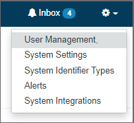

Below are explanations of each of the different possible configurations.

|Setting Name|Description|Values|
|---|---| ---|
|legacy.sourceDir|path to a directory that the dashboard uses in file processing after uploads|a valid path on the application server|
|legacy.processedDir|path to a directory that the dashboard stores successfully imported xml files in|a valid path on the application server|
|legacy.errorDir|path to a directory where the dashboard stores xml files that failed to import correctly|a valid path on the application server|
|legacy.processedRetentionNumber|The amount of files that will be retained in the legacy.processedDir folder.  The directory will be purged down to this number after each new upload.|any integer greater than 0|
|primarySystemIdentifierType|the type of identifier that will be used for target systems every where targets are listed in the Dashboard Application.  See the Primary Identifier Type section of this document for more details.|System Identifier Types|
|vulnerabilityFailuresOnly|When importing vulnerability reports, if this is true, the system will only import failures, which will improve performance and save space.|true or false|
|vulnerabilityWarningAge|The number of days old a vulnerability has to be before the warning is displayed on the vulnerability report.  See the Vulnerability Report section of this document for more details.|Integer number of days|
|vulnerabilityHighThreshold|The CVSS score that will categorize vulnerabilities as High on the report and in the dashboard. Scores above this value will be considered High Impact The default value is 7|number between 0-10|
|vulnerabilityLowThreshold|The CVSS score that will categorize vulnerabilities as Low on the report and in the dashboard. Scores below this value will be considered Low Impact.  The default value is 4|number between 0-10|
|displayDBNameInPrimary|Display the Database Name target system identifier in the target system Primary ID.  For target systems with Database Benchmark results.|true or false|
|alert.lowScoreThreshold|Threshold for producing the "Low Score Alert" when test results are imported. Default is 80.|number between 0-100|
|admin.password.expirationDays|The number of days before a users password will expire|number of days|
|admin.maximumFailedLogonAttempts|The number of failed login attempts before an account is locked.|number|
|dashboard.height|The number of pixels in the height of the dashboard graphs.|number|
|dashboard.width|The number of pixels in the width of the dashboard graphs.|number|
|testResult.score.high|The percentage score for a group of recommendations that will have the group appear in green on the assessment results, indicating high compliance|number between 0-100|
|testResult.score.medium|The percentage score for a group of recommendations that will have the group appear in yellow on the assessment results, indicating moderate compliance|number between 0-100|
|testResult.score.low|The percentage score for a group of recommendations that will have the group appear in orange on the assessment results, indicating poor compliance.  Scores below this will appear in red, indicating very poor compliance.|number between 0-100|
|alert.diffScoreThreshold|Threshold for producing the &quot;Test Result Diff Alert&quot; when test results are imported and when the score goes down compared to the previous score (same machine/benchmark/profile). The value is the score difference between the 2 test results. Default is 0.|A percentage between 0-100|
|controls.version.default|Set your preferred CIS Controls default view.|CIS Controls version|
|delete.assessment.start.time| Sets the start time that a job will begin processing a permanent delete of flagged report(s). A routine database backup process is recommended. Both the start and end time must be set with whole integers ranging from 0 to 23. A setting of any other value, such as -1, will disable the job.| A whole integer from 0 to 23
|delete.assessment.end.time| Sets the end time that a job will stop processing a permanent delete of flagged report(s). A routine database backup process is recommended. Both the start and end time must be set with whole integers ranging from 0 to 23. A setting of any other value, such as -1, will disable the job.|A whole integer from 0 to 23

## Logging In/User Profile ##
When a user first navigates to CIS-CAT Pro Dashboard, they are asked to log into the system.  If a user account has been created for that user, they will initially be asked to reset their password following a successful login.

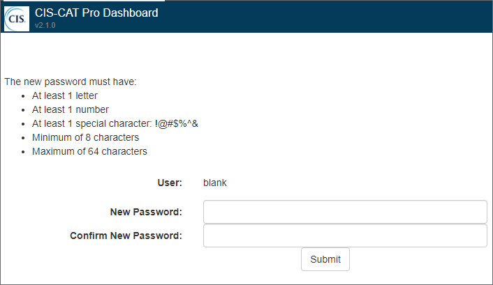

Once the user configures their password, they are asked to re-login using those new credentials.  Once logged in with updated credentials, the user is taken to the "Overview" Dashboard view.  In the top right-hand corner of the application now resides the display of the logged-in user's username:

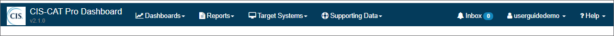

Clicking on the username, a menu will appear, showing the user options for controlling their user account, such as editing their user profile, or logging out of the application:

Click on the Profile link to navigate to the user's profile:

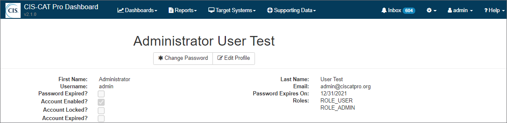

The User's profile screen shows account and role information, as assigned by an administrator.  Clicking the Change Password button opens a dialog box allowing the user to enter and confirm new credentials to be used when logging in to CIS-CAT Pro Dashboard:

Validations exist when users change their credentials.  The passwords entered must match, the new password must be between 8 and 64 characters in length, and must include at least one uppercase letter, one lowercase letter, a numeric character, and at least one special character, such as "!@#$%^&"
Clicking the Edit Profile button from the user's profile opens a dialog allowing the user to make changes to their information.  This information is limited because many user changes should only be performed by an administrator, such as editing user roles or activating/deactivating a user's account.

Making changes to this dialog and clicking Save will update the user's information.

The user profile screen also features a list of Alerts that the user is currently subscribed to, as a well as why they are subscribed to that alert type:

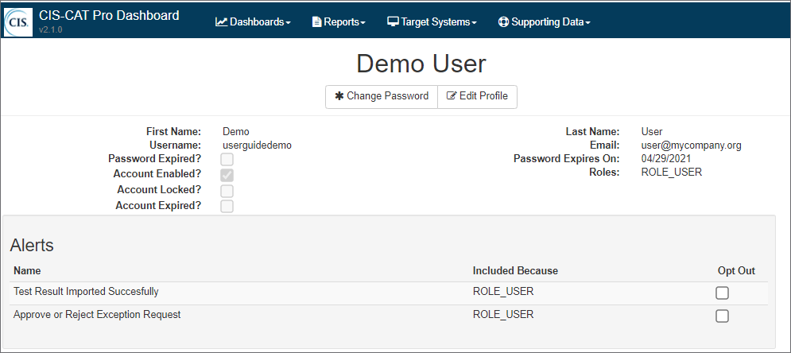

From this list users can choose to opt out of any of the alert types that they are receiving.

**NOTE:** If LDAP is integrated with CCPD, "change password" and "edit profile" buttons are no longer available as well as some user account properties. Password and profile attributes (firstname, lastname, email) are managed and retrieved from LDAP.   

## User Favorites ##
Clicking on the username, a menu will appear, showing the user options for controlling their user account, such as editing their user profile, user favorites or logging out of the application:

Click on the Favorites link to navigate to the user favorites:

Users can maintain a list of preferred benchmarks and target systems. 
 
In this page, you can add/delete favorite benchmarks as well as favorite target systems.

In Benchmark view (Dashboards), you can select benchmarks from your list of favorite benchmarks that you would like to see results for.
This is the same for Target System view. 

##User Inbox##

The User Inbox contains all of the alerts/tasks assigned to the user.  Simply click on the Inbox item on the menu bar to navigate to the inbox:

The bubble next to the Inbox will indicate how many unread messages you have.

The inbox features serveral views, which can be navigated to using the tabs on the left hand side:

 - **Inbox** - has all new alerts and tasks that have not been deleted or completed.  Unread messages will appear in white with bold text.  You can also toggle between all inbox messages, or just the unread messages.  This contains all alert types, except Tasks
 - **My Tasks** - contains tasks. You can toggle between open and closed tasks.  Closed tasks already have had their action(s) completed and no longer require work by the user.
 - **Trash** - contains deleted messages
 
Clicking on the messages in any of the lists will pop up a dialog displaying the message.  Clicking on the delete button in the list will move the message to the trash folder.

**Sending Manual Alerts**

You can send a custom alert to any user or group of users in the system by clicking the Send button:

This will open the manual alert dialog,  from here you can select the recipients you want and add a title and message to the alert:

When complete click "Send" and your message will go to the inbox's of the selected recipients.

**Alert Types** - There are several different types of messages that you can receive in your inbox:

 - **Task** - A task has an action that you need to perform in order to close it.  When you open a Task, there will always be one or more Actions you can take to close the task.  These will appear in the "My Tasks" tab.
 - **Alert** - An alert informs you of a system event directly related to you,  such as the completion of an upload you initiated. 
 - **Event** - An event informs you of an occurrence in the system that you need to be informed of.
 - **Manual** - A manual message was sent directly to you by another user.
 
##Alert Management##

In the Administration menu there is an option for Alerts.

This will navigate to the alert list, where you can select an alert to bring up the show Alert page where alerts can be managed.

The important feature of this page is the configurable recipient list.  This shows all the users that are configured to receive the alert, why they are, either directly, by a role they have assigned, or by a tag they have assigned.  Users can then use the Receiving Users, Receiving Roles, and Receiving Tags list to manage who will receive an alert.

The Recipient list also shows which users have opted out of the alert type.

**NOTE:** A user will only receive one instance of an alert,  even if they are included in the recipient list by multiple criteria.  i.e.  if they have a tag and a role that include them in the recipient list, they will still only recieve one alert.

##Primary Identifier Type##

When assessment results are imported,  CIS-CAT Pro Dashboard creates a new target system to represent the assessed endpoint.  Subsequent imports for the target will be associated with the same target system.  The assessment results has several different identifier types that are imported.  By default, target systems within CIS-CAT Pro Dashboard are primarily identified by hostname.  This means, where ever you see a target system in a list, or a search result,  the identifier you see is the hostname.  The primary identifier however can be configured, either at the CIS-CAT Pro Dashboard application level or on each individual target system.

To change the primary identifier type at the CCPD Application level, navigate to the system settings menu administrative menu option:

Once on the System Settings page,  find the "primarySystemIdentifierType" option:

Click on the edit action to bring up the Primary System Identifier Type dialog:

Select the ID type from the drop down, then chose the option you would like to for existing data:

 - **Leave Existing values.** - this option will leave all the existing target systems as they are.  Going forward, new systems that are imported will receive the new primary ID type.
 - **Change Primary Only.** - This will change the  primary identifier type on target systems whose primary ID is the same as the the current default system primary ID type. Targets whose primary ID is set to other types will remain unchanged.
 - **Change All.** - This will change all of the existing primary ID types to the new type, regardless of system level customization.

**NOTE:** If a target system does not have an identifier of the new primary identifier type, then the Change Primary Only and Change All options will leave the existing primary identifier on that target system.

**Custom Identifier types**

CIS-CAT Pro Dashboard has several identifier types that are imported with test results:  hostname, fqdn, ip4, ip6, and MAC Address.  An organization can add custom identifier types via the System Identifier Type Administrative menu option:

Once on the System Identifier Type screen you can add additional types:

The Display value is what the ID type will appear like on screen,  the code is a backend value for using the identifier in code.

Once this type is in the system, you can the begin assigning them to target systems via the Add Identifier button on the Target System Screen:

The add identifier dialog allows you to select a type, enter a value, and determine whether this is the primary Identifier for this specific target system:

A target system must always have one and only one primary identifier.  As such,  if you assign an identifier as primary,  all other identifiers marked primary will be marked as non-primary automatically.

You can pass a custom identifier in to the CCPD from the CIS-CAT Pro Assessor by using the system.identifier.ciscat.primary argument.

1. First you need to follow the steps above to create a custom identifier type with a code of: ciscat.primary.  The display value can be whatever you want.  If you want this to be used to identify the target everywhere in the CCPD application, then mark this type as primary.
2. Open the "cis-cat-centralized-ccpd.sh" script in a text editor.  Line 115 of the script indicates the AUTHENTICATION_TOKEN for upload to CCPD.  Add a line after that, adding:

		PRIMARY_IDENTIFIER='<Primary_Identifier>'
Replace the `<Primary_Identifier>` indicator with the actual identifier to be passed to CCPD.

3. Navigate to the configuration of the "CISCAT_CMD" variable.  It looks like this:

		CISCAT_CMD="$JAVA_HOME/bin/java -Xmx768M -jar $CISCAT_DIR/CISCAT.jar $CISCAT_OPTS"
Add an additional indicator to set the property:

		CISCAT_CMD="$JAVA_HOME/bin/java -Xmx768M -jar $CISCAT_DIR/CISCAT.jar $CISCAT_OPTS -D system.identifier.ciscat.primary=$PRIMARY_IDENTIFIER"

4. This will configure the same identifier for all systems that execute via this script.  If each system requires a distinct primary identifier, an environment variable should be set up on each machine so it can then be referenced in the "cis-cat-centralized-ccpd.sh" script:

		PRIMARY_IDENTIFIER=$ENV_VAR_IDENTIFIER

## System Integrations ##

**CIS-CAT Pro Release alerts**

After [establishing a connection with CIS WorkBench](./Dashboard%20Deployment%20Guide%20for%20Windows/#cis-workbench-integration), CIS-CAT Pro Dashboard will check CIS WorkBench daily at 5PM for the availability of a new release of CIS-CAT Pro.

If a new CIS-CAT Pro release is available, the following alert will appear in the inbox:

The alert provides the bundle title, version, description, hashes, and release date.

The alert provides a link to download directly the latest bundle.

**Connection Error Alerts**

Error alerts will appear in the inbox when the connection between CIS-CAT Pro Dashboard and CIS WorkBench is not successful.

See below examples of potential alerts you might receive: 

1. SecureSuite membership status changed:

2. CIS WorkBench Api client cannot be found:

## Importing CIS-CAT Assessor Results ##
**In-Application Import**

Importing CIS-CAT Assessor results using the CIS-CAT Pro Dashboard user interface assumes that a user has executed a CIS-CAT assessment and produced the Asset Reporting Format (ARF) results.  Once an ARF has been generated in CIS-CAT and saved to the designated reports location, open a web browser and log into the Dashboard application.  From the main navigation bar, select Reports -> Assessment Results List.  

The "Assessment Results List" page will be displayed.  Click the "Import Assessment Results" button.  A file selection dialog will open, allowing the user to browse to the saved reports location and select the CIS-CAT-generated ARF or XML report.  

Click "Upload" to start the import process.  Note that the import processes asynchronously, so the user will see a message indicating that the report upload has begun.  This process can take up to a few minutes to complete.

This process is asynchronous, so after you start the import you can navigate away from the Assessment Results list.  When the import process is complete you will receive one or two of the following alerts:

 - Successful Import - when the import is finished, the user who requested the upload will receive an alert that their report was successfully uploaded.  If the upload was initiated via the CIS-CAT Assessor API upload, or the Legacy method, this alert will not be generated
 - Failed Import - similar to the successful import alert,  the requesting user will receive this alert if the import process fails.
 - Low Score Alert - if the score of a report imported by any method is below the system wide threshold,  the users on the recipient list for the low score alert will receive an alert.  By default, the low score threshold is 80%.  This theshold can be configured by `lowScoreThreshold` System Setting.

**CIS-CAT Import**

Importing Asset Report Format (ARF) results from CIS-CAT assumes that the CIS-CAT Deployment instructions have been completed.  The end result of that configuration is that a user has been created in CIS-CAT Pro Dashboard, been assigned to the "ROLE_API" role, and an authentication token has been generated.  

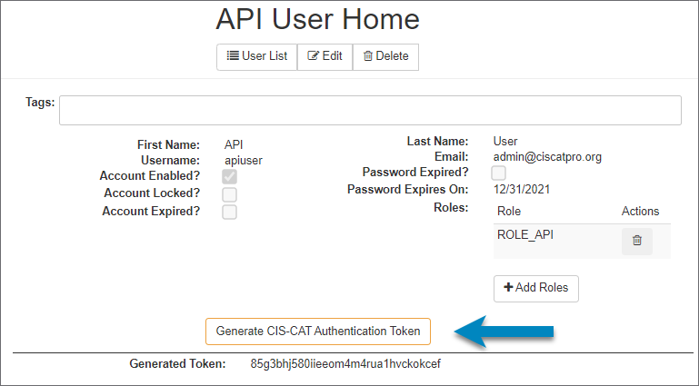

Once generated, that authentication token must be added to the CIS-CAT properties file in order for automated upload to function.

**CIS-CAT Pro Assessor v4**

assessor-cli.properties:

	# Allow for a "bearer" token to be generated in CIS-CAT Pro Dashboard, allowing upload of
	# generated ARF reports to the new database application.
	ciscat.post.parameter.ccpd.token=m9i0o2lrqno60dlq49qlln6gqrj2l7kt

Save the property file and execute CIS-CAT.

**Graphical User Interface (GUI) for Assessor v4**

On the Assessment Options page, enter the Dashboard URL where the resulting report should upload. Utilize the help icon on this screen to understand the format to use.

**Command Line User Interface (CLI)**

To enable the CIS-CAT Command Line to import results directly into CIS-CAT Pro Dashboard the following options are used:

	-arf : This option indicates that CIS-CAT will generate the Asset Reporting Format (ARF) results
	-n   : This option indicates that CIS-CAT should NOT generate the HTML report
	-u   : This option allows users to specify the URL to which ARF reports will be uploaded.  This is the CIS-CAT Pro Dashboard URL
	-ui  : This optional argument allows users to ignore any certificate warnings/errors when connecting to the CIS-CAT Pro Dashboard URL
	 
	For example, assessing and uploading the Windows 7 Benchmark would look like:
	> CIS-CAT.bat -b benchmarks\CIS_Microsoft_Windows_7_Benchmark_v3.0.0-xccdf.xml -arf -n -u http://myapp.example.org/CCPD/api/report/upload -ui
 

**Legacy Data Import**

To help facilitate organizations migrating from static CIS-CAT dashboards and reporting to storing assessment results in CIS-CAT Pro Dashboard, a legacy data import process has been developed.  This process is configured as a recurring job running in the background of a CIS-CAT Pro Dashboard installation.  Users are required to configure 3 folder locations:

1. **The "Legacy" Folder:**  This folder will be the location for all CIS-CAT XML results to be placed, as the staging area for results waiting to be imported into CIS-CAT Pro Dashboard
2. **The "Legacy Processed" Folder:**  This folder will be the location for all CIS-CAT XML results which have been successfully imported into CIS-CAT Pro Dashboard from the staging area.
3. **The "Legacy Error" Folder:** This folder will be the location for any CIS-CAT XML results which were not successfully imported into CIS-CAT Pro Dashboard.

These folder locations are set in the application's System Settings using the following properties: `legacy.sourceDir`, `legacy.processedDir`, and `legacy.errorDir`.

## Target Systems ##
**Creation**
Target Systems represent endpoints in your environment that have assesment data within CIS-CAT Pro Dashboard.  There are several ways to create target systems within the application:

1. **Import** - The section above describes the import of CIS-CAT data processes.  The assessment results produced by CIS-CAT relate to a specific Target System.  On import, CIS-CAT Pro Dashboard will check the existing target systems to see if the relevant Target already exists within in the system.  If not, CIS-CAT Pro Dashboard will create a new Target System and associate the imported assessment result with that new Target.  If the Target System already existed, based on the Hostname identifier,  the application will associate the imported result with the existing Target.
2. Online Entry - From the main application menu bar, users can navigate to the Target Systems List:

Once there, you can select the "New Target System" button, which will open the creation dialog:

Simply enter the Hostname and click Add Target,  this will create a new target system.

**v1.1.3 Data Conversion**

v1.1.3 of the CIS-CAT Pro Dashboard introduced a new data model for storing configuration and vulnerability assessment results.  The new model significantly reduces the number of records stored in the database on import and offers performance improvements to many aspects of assessment processing: import, export, and delete.  Assessments that existed in CCPD implementations prior to the release of v1.1.3 will not be converted automatically.  The conversion process can be long and intrusive if the implementation has many reports.  Existing reports can be left as is, but will continue to have the same performance characteristics as they previously had.  In order to take advantage of the new data model, these reports must be converted.  This can be achieved on a one off basis from the Target Systems Configuration Assessment or Vulnerability Assessment Tab:

Pre-v1.1.3 reports will have their Converted Column set to "No".  In order to convert them, select the Convert Action from the Actions column.  The report will convert asynchronously and be available in a few minutes.

For a more system wide approach to conversion you can use the new system settings `auto.convert.start.time` and `auto.convert.end.time`.  By default, these will both be -1,  but if you set the to an hour between 0-23 (0 being midnight) the system will automatically convert as many reports as it can in the time frame specified.  For example,  if you set the start time to 22 and the end time to 6, the system would convert assessments between the hours of 10pm and 6am each night, until all of the existing assessments were converted.

All assessments imported after the implementation of v1.1.3 will come into the system utilizing the new data model,  they will be shown as converted throughout the application.

**Difference report**

The user can compare two Configuration Assessment Results and generate a Difference report. The report highlights configuration changes (rules status and scores), for example when some rules were passing, and are now failing. This feature is accessible from the Target System page:

Click on  brings the following options:

* **Compare with immediate previous result for same profile** - If applicable, the selected Assessment Result will be compared to the immediate previous Assessment Result for the same target system, benchmark version and profile.

* **Compare with any other results** - This option forwards the user to an intermediate search page. The user can search and select the Assessment Result to compare with.

Then the user is redirected to the Security Configuration Assessment Difference Report page:

**Difference report alert**

An alert can be sent during the import process if the score of the uploaded Assessment result went down compared to  the previous one (same machine/benchmark/profile).

To receive this alert, the user needs to add recipients to the **testResultDiff** Alert from the Alert List:

As well as setting the **alert.diffScoreThreshold** threshold from the System Setting List. The threshold is set to zero by default which means the alert will be sent if any score changes are detected when the score goes down:

For more details about how to manage Alerts, please refer to Alert Management section of this guide.  

**Assessment Deletion**

Both Configuration and Vulnerability Assessments can be deleted from their respective tabs on the Target System.  Each row in the Assessment Lists now has a Delete Action in the Actions column.  When clicked, you will be prompted to confirm you would like to delete, then on confirmation the individual result will be deleted:

  
         

##Group Target Systems with Tags##

CIS-CAT Pro Dashboard allows you to group target systems by assigning user-defined tag names that best fit your organization. A tag name could represent a region, a department, internal/external ownership, functional use, operating systems, etc. Once a tag name has been assigned to a target system, you have the option of creating CIS Benchmark [exceptions](./Dashboard%20User%27s%20Guide/#exceptions) or utilizing the graphical display of tagged systems in the [Dashboard - Tag View](./Dashboard%20User%27s%20Guide/#dashboard).

Regularly reviewing target systems, for example, by organizational departments or geographical locations helps you focus remediation efforts in the right places.

**Assign Tag to a Single Target System**

To tag an existing target system individually, navigate to Target Systems in the menu, locate the desired system, and click on the target system's primary identifier in the "Target Primary ID" column.

From within the target system's individual screen, create a new tag by entering a unique string, select an existing tag, or click the "x" on any tag to remove it from the system.

The "Tags" field is available only to users with ROLE_ADMIN. Modifying tag assignment currently affects Benchmark exception application.

**Assign Tags to Multiple Target Systems**

Navigate to Target Systems - Search screen to add or remove tags to multiple target systems based on the searched result set and the selection boxes. Enter target system criteria and press the Search button. Once search results are present, select the "Add/Remove Tags" button. Enter tags to apply or remove from the selected systems in your result set and select "Apply."

The "Add/Remove Tags" button is available only to users with ROLE_ADMIN. Modifying tag assignment currently affects Benchmark exception application.

Both the Add and Remove Tags field feature an autocomplete functionality with a list of tags that already exist.

Tags will be applied or removed from the selected systems in the original result set. Upon selecting "Apply," a refreshed result screen based on the existing criteria is presented.

**Searching**

Once tagged, use individual tags, or logical combinations of tags to search for a specific set of end points. Utilize the include/exclude tags field that offer an "AND" or "OR" operator applicable to the tag fields only. Search directly by Primary ID or IPv4 Range.

- **Target Primary ID** - Search by Target Primary ID is case insensitive. Use % as a wildcard character.

- **IPv4 Range** - Use the IPv4 Range fields to search by minimum or maximum IPv4 or both. The fields need to have a valid IPv4 value (0.0.0.1 to 255.255.255.255), and will return a warning if not valid.

- **Include Tags** - type into the include tags list the tags you would like to see in the search results.  i.e.  if you would like to see target systems with the "PCI" tag, simply type it in the box and click search.

  * **"and" operator** by default the "and" operator is selected.  This means that if you type multiple tags into the Include Tags box,  the resulting systems would need to contain ALL of the tags in the Include Tags box.  i.e.  If you typed in "PCI" and "Workstation"  all systems with BOTH of those tags would be returned.  If a system only contained the "PCI" tag, it would not be returned.

  * **"or" operator** -  The "or" operator can be selected using the available radio button.  When selected, if you type multiple tags into the Include Tags box, the resulting systems would need to contain ANY of the tags listed in the Include Tags box.  i.e.  if you typed in "PCI" and "Workstation"  all systems with EITHER of those tags would be returned.  If a system only contained the "PCI" tag, it would be in the result set.

- **Exclude Tags** - type into the Exclude tags list the tags that you do not want in your search results.  This is useful if there were particular tags you would like excluded from your search.  i.e.  Say you wanted to see all of your Servers that did not deal with PCI.  You could type the "Server" tag into the Include Tags box and "PCI" into the Exclude Tags box.

## Assess a Target System ##
To assess a target system from within CIS-CAT Pro Dashboard, ensure that [CIS-CAT Pro Assessor v4 Service Integration](./Dashboard%20Deployment%20Guide%20for%20Windows/#cis-cat-pro-assessor-v4-service-integration) procedures have been executed. The assessment features currently only support a remote assessment.

Pre-Requisites:

- Installation of CIS-CAT Pro v4 Service
- CIS-CAT Pro Dashboard v1.1.11+
- CIS-CAT Pro v4 Service has been configured and started
- CIS-CAT Pro Assessor v4 Service Integration steps have been followed
- CIS-CAT Pro Dashboard is able to communicate with CIS-CAT Pro Assessor v4 Service system
	- Verify that benchmark data is returned by entering `<assessor-service url>/benchmarks` in the Dashboard’s system’s browser
- Assessed target system is configured for remote assessment (WinRM setup, SSH enabled, etc.)
- Assessed target system is able to communicate with CIS-CAT Pro Assessor v4 Service host system

Steps:

1.	Navigate to a single target system via the Target Systems menu
2.	Search for the desired target system to assess
3.	Select the link for the desired target system in the Target Primary ID column
4.	Select Assess 

5.	Enter the required information  

6.	Select Start Assessment to begin an assessment or Cancel to clear and close the form
7.	Correct missing, required information if necessary 
	

All values entered in the modal are the same values expected in the  CIS-CAT Pro Assessor v4 sessions.properties or assessor-config.xml files. See the [CIS-CAT Pro Assessor v4 User’s Guide](https://ccpa-docs.readthedocs.io/en/latest/User%20Guide%20for%20Assessor%20Service/) for detailed information on each of the below values. The target system to be assessed must be configured to accept a remote connection and must be able to communicate with the system that hosts CIS-CAT Pro Assessor v4 Service.

None of the below information will be stored in the supporting database. It is highly recommended that CIS-CAT Pro Dashboard and CIS-CAT Pro Assessor v4 Service communicate using an HTTPS protocol due to the sensitive nature of the data transferred. 

- **Username:** username with elevated privileges as a root or sudo for ssh or member of Administrator's group
- **Password:** the credentials for the above username
- **Target System Type**: remote connection type to the target system
- **Port:** The port number on which the communication takes place between Assessor v4 and the target system. Auto populates with recommended remote ports.
- **IP Address / Hostname:** Primary active IP Address or hostname that designates the location of the target system.
- **Temporary File Path:** Optional. If specified, directory must exist on target system and above user must have read/write ability. If not specified, the default temp folder will be used.
- **Benchmark:** Supported benchmarks for dashboard orchestration. See Assessor Service guide for more information on supported benchmarks.
- **Profile:** List of profiles related to the selected benchmark.

Once the Start Assessment button has been selected, the below message confirms that the assessment request was sent to CIS-CAT Pro Assessor v4 Service. Status can be tracked in the Job Status screen.

The below error message may be received if communication to CIS-CAT Pro Assessor v4 Service is interrupted. To troubleshoot, navigate to the CIS-CAT Pro Assessor v4 Service host and verify the status of the service.

**Job Status Screen**

The Job Status screen (Reports menu) lists only assessments requested from within the CIS-CAT Pro Dashboard. The latest assessments will appear at the top of the list.

- **Job ID:** Sequential, system generated number used to help identify requests.
- **Target Primary ID:** The Primary ID for the target system where an assessment was requested.
- **Benchmark and Profile:** The name of the benchmark and profile used for the evaluation of the target system.
- **Status:** Shows the life cycle of the request. 
	- **Pending:** Assessor confirmed receipt of assessment request, waiting for CIS-CAT Pro Assessor v4 to start assessment activity.
	- **In Progress:** Assessment activity has started.
	- **Error:** Assessment could not start or encountered an error and could not finish. Hover over Error to learn more about the problem.
	- **Assessment Complete:** The assessment has completed. This status does not represent viewing status in the Dashboard. The report may be in the process of uploading if Assessor Service has been configured to POST reports to Dashboard via the API. If the API has not been configured to POST to Dashboard or there is an issue uploading, then the report will not be viewable in the Dashboard. 
- **Requested By:** The username that requested the assessment.
- **Start Date:** The date and time of when the assessment was requested.
- **End Date:** The date and time an assessment report was generated.

The screen can be manually refreshed by selecting the Job Status menu item or by selecting the “Refresh” link near the top of the results. A total count of requests and time of last screen refresh appears at the top of the results.

**Note:** The date and time for these fields are based off of the location of the server that host CIS-CAT Pro Dashboard.

**Errors in the Job Status Screen**

|Error Message|Potential Cause|Solution|
|---|---| ---|
|An unknown error occurred.|- Username was incorrect - Password was incorrect - User does not have admin or sudo permissions - Wrong IP or domain name of system - Unsupported Benchmark selected| - Verify username and password and privilege to run scan on target system - Verify CIS-CAT log for more detail on error - Only use the unchanged Benchmarks delivered with the application|
|An XML file was parsed, but contained an invalid signature.|- The signature in the benchmark file is not valid.  To invalidate the signature, simply modify the XCCDF in some way (e.g., open it and add some extra text to the title of the benchmark).|- Only use the unchanged Benchmarks delivered with the application|
|Could not find requested assessment content|- The selected Benchmark was removed from the Benchmark directory in Assessor v4 Service just before assessment ran|- Do not remove the Benchmarks from the Benchmark directory once an assessment has been requested|
|CIS-CAT Pro Assessor encountered invalid assessment content.|- The Assessor parsed the assessment file requested to be run, but could not determine what type of assessment it is for (e.g., benchmark or vulnerability assessment).  - For Benchmark assessments, the root of the benchmark file should be <Benchmark> or <data-stream-collection>. - For OVAL Definitions or Vulnerability assessments, the root of the file should be <oval_definitions>.|- Only use the unchanged Benchmarks delivered with the application|
|An XML file was parsed but XML Schema validation errors.|An XML file has schema validation errors.  This exit code is used when validating the schema for the Benchmark file requested to be run.|- Only use the unchanged Benchmarks delivered with the application|
|Could not parse an XML file required for assessment.|- The assessment content (e.g., benchmark file) contains XML formatting errors.  For example, an end tag for an element does not match the start tag.|- Only use the unchanged Benchmarks delivered with the application|

## Reports ##
CIS-CAT Pro Dashboard reports provide a few options to view CIS-CAT Assessment Results.  An individual configuration or vulnerability result view provides the same information as the HTML report generated from CIS-CAT Pro Assessor. The Dashboard views offer more flexibility in results presentation, including a CIS Controls-based view. The Dashboard also offers the ability to apply exceptions for benchmark recommendations.  Exceptions can be applied from the various result views. The remediation report provides a list of only the latest failed results for a target or group of targets.  The intent is for a remediator to print this report and use it to manually remediate desired configurations when they depart from a benchmark recommendation.  The complete Results Report will give an abbreviated version of the complete results for a system.  This is intended for an auditor to get a full picture of CIS compliance for a specific target or set of targets.

###Assessment Results ###

The individual test results report provides a view of a selected target system's results when compared to expected benchmark states.  The display is aligned with the order of an HTML report generated from CIS-CAT Pro Assessor.

 View an assessment result by selecting `Reports` menu and select `Assessment Results Search` or `Assessment Results List`.  Select the `view` link to display the results for an individual assessment.  As an alternative,  navigate to an individual target system and select an assessment to view.  

**Report Score:** Total Pass Results / Sum Results of (Pass + Fail + Error + Unknown). When active, Exception counts are removed from Scored Recommendation Total and affected result category (Pass, Fail, etc.) of related Section. As a result, they are also removed from the overall Report Score. When a recommendation is weighted, each individual result will be multiplied by the weight value (e.g.: (Pass * weight value), etc.) By default, all scores are weighted at 1. The weight can only be modified manually in the xccdf Benchmark content.

Report scores will match report scores as shown on CIS-CAT Pro Assessor v4 HTML reports as of CIS-CAT Pro Dashboard v2.1.0+ when there are no exceptions applied in the Dashboard for a particular result.

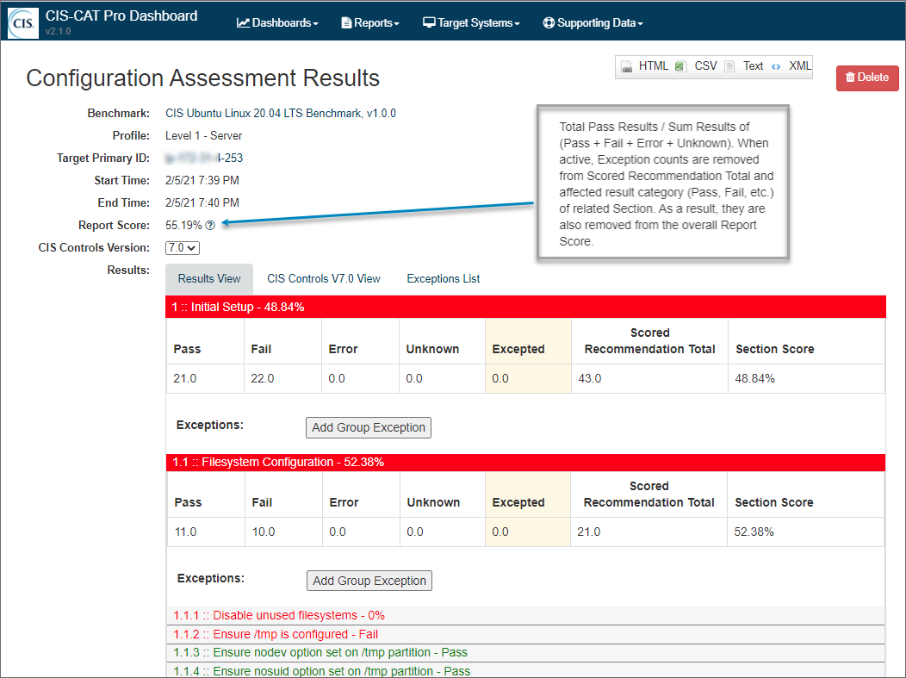

1. **Results View** 
	- Results presented in order and structure of benchmark
	- Groups and subgroups scored individually
	- Apply exceptions to a recommendations from this view  
  
2. **CIS Controls View** Not all Benchmarks will be mapped to a CIS Control. Only the latest CIS Benchmark versions will be mapped to the latest version of CIS Controls. 
	- Test results presented in CIS Controls structure where mappings are present to CIS Controls and Sub-Controls(most recently known as Safeguards)
	- View is useful when identifying which recommendations represent or support a CIS Control
	- Counts in brackets indicate the count of recommendations mapped to a CIS Sub-Control
	- Empty brackets indicate that there are no recommendations are mapped to a CIS CIS Sub-Control for the selected CIS Controls
	- Toggle CIS Controls version displayed using the "CIS Controls Version" dropdown in the header section.   

    
 
3. **Exceptions List**  Exceptions may be associated per target system, per tag associated with the selected target system, or per benchmark (global). 
	- List of active exceptions associated with the selected configuration result   
 

###Configuration Assessment Result Summary###

The Configuration Assessment Result Summary report shows all recommendations for the selected Benchmark that failed during the most recent assessment. The details behind the summary counts can be exported in *.csv format.

The total counts of target systems:

- Are based on last scan for each system as stored in Dashboard's database
- Exclude active exceptions applied against each system's most recent scan
- Are sorted by recommendations with highest count of "Fail" results

The report is designed to support actions for remediation. It provides a current system count of deviations from a Benchmark's best practices.

- Focus on gaps (deviations from CIS or your organization's tailored best practices/security policies)
- Utilize the information to communicate to leadership and discussions on policies to adapt
- Export the system details and capture information to perform remediation

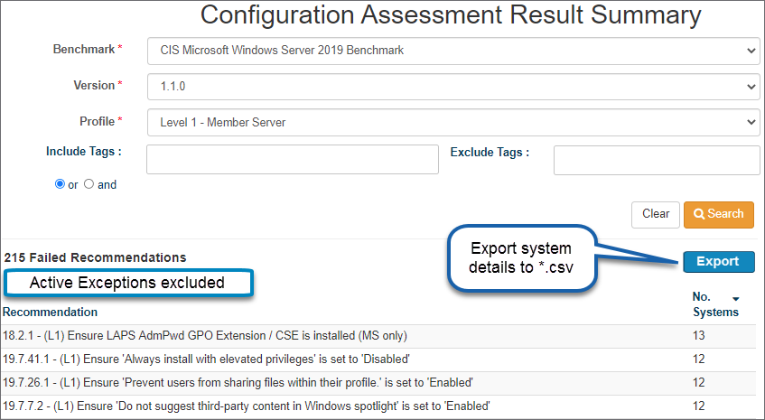

**Export Target System Details**

The details of the systems and assessment results supporting the summary counts can be exported using the `Export` button. The format will be in CSV (Comma delimited) and can easily be converted to Microsoft Excel format. The following columns of information will be present in the export.

- benchmark_title
- benchmark_version
- profile
- assessment_date
- target_system
- target_system_tags
- database_name
- rule_title
- rule_result
- mapped_controls_v7
- mapped_controls_v8
- implementation_groups_v8

For CIS Benchmarks mapped to CIS Controls V8, sort by Implementation Group 1 for most important recommendations to remdiate first.

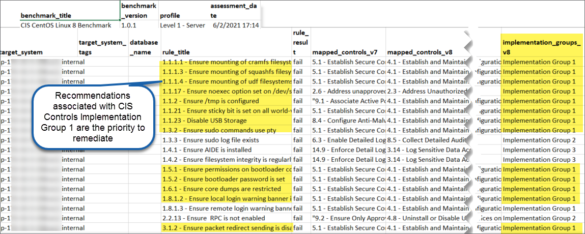

###Vulnerability Report###

Vulnerability results in XML format can be imported into Dashboard using the API, manually placing in the Legacy folder, or by manually importing.  To import a result manually from the Dashboard, navigate to the target system you have a vulnerability result for.  From the Results History List, open the Vulnerability Reports accordion and click the import button:

This is an asynchronous process and you will be notified when the import is complete.  Once complete you will see the result in the Vulnerability Reports accordion of the Results History List:

Clicking on a row in the list will bring you to the Vulnerability Report:

The top of the report contains some information about the target system assessed and the vulnerability definitions that were assessed.  Opening the High, Medium, or Low accordions below will show you details about the vulnerabilities found:

Vulnerabilities can also issue an age warning.  By default if a vulnerability on a system is over 90 days old, the vulnerability will appear differently in the report:

Note the color difference and the Oldest Failure Date present in the title.

To configure the vulnerability age warning threshold, navigate to the System Settings menu in the administration menu.  From there choose the vulnerabilityWarningAge setting:

 

You can then enter the amount of days old you would like vulnerabilities to be before the warning appears on the report:

You can also configure the High/Medium/Low thresholds in the system settings.  These categories are based on CVSS Scores.  By default, the low threshold is 4.0, and the high threshold is 7.0.  This means any found vulnerability with a CVE that has a CVSS base score of 7.0 or more, will be categorized as High on the report and in the Vulnerability Reports list.  To configure these thresholds you can change the vulnerablityHighThreshold and/or the vulnerabilityLowThreshold in the System Settings.

###Remediation Report###

The Remediation Report provides a list of recommendations with a `Failed` status. Remediation steps are included. It is useful to utilize this report as a focused effort on remediation of system states departing from the benchmark recommendations.  If a recommendation has been excepted in the Dashboard and it has a result of `Fail`, it will still be shown on this report. Generate this report by selecting `Remediation Report` from the CIS-CAT Pro Dashboard Reports Menu.  Select the desired Target System and the latest results for a benchmark.

###Complete Results Report###

The Complete Results Report provides all detailed results of a target system or group of target systems compliance across multiple CIS benchmarks.  To generate the Complete Results Report, select the menu option under reports, search and select desired for target systems, then click on the `Complete Results Report` listed at the bottom of the results. 

The Complete Report lists the Target System, Benchmark,  Rule Number and Title, as well as the overall pass fail result of each individual rule.

## Delete Multiple Configuration Reports ##
Getting started with CIS Benchmark adoption often involves an analysis period. During the analysis phase, reports may be imported to Dashboard, but users may not desire to store results for a long period of time. Multiple reports can be selected and removed from the CIS-CAT Pro Dashboard's database. Deletion will remove report scores from overall averages displayed in the graphical dashboard views.

The report delete process begins by selecting desired reports in the "Assessment Results Search" screen. On confirmation, the selected reports are flagged for deletion. Once flagged, the flagged reports are removed from all averages in the Dashboard and can no longer be searched. The final purge will occur during the hours specified in system settings. The delete button and system settings are available to users with ROLE_ADMIN.

It is highly recommended that a routine database backup process is in place, as the deletion process is permanent.

### Select Reports for Deletion ###

Navigate to “Assessment Results Search” in the “Reports” menu.

Enter desired criteria, and press “Search”. The “Delete Report” button is available to Dashboard users with an admin role. View the reports by selecting “View”.

Select the reports desired for removal from the database using the checkbox to the left of each report and select the “Delete Report” button. Confirm the delete by selecting “Delete” once more.

### Configure Final Report Delete Run Time ###

Navigate to "Systems Settings" and locate the `delete.assessment.start.time` and `delete.assessment.end.time`. Only whole integers ranging from 0 to 23 will enable to final purge job to run successfully. For example, if the process should run between the hours of 5 p.m. and 11 p.m., then enter 17 as the `delete.assessment.start.time` and 23 as the `delete.assessment.end.time`. For jobs that should run between 11 p.m. and 5 a.m. the next morning, configure the `delete.assessment.start.time` to 23 and the `delete.assessment.end.time` to 5. A setting of any other value in either setting such as -1, will disable the job.

## Exceptions ##
Most organizations do not adopt every CIS Benchmark recommendation. Organizations often choose to accept some risk for the benefit of a functioning business environment. It is also possible that an organization may be solving a recommendation in other ways that CIS-CAT is not able to detect. CIS-CAT Pro Dashboard provides functionality to create an exception to specific rules or groups of rules on a per target system,  global (all targets for a specific benchmark), or by targets associated with user-defined tags. When an exception is applied and approved within the Dashboard exception approval process, existing configuration or vulnerability reports falling within the criteria will be rescored. Additionally, newly imported reports also falling within the criteria of the exception conditions will exclude the excepted result when scoring. 

Exceptions are applied from within an Assessment Test Results Report for a configuration or vulnerability assessment. The `Reports` menu can assist in navigating to configuration test results. Vulnerability test results can only be shown from within a Target System record on the `Vulnerability Assessments` tab.

Exceptions are applied to a specific CIS Benchmark published version. New exceptions must be created for each separate CIS Benchmark version.

###Setup Exception Workflow###
It is an important first step to establish an exception workflow process before exceptions are applied. The exception workflow requires that a created exception is approved by a valid user before report scores are recalculated. Approval submissions cannot be recreated or resent if the workflow is not initially setup.

- Login to Dashboard as a user with `ROLE_ADMIN`
- Select the Settings icon and select `Alerts`
- Select `Approve or Reject Exception Request`
- Ensure `ROLE_ADMIN` is present in `Receiving Users` and `Receiving Roles`

###Create an Exception###

If an exception already exists on a rule or group, the corresponding `Add Exception`/`Add Group Exception` buttons will not be present. Although it is possible to edit the `End Date` for an approved exception from a Results screen, CIS-CAT recommends following the procedure for editing an exception below. On creation, an exception will enter pending status, a task will be created for all users with ROLE_ADMIN. The task will be present in each qualifying user's Dashboard Inbox in the Task section.

Exceptions where the start date = end date have no effect on the configuration score.

**Rule** 

- Navigate to the rule to except within a Test Results Report
- Select `Add Exception`  
  
  
- Enter the desired criteria
	- Start and End Date can apply to any date range. 
	- Rationale is required
	- To apply to all target systems for this CIS Benchmark version, select the `Global` checkbox. Otherwise, the exception will apply to only this target system.
	- Enter `Tags` to apply this exception to all targets associated with entered tag. If `Global` is checked on, entries in `Tags` will be ignored as this exception will be applied to all targets for this CIS Benchmark version
- Select `Add Exception`

**Group** 

- Navigate to the group to except within a Test Results Report
- Select `Add Group Exception`
- Enter the desired criteria
	- Start and End Date can apply to any date range. 
	- Rationale is required
	- To apply to all target systems for this CIS Benchmark version, select the `Global` checkbox. Otherwise, the exception will apply to only this target system.
	- Enter `Tags` to apply this exception to all targets associated with entered tag. If `Global` is checked on, entries in `Tags` will be ignored as this exception will be applied to all targets for this CIS Benchmark version
- Select `Add Exception`	

###Approve or Reject an Exception

Ensure the exception workflow setup has been followed. Exceptions that are rejected will not apply to a score recalculation. Rejected exceptions must be recreated. Approved exceptions will rescore reports falling within the criteria of the exception. 

- Login to Dashboard as a user with `ROLE_ADMIN`
- Navigate to Inbox
- Select `My Tasks`
- Review alert in Inbox
- Select `Approve` or `Reject`

  
	
**View Configuration Exceptions**

Exceptions can be viewed in the following ways: 

- **Exception List on Test Results** - within a test result, navigate to the exception tab
- **Target System Configuration Assessment Exceptions List** - on each target systems view page in Configuration Assessments tab, note list of exceptions applicable to selected target.
- **Configuration Assessment Exception Search** - Navigate to `Reports` menu
	 

**View Vulnerability Exceptions**

Exceptions can be viewed in the following ways:

- **Target System Vulnerability Exceptions List** - on each target systems view page in Vulnerability Assessments tab, there is a list of exceptions that apply to that target.
- **Vulnerability Exception Search** - Navigate to `Reports` menu
	  

###Modify a Configuration Exception

Exceptions in a status of `Approved` may be edited by a user with `ROLE_ADMIN`. The exception edit does not require use of the Exception Workflow process for Approval or Rejection. Upon submission, the rescore event for reports falling within the exception's criteria are scheduled for immediate rescore. Depending on how much data is in your system, this can take some time. It is required for the exception to be associated with a Target that has a Target Primary ID.

- Navigate to `Reports` menu
- Select `Configuration Exception Search`
- Select desired criteria and press `Search`
- Select the `Edit` icon for the exception to modify

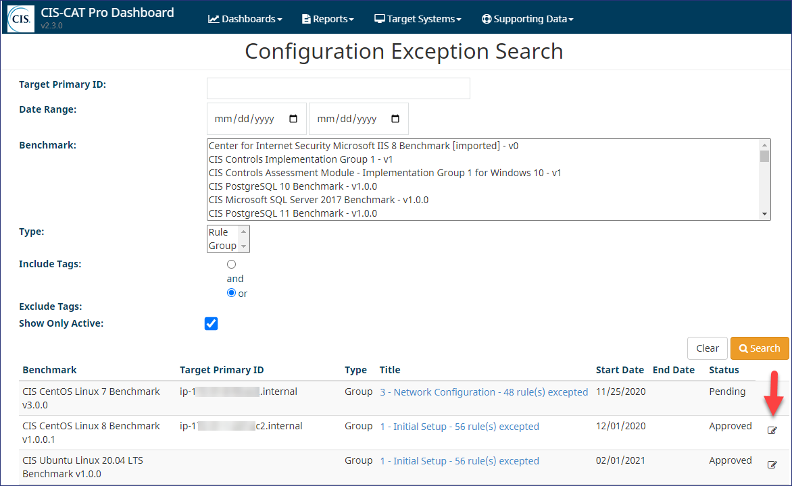

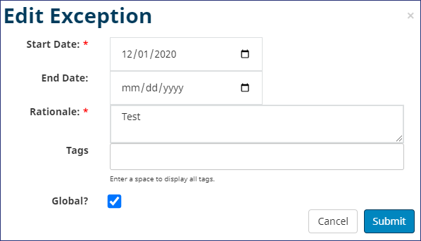

- Correct the desired criteria and press `Submit`
- If no changes are needed, press `Cancel`

Upon submit, the reports falling within the criteria of the exception will be rescored. Exceptions where the start date = end date have no effect on the configuration score.

## Dashboard ##
The CIS-CAT Pro Dashboard application's dashboard views provide a high level overview of organizational compliance with CIS Benchmarks.  There are several views, which comprise different aggregation levels which produce a graph that represents compliance over time.  The default views show all of the compliance results for the aggregation group selected, i.e.  "Overview" is all of your target systems for all benchmarks,  The "Benchmark View" is by benchmark,  the "Tag View" is all systems with a specific tag or set of tags.  Each point on the graph is an average score for the month.  Each of the points can be clicked to "drill-down" into the Monthly view.  This view has a point for each day in the selected month that has results.  Each of these points can be clicked on to drill down to that specific day,  which will display points for each time you have an assessment result.  The points on the daily view will take you straight to the individual assessment result that produced the score.  This way you can navigate from a very high level view of your compliance data, all the way to the details,  the individual assessment reports that comprise the high level graphical information.

**Overview** 

The overview contains a fully aggregated view of all endpoints across all benchmarks:

**Benchmark View**

The benchmark view has results aggregated by benchmark.  You can select any number of benchmarks from your list of favorite benchmarks that you would like to see results for.  Each benchmark selected will be represented by a separate line on the graph.  This allows you to compare compliance against various CIS Benchmarks.
In this view, you can also add/delete favorite benchmarks.

**Target System View**

The target system view has the results aggregated by individual target system.  The default target system view is the Multiple Target System view, which allows you to select many target systems from your list of favorite target systems and compare their aggregated results. In this view, you can also add/delete favorite target systems.

**Target System Search View**

Click on "Switch to Search View" link to navigate to Target System Search View.
This view allows you to search many target systems by criteria and compare their aggregated results.

**Target System by Benchmark View**

If you only select a single target system, you can switch to the single target system view.  This will allow you to select the benchmarks that have assessment results for the selected target system and compare the benchmark compliance for just a single target.  This allows you to see potentially which benchmarks are reducing the compliance score for a single system.

**Tag View**

The tag view allows you to aggregate compliance results for a group of target systems with the same tag, or with multiple tags.  Each tag entered will be represented by a single line, so that you could compare results accross multiple tags.

**Vulnerability View**

The tag view allows you to aggregate vulnerability results for all target systems with vulnerability reports.  Each set of bars represents the average of the high, medium, and low CVSS scored vulnerabilities detected in the given time period (monthly, daily, single day).

## Supporting Data ##

**Benchmarks List**

Navigate to Supporting Data > Benchmarks List to view the details of imported CIS Benchmark recommendations. Benchmarks are uniquely identified by their internal ID and version number.  Therefore, there may be multiple instances of the CIS Debian Linux 8 benchmark, but with different version numbers, such as 1.0.0, 2.0.0, or 3.0.0.  Assessment results imported into CIS-CAT Pro Dashboard are associated with a specific version of a benchmark.

Select a CIS Benchmark version to view.

Once selected, the additional details of a CIS Benchmark are available. Review the description below on each tab of data.

1. **General** - Provides a description of the CIS Benchmark to include CIS version number, status, style, etc.  

2. **Profiles** - The list of Profiles for the selected benchmark. Select the header section bars to reveal additional information such as profile description or recommendations.

3. **Recommendation** - Select to view Results/CIS Controls/Exceptions. 

  **Results View** - The list of recommendations organized into the groups. Each group is expandable to display additional sub-groups. All Benchmark information displayed is imported at the time the first configuration assessment test result for a particular benchmark is imported. The content displayed is the content imported and cannot be modified in CIS-CAT Pro Dashboard.

  **CIS Controls View** - The list of recommendations presented by CIS Controls. Where possible, recommendations are mapped to a CIS Controls CIS Sub-Control using metadata from the imported benchmark content. It is not possible for all recommendations to relate directly to a CIS Sub-Control (also known as Safeguards). 
  Change the CIS Controls version displayed by selecting a different version in the "CIS Controls Version" dropdown on the General tab.  Below is an example of the CIS Controls View screen:

  The number in the bracket, for example `[6]` for `CIS Control 2`, indicates the count of Recommendations mapped to a specific CIS Controls version (V7.0 here). Absence of a number in the brackets means that no recommendations have been mapped to this CIS Control for this CIS Benchmark. Only the latest CIS Benchmark versions will be mapped to the latest version of CIS Controls (V7.0 here). You can verify from the CIS website which benchmark is mapped to which CIS Controls version(s). 

**Exceptions List** - All active exceptions applicable to this benchmark. Exceptions can be applied to a single test result, via a tag assigned to the target system, or global for all systems for that CIS Benchmark version.  

  
4. **Results** - The list of Security Configuration Assessment Results for the selected benchmark.

 
**CIS Controls**

The CIS Controls reflect the combined knowledge of experts from every part of the ecosystem (companies, governments, individuals), with every role (threat responders and analysts, technologists, information technology (IT) operator and defenders, vulnerability-finders, tool makers, solution providers, users, policy-makers, auditors, etc.) and across many sectors (government, power, defense, finance, academia, etc.), who have banded together to create, adopt, and support the CIS Controls.

CIS Controls V7 is the default CIS Controls shown when viewing a Configuration Assessment Result in the Controls View. Note that CIS Controls V7.0 is the same as V7.1. In this view, it is possible to toggle to CIS Controls V8. [CIS Controls V8 was released](https://www.cisecurity.org/controls/v8/) in May 2021. CIS Controls V8 has reduced the list of 20 CIS Controls to 18. Please note that Safeguard is the newer term in CIS Controls v8, while Sub-Control was the term used previously in CIS Controls v7.0/v7.1.

Select a CIS Controls version to view additional information for each Control:

**View**

Select a CIS Control from the CIS Controls V8 to list the supporting SubControl.

Select a CIS Sub-Control to learn more details. Sub-Controls fall into CIS Controls Implementation Groups (IGs). Implementation Groups are recommended guidance to prioritize implementation. Implementation Group 1 is definded as "basic cyber hygiene," the foundational set of cyber defense Sub-Controls that every enterprise should apply to guard against the most common attacks. Each IG builds upon the previous one: IG2 includes IG1, and IG3 includes all CIS Sub-Controls in IG1 and IG2.

**NVD Vulnerability Data**

In order to support the CIS-CAT Assessor vulnerabilty reports, CIS-CAT Pro Dashboard requires CVE and CVSS data from the National Vulnerability Database (NVD).  In order to insert/update/or view the NVD data you need to go to the "Vulnerability List" menu option in the Supporting Data menu. The vulnerability list will display the current vulnerability data by year and month:

Selecting any individual month will navigate to the Monthly CVE View.  This page will list all the CVE's published that specific month and year:

Clicking any of the entries will bring up all the data about that specific CVE in the CVE Dialog.  This dialog also contains an NVD link which will navigate directly to the CVE entry on the NVD website:

From the top of the Vulnerabilities List, navigate to the search to learn more about a specific CVE by ID or keywords from the CVE Summary:

Again, clicking on the CVE ID will bring up the CVE Dialog.

There are several ways to import the NVD data into your dashboard instance:

 - **Update NVD Data via Direct NIST Connectivity** -  Direct internet connectivity required, a proxy will not work. Use the Update CVEs button from the Vulnerability list page. On button selection, a direct connection to NIST NVD is made and the latest JSON NVD version will update the database storage with the current CVE definitions. The update is completed with an asyncronous process. Depending on environment factors, the process could take some time to import the thousands of CVE definitions. One Dashboard Inbox alert will be present upon completion.
 - **Update NVD Data via Import** - Internet connectivity not required. Manually download most recent JSON vulnerability feed from NVD. Move the files to the Legacy folder on the supporting Dashboard machine or use the Import Vulnerability Feed button from the Vulnerability list page to manually select the files. The import is completed with an asyncronous process. A Dashboard Inbox alert will be present for each completely imported file.

**Note:** Import of NVD feeds in **XML format is no longer supported**. Please use the JSON format. 

## Trouble Shooting and Support ##

For CIS support, enter a support request at our [online support portal](https://www.cisecurity.org/support/).

Start a discussion on the [CIS-CAT Discussion Group](https://workbench.cisecurity.org/communities/30), (login required). These discussions are a great way for members to use their experience to support each other.