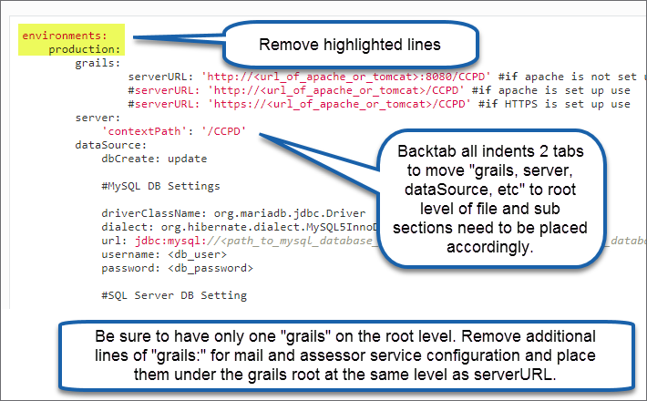

# CIS-CAT Pro Dashboard Deployment Guide for Linux#

----------
## Introduction ##
CIS-CAT Pro Dashboard is a web application built using the Grails Framework. The grails framework uses a hibernate data model, which allows CIS-CAT Pro Dashboard to be database management system (DBMS) agnostic. Grails code compiles into java byte code and runs on the Java virtual machine (JVM). Although CIS-CAT Pro dashboard is database agnostic, CIS only tests and supports use of the listed databases below. The documentation below describes how to deploy CIS-CAT Pro Dashboard on the CIS-preferred, officially supported components.

**CIS Supported Relational Database Management Systems (RDBMS)**

 - MySQL until version 5.7 (MariaDB 10.2)
 - MS SQL Server
 - Oracle

**CIS Preferred Component Installation**<br/>
*The preferred component installation instructions are included in this documentation. Any operating system can host the application server provided the platform can utilize software capable of hosting a Java web application archive (.war file).*

 2 Ubuntu 16.04 servers* 
	

- **Server 1**: MySQL 5.6
- **Server 2:** Tomcat 8 or 9 (Recommended)
- **Server 2:** Apache 2.4
- **Server 2:** JRE 8 to 11
	- OpenJDK versions supported
	- Java Development Kits (JDK) versions 9+ contain the JRE

*Separate servers are recommended to contain the identified components above for security and performance purposes.

## System Recommendations ##
 There are no strict requirements associated with our Dashboard application. Any OS will be suitable so long as it can run Tomcat. Disk space will be minimal on the application server, but will require more space on your database server depending upon the size of your organization and the amount of endpoints you have.

Our test environment uses an AWS t2.large instance (designed for burst processing), which has:

 - 8GB RAM
 - 2 vCPU’s with 4 cores each
 - Ubuntu 16.04
 
The application is fairly lightweight on processor and memory use. However, when importing results, the usage will spike. Our recommendation would be to conduct importing off hours and then the functionality of the application will not be hindered during business hours.

## Component Deployment ##
The following sections describe the installation and configuration of all components necessary to deploy CIS-CAT Pro Dashboard.

### Database ###
Install MySQL Server 5.6 onto the database Ubuntu server using [these instructions](https://www.digitalocean.com/community/tutorials/how-to-install-mysql-on-ubuntu-16-04).  
Once the MySQL database has been installed, note the following information:

- hostname/IP of database server
- port for connecting, by default this is `3306`
- username/password for connecting to the database

### Application Server ###
As security best practice, CIS recommends a separate server installation for the database and the application.  The application server requires network accessibility for multiple users of the Dashboard application. To reduce exposure of the data in the database to the broader network, install the database on a separate server.  Configure the database to only allow communication over the network via the MySQL port.  A separate server for the database also helps with performance. Where necessary, as load increases, application servers can be added to the environment with the same database server connectivity.

The [Application Server Instructions](#applicationServerInstallation) will further guide the installation.

 

### MySQL Client ###
A MySQL client should be installed in order to test connectivity with the database and create the schema for CIS-CAT Pro Dashboard.

run: `sudo apt-get install mysql-client`

This will give you access to the mysql command.
From the MySQL database instructions above, note the hostname/ip of the database server as `<hostname>`, and the configured `<username>` and `<password>`
run: `mysql -h <hostname> -u <username> -p`, you will then be prompted for the `<password>`.  If you see a `mysql>` prompt, then you have successfully connected to the database.
 
run: `CREATE DATABASE ccpd CHARACTER SET utf8 COLLATE utf8_general_ci;`

This will create a DB schema named `ccpd` for CIS-CAT Dashboard Pro data using UTF-8 character set (required).

**NOTE:** If your database server is not installed on the same machine as tomcat, make sure that your database user has privileges for remote access.
Here is a SQL statement to enable access for the remote user:
	
	GRANT ALL ON *.* TO <user>@'<tomcat_server_IP>' IDENTIFIED BY '<password>';
	
For more details, refer to [this article](https://support.rackspace.com/how-to/mysql-connect-to-your-database-remotely/).

### Java Runtime Environment (JRE) ###
Because CIS-CAT Pro Dashboard is a java-based application, a compatible java runtime environment (JRE) is required. OpenJDK versions are also supported. 

Java versions 8 through 11 are officially supported by CIS-CAT Pro Dashboard v2.0.0+. For prior versions of Dashboard, only Java 8.250 and below is supported.

1. Verify presence of a Java Runtime Environment (see [Component Installation](https://cis-cat-pro-dashboard.readthedocs.io/en/latest/source/Dashboard%20Deployment%20Guide%20for%20Linux/#introduction))
	
	`java -version`


1. To install, use an example command like below to obtain a compatible version: 
	
	`sudo apt-get install openjdk-11-jre`


CIS currently tests with JRE versions 8 and 11. However, the Dashboard may run successfully with later versions of JRE. Below is a example command to uninstall a specific version of JRE:
	
	`sudo apt-get autoremove openjdk-14-jre` 
 
Replace `14` above with the desired version to uninstall.	

<a name="applicationServerInstallation"></a>
### Application Server ###

It is recommended to [utilize Apache Tomcat 9](https://tomcat.apache.org/download-90.cgi) with CIS-CAT Pro Dashboard v2.0.0+. We have found [this site](https://www.digitalocean.com/community/tutorials/install-tomcat-9-ubuntu-1804) useful to guide installation. The below instructions will assume installation of Apache Tomcat 9.


Should Apache Tomcat 8 be required by your organization for prior versions of Dashboard, follow [this article](https://www.digitalocean.com/community/tutorials/how-to-install-apache-tomcat-8-on-ubuntu-16-04), through the end of Step 6. 

The specific versions of Tomcat 8 or 9 mentioned in the installation articles are no longer available for download, but the instructions are still applicable to currently available downloads.

As an example, if your version of tomcat is 9.0.39, your curl command would look like the below:

	
	curl -O paste_the_copied_link_here


The CIS Apache Tomcat 9 Benchmark provides prescriptive guidance for establishing a secure configuration posture for Apache Tomcat versions 9 running on Linux. CIS recommends consulting this guidance in addition to CIS-CAT specific configurations. For example, many of the recommendations make the assumption that the privileged access is granted only to `tomcat_admin`. See [CIS Tomcat Benchmark](https://workbench.cisecurity.org/benchmarks/4439/files).

**Required Tomcat Configurations:**

 - maxPostSize attribute
 - Environment variables
 - JVM Heap Settings
 - UTF 8 default character encoding
 - Remove default applications
 - Add bcprov*.jar to "jars to skip" in catalina.properties file


#### Configure maxPostSize Attribute ####
This will increase the max allowable file size for upload.  Many CIS-CAT Pro Assessor ARF reports will be larger than the default size.

Open `/opt/tomcat/conf/server.xml` and find this line:

    <Connector port="8080" protocol="HTTP/1.1"
           connectionTimeout="20000"
           redirectPort="8443"/>

and add the maxPostSize attribute:

    <Connector port="8080" protocol="HTTP/1.1"
           connectionTimeout="20000"
           redirectPort="8443"
           maxPostSize="35728640"/>


**Note:** During an import, if you receive an exception related to the maxPostSize limitation, make sure that you use CIS-CAT Pro Dashboard 1.1.9+ and CIS-CAT Pro Assessor v4.0.12+ with the property set to compress result XML reports. For more details, please refer to the options that are set in the ```config\assessor-cli.properties```. 

#### Add Environment Variables ####

Open `/opt/tomcat/bin/catalina.sh` and add the following lines to the top of the file, which will add some environment variables that CIS-CAT Pro Dashboard requires to run.

    export CCPD_CONFIG_FILE="/opt/tomcat/ccpd-config.yml"
    export CCPD_LOG_DIR="/opt/tomcat/logs"

**Note:**  The values of these environment variables can be configured to any location the administrator wishes, and must be to file system locations to which the Tomcat application server can access on startup.

#### Configure JVM Heap Settings ####

To set the JVM Heap Settings, add the following line in setenv.sh or catalina.sh:

	export CATALINA_OPTS="-Xms1024M -Xmx2048M "

#### Set UTF 8 Character Encoding ####

The application requires tomcat to use **UTF-8** as a default character encoding.<br/>
If you receive the following error during an import, that means your system uses another character encoding:

	Invalid byte 1 of 1-byte UTF-8 sequence

To change the tomcat default character encoding to UTF-8, please add `-Dfile.encoding=UTF-8` option in the above CATALINA_OPTS as following:

	export CATALINA_OPTS="-Xms1024M -Xmx2048M -Dfile.encoding=UTF-8"


#### Remove Default Applications ####
Remove the default applications available from the Tomcat install, including the examples and management applications.  These default sites can and will give away information about the environment and present an information security risk.

	# Navigate to the Tomcat applications directory
	cd /opt/tomcat/webapps
	
	# Remove the default applications
	sudo rm -R *  

This will remove all the default applications from the tomcat installation to help reduce the attack surface of the application server.

#### Modify Property File ####

Add bcprov*.jar to the list that appears here:

Open `/opt/tomcat/conf/catalina.properties` and add `bcprov*.jar` to list that appears under: 

	tomcat.util.scan.StandardJarScanFilter.jarsToSkip


### Web Browser###
The CIS-CAT Pro Dashboard officially supports **Google Chrome** web browser. Other browsers  may produce unexpected behavior.

<a name="confAndDeploymentInstaller"></a>
##Configuration and Deployment - Installer##
<b>This section describes how to configure and deploy the Dashboard using the Installer.  For instructions on how to configure and deploy the Dashboard manually, see [Configuration and Deployment - Manual](#confAndDeploymentManual).</b>

The permissions on the configuration file (ccpd-config.yml) and the logs directory for CIS-CAT Pro Dashboard need to allow the tomcat user to read and/or write.


- Locate latest version of CIS-CAT Pro Dashboard in the Downloads section, from [CIS WorkBench](https://workbench.cisecurity.org/)
- Download the CIS-CAT Pro Dashboard Unix bundle from [CIS WorkBench](https://workbench.cisecurity.org/)
- Extract the bundle on your tomcat instance and move contents of the extracted bundle to be placed under `/opt/tomcat/` as opposed to `/opt/tomcat/CIS-CAT Pro Dashboard...`.
- Confirm contents of the bundle look similar to the following image:

				

- Stop Tomcat application server
	- `run: sudo service tomcat stop`
- Verify completed component installation
	- JRE 8+ (see Java notes above)
	- Tomcat 8 or 9 (recommended for Dashboard v2.0.0+)
	- Database
- Execute CIS-CAT Pro Dashboard Installer (`CIS-CAT_Pro_Dashboard_Installer.sh` in this example) as root or user that has root privileges (use "sudo" or "su" to elevate your privileges)
	- `run: sudo chmod 755 CIS-CAT_Pro_Dashboard_Installer.sh`
	- `run: sudo ./CIS-CAT_Pro_Dashboard_Installer.sh`

####Welcome (First-time user)####
First-time users of the CIS-CAT Pro Dashboard Installer tool will be presented with the below screen. On this screen you can also see the location of the temporary installation log.


####Welcome (From previous installation)####
Users with previous successful use of CIS-CAT Pro Dashboard Installer tool will be presented with the below screen. The screens will navigate only to the information required to be collected for the installation actions selected.


####Existing Dashboard Installation and Express Installation ####
If there are no expected changes to the existing installation, this is the best option to select to simply update the *.war file with the latest. 

####Preload configuration file####

The Installer might be able to detect an existing CIS-CAT Pro Dashboard configuration file (`ccpd-config.yml`). If one is found you will be given the choice of using that one or manually entering the location of one, in order to pre-populate some of the Installer screens. The screens will navigate only to the information required to be collected for the installation actions selected.


####Configuration File Location####
If this is a new installation, the Configuration File Location screen will be presented. This is the location where CIS-CAT Pro Dashboard configuration file (`ccpd-config.yml`) will be created.


####Application Server Location####
For users performing a new installation, or modifying existing configuration information, use the below screen to specify the application server home directory. The default value appearing in the field is the recommended location for the application server. However, each environment may vary. For example, if the Tomcat home directory is `/opt/tomcat`, then the CCPD.war will be created under `/opt/tomcat/webapps/CCPD.war`.


####Import Directory####
It is required to setup processing folders that the Dashboard will use while importing files.Example report folder structure is shown within the CIS-CAT Pro Dashboard Installer.


####Environment Variables####
Specify the environment variables needed by the CIS-CAT Pro Dashboard. CCPD_CONFIG_FILE points to CIS-CAT Pro Dashboard runtime configuration file (`ccpd-config.yml`). CCPD_LOG_DIR is the logs directory for CIS-CAT Pro Dashboard.


####Application Server URL
Specifies the application URL of the CIS-CAT Pro Dashboard application. Example formats are shown within the CIS-CAT Pro Dashboard Installer.


####Email Configuration####
The email configuration information is optional and is intended for users that want to send email messages such as password reset requests. CIS-CAT Pro Dashboard must be able to connect to and utilize a valid SMTP server in order to send email messages. CIS-CAT Pro Dashboard utilizes the Grails mail plugin for email communication.
Along with the default sender email address, CIS-CAT Pro Dashboard's mailing configuration must also include connection to a valid SMTP server in order to correctly distribute the "forgot password" messages. Numerous SMTP services exist, such as Gmail, Hotmail, Amazon SES, or in-house SMTP services available through corporate emailing technologies, such as Exchange. CIS-CAT Pro Dashboard can support these SMTP servers, as long as the connection information entered below is correct. By default, the plugin assumes an unsecured mail server configured at `localhost` on `port 25`. However, this can be modified in the email configuration screen.


####Database Configuration####
The primary purpose of this screen is to assist in establishing a connection to the database for the CIS-CAT Pro Dashboard. Three types of databases are currently supported: MySQL, SQL Server and Oracle. Optional function available in this screen:

 - **Test Database Connection:** Enter correct Hostname/IP, Port, Username, Password, and Schema name and select the “Test Database Connection” button. A message will indicate if the connection was successful.


####Summary####
The Summary screen is intended for a final review of all information provided in previous screens. If any information is incorrect, you can cancel and navigate to the appropriate screen and make a correction.


####Installation####
The system may ask for permission to create a backup of the current configuration file (`ccpd-config.yml`) and/or a backup of the current CCPD.war file. This is a recommended procedure.

The installer does not preserve or setup LDAP configuration. This is done manually using the backup file to merge any existing LDAP settings to the latest ccpd-config.yml


####Complete####
If the installer process was successful, the Complete screen will be presented. On this screen you can also see the location of the final installation log, which is created with a unique date and timestamp added to its name. The tomcat application server can now be started if it was previously stopped.


####Installer Logs
During the installation, the Installer will create logs. The logs will be created in a directory within the temporary directory of the operating system. Each finished installation will create an individual log with a timestamp. If you have trouble with the installation, please provide this log file on a [support ticket created on our support portal](https://www.cisecurity.org/support/). 

The permissions on the configuration file (ccpd-config.yml) and the logs directory for CIS-CAT Pro Dashboard need to allow the tomcat user to read and/or write.

<a name="confAndDeploymentManual"></a>
##Configuration and Deployment - Manual##
<b>This section describes how to configure and deploy the Dashboard manually.  For instructions on how to configure and deploy the Dashboard using the Installer, see [Configuration and Deployment - Installer](#confAndDeploymentInstaller).</b>

At this point, it is prudent to deploy the CIS-CAT Pro Dashboard application (the "war") included in the downloadable bundle.  The initial deployment of the web application can then be tested via direct connection to the application server on port `8080`, without the web server.  This can help identify any application or application server misconfigurations prior to web server installation/configuration.


The permissions on these files need to allow the tomcat user to read/write.  The user who will be managing the Legacy imports will need write access to the Legacy folder.

Create the CIS-CAT Pro Dashboard runtime configuration file: `/opt/tomcat/ccpd-config.yml`, including the following lines:

	grails:
    	serverURL: 'http://<url_of_apache_or_tomcat>:8080/CCPD' #if apache is not set up, only tomcat
		#serverURL: 'http://<url_of_apache_or_tomcat>/CCPD' #if apache is set up use
		#serverURL: 'https://<url_of_apache_or_tomcat>/CCPD' #if HTTPS is set up use
    	mail:
        	host: ""
        	port: 
        	username: ""
       	 	password: ""
        	props:
            	mail.smtp.auth: ""
            	mail.smtp.socketFactory.port: ""
            	mail.smtp.socketFactory.class: ""
            	mail.smtp.socketFactory.fallback: ""
            	mail.smtp.starttls.enable: ""
    
		plugin:
        	springsecurity:
            	ui:
                	forgotPassword:
                    	emailFrom: "no-reply@CISCATProDashboard.com"
    	assessorService:
        	active: false
        	url: ""
        	ignoreSslCertErrors: false
	server:
    	'contextPath': '/CCPD'
    	servlet:
        	context-path: '/CCPD'
	dataSource:
		dbCreate: update
	
		#MySQL DB Settings

		driverClassName: org.mariadb.jdbc.Driver
		dialect: org.hibernate.dialect.MySQL5InnoDBDialect
		url: jdbc:mysql://<path_to_mysql_database_server>:3306/<schema_name_of_mysql_database>
		username: <db_user>
		password: <db_password>

		#SQL Server DB Setting

		#driverClassName: com.microsoft.sqlserver.jdbc.SQLServerDriver
		#dialect: org.hibernate.dialect.SQLServer2008Dialect
		#url: jdbc:sqlserver://<path_to_mysql_database_server>:1433;databaseName=<schema_name_of_database>
		#username: <db_user>
		#password: <db_password>

		#Oracle DB Settings

		#driverClassName: oracle.jdbc.OracleDriver
		#dialect: org.hibernate.dialect.Oracle10Dialect
		#url: jdbc:oracle:thin:@<path_to_mysql_database_server>:1521:<schema_name_of_database>
		#username: <db_user>
		#password: <db_password>
	
		properties:
			  jmxEnabled: true
			  initialSize: 5
			  maxActive: 50
			  minIdle: 5
			  maxIdle: 25
			  maxWait: 10000
			  maxAge: 600000
			  #validationQuery: SELECT 1 from DUAL #ORACLE
			  validationQuery: SELECT 1 #Non-Oracle
			  validationQueryTimeout: 3
			  validationInterval: 15000
			  defaultTransactionIsolation: 2 # ORACLE AND MYSQL
			  #defaultTransactionIsolation: 1 #SQL SERVER ONLY
			  dbProperties:
					autoReconnect: true
	database: MySQL										


This file is also available in the CIS-CAT-Pro-Dashboard bundle, you will just need to replace the pertinent information, marked with <>, with the specifics of your environment.


**NOTE: MySQL Timezone setting** It is important for the timezone on the application server and the database server to be the same.  If this is not the case in your environment you can set the timezone of the database connection using a jdbc option:

	jdbc:mysql://<path_to_mysql_database_server>:3306/<schema_name_of_mysql_database>?useLegacyDatetimeCode=false&serverTimezone=<3-letter-timezone>

**MySQL 5.7 specific:** <br/>
If you use MySQL 5.7 version, you need to replace:
 
	database: MySQL

by:

	database: MySQL.5.7

### Manually Upgrading Dashboard Configuration File from Prior Versions to v2.0.0+###

If updating Dashboard's ccpd-config.yml file manually, there are a few spacing changes that need to occur as well as a removal of two lines. See the below screen shot for what to change.




### Database Configuration ###
By default the ccpd-config.yml is configured to utilize a MySQL database.  Starting with version v1.0.3 you will be able to use MS SQL Server and Oracle Databases as well.  In the ccpd-config.yml, there are several settings you need to make to utilize these other DBMS:


**SQL Server**

You will need to comment out the MySQL configuration and uncomment the SQL Server Section:

	#MySQL DB Settings
	
    #driverClassName: org.mariadb.jdbc.Driver
    #dialect: org.hibernate.dialect.MySQL5InnoDBDialect
    #url: jdbc:mysql://<path_to_mysql_database_server>:3306/<schema_name_of_mysql_database>
    #username: <db_user>
    #password: <db_password>

    #SQL Server DB Setting

    driverClassName: com.microsoft.sqlserver.jdbc.SQLServerDriver
    dialect: org.hibernate.dialect.SQLServer2008Dialect
    url: jdbc:sqlserver://<path_to_mysql_database_server>:1433;databaseName=<schema_name_of_database>
    username: <db_user>
    password: <db_password>

Then enter the connection information appropriate to your SQL Server database.

In the database properties section, comment out the following property for SQL Server:

	#defaultTransactionIsolation: 2 # ORACLE AND MYSQL
	defaultTransactionIsolation: 1 #SQL SERVER ONLY

At the very bottom of the file comment out the database entry for MySQL and uncomment the entry for SQL Server:

	#database: MySQL
	database: SQLServer
	#database: Oracle


**Oracle**

You will need to comment out the MySQL configuration and uncomment the SQL Server Section:

	#MySQL DB Settings
	
    #driverClassName: org.mariadb.jdbc.Driver
    #dialect: org.hibernate.dialect.MySQL5InnoDBDialect
    #url: jdbc:mysql://<path_to_mysql_database_server>:3306/<schema_name_of_mysql_database>
    #username: <db_user>
    #password: <db_password>

    #Oracle DB Settings
	
    driverClassName: oracle.jdbc.OracleDriver
    dialect: org.hibernate.dialect.Oracle10Dialect
    url: jdbc:oracle:thin:@<path_to_mysql_database_server>:1521:<schema_name_of_database>
    username: <db_user>
    password: <db_password>

Then enter the connection information appropriate to your Oracle database.


At the very bottom of the file comment out the database entry for MySQL and uncomment the entry for Oracle:

	#database: MySQL
	#database: SQLServer
	database: Oracle

You will also need to comment out the validationQuery in the dataSource properties, and replace it with the one appropriate to Oracle:

	validationQuery: SELECT 1 from DUAL #ORACLE
	#validationQuery: SELECT 1 #Non-Oracle

### Mail Configuration ###
CIS-CAT Pro Dashboard utilizes the Grails `mail` plugin in order to send email messages from time to time, including password reset requests.  CIS-CAT Pro Dashboard must be able to connect to and utilize a valid SMTP server in order to send these email messages.  

Configuration of the mail plugin will be member-specific, and those configuration items will also be added to the `/opt/tomcat/ccpd-config.yml` file, noted above.

#### Default Sender Email Address ####
CIS-CAT Pro Dashboard can be configured with a default "sender" email address, indicating that the application has sent a "forgot password" message, allowing users to enter new logon credentials.  In the `/opt/tomcat/ccpd-config.yml` file (noted above), add the following section:

    ---
    grails:
	    plugin:
	    	springsecurity:
	    		ui:
	    			forgotPassword:
	    				emailFrom: "your-email@member-organization.com"

#### SMTP Configuration ####
Coupled with the default sender email address, CIS-CAT Pro Dashboard's mailing configuration must also include connection to a valid SMTP server, in order to correctly distribute the "forgot password" messages.  Numerous SMTP services exist, such as Gmail, Hotmail, Amazon SES, or in-house SMTP services available through corporate emailing technologies, such as Exchange.  CIS-CAT Pro Dashboard can support these SMTP servers, as long as the connection information is correct in the configuration file (the `/opt/tomcat/ccpd-config.yml` noted above).

By default the plugin assumes an unsecured mail server configured at `localhost` on port `25`. However you can change this via the application configuration file (the `/opt/tomcat/ccpd-config.yml` noted above). 

For example here is how you would configure the default sender to send with a Gmail account:
#### *Mail Configuration - Gmail* ####
    ---
    grails:
	    mail:
		    host: "smtp.gmail.com"
		    port: 465
		    username: "youracount@gmail.com"
		    password: "yourpassword"
		    props:
			    mail.smtp.auth: "true"
			    mail.smtp.socketFactory.port: "465"
			    mail.smtp.socketFactory.class: "javax.net.ssl.SSLSocketFactory"
			    mail.smtp.socketFactory.fallback: "false"

And the configuration for sending via a Hotmail/Live account:
#### *Mail Configuration - Hotmail/Live* ####
    ---
    grails:
	    mail:
		    host: "smtp.live.com"
		    port: 587
		    username: "youracount@live.com"
		    password: "yourpassword"
		    props:
			    mail.smtp.starttls.enable: "true"
			    mail.smtp.port: "587"

And the configuration for sending via a Outlook account:
#### *Mail Configuration - Outlook* ####
    ---
    grails:
	    mail:
		    host: "smtp-mail.outlook.com"
		    port: 587
		    username: "youracount@outlook.com"
		    password: "yourpassword"
		    props:
			    mail.smtp.starttls.enable: "true"
			    mail.smtp.port: "587"

And the configuration for sending via a Yahoo account:
#### *Mail Configuration - Yahoo* ####
    ---
    grails:
	    mail:
		    host: "smtp.correo.yahoo.es"
		    port: 465
		    username: "myuser"
		    password: "mypassword"
		    props:
			    mail.smtp.auth: "true"
			    mail.smtp.socketFactory.port: "465"
			    mail.smtp.socketFactory.class: "javax.net.ssl.SSLSocketFactory"
			    mail.smtp.socketFactory.fallback: "false"

**Security Considerations**

We want the ccpd-config.yml to be as secure as possible.  Only the tomcat user needs to be able to read and write into the file.  We recommend limiting permissions to the file by running the following commands:

	> sudo chown tomcat ccpd-config.yml
	> sudo chgrp tomcat ccpd-config.yml
	> sudo chmod 600 ccpd-config.yml

### Deploy WAR ###
Connect to the application server and transfer the `CCPD.war` to the `/opt/tomcat/webapps` directory.  If Tomcat is running, it should automatically deploy the application.  If Tomcat is not running, starting it will deploy the application.

Once Tomcat is done with its deployment you should be able to access the application by entering `http://<public url of application server>:8080/CCPD/`, into a browser.

You may need to restart tomcat in order to complete the deployment,  you can do so using the following command

	> sudo service tomcat restart

CIS-CAT Pro Dashboard will bootstrap in a user with:

    username: admin
    password: @admin123

**Notes**:
Your network must allow traffic on 8080
(If deployed to AWS) Your security group in AWS must allow traffic on 8080

### Web Server ###
The final configuration is for a web server to proxy the Tomcat instance and to answer traffic on port `80/443`.

#### Apache HTTP Server for Ubuntu####
Install Apache 2.4 for Ubuntu by running: 
    sudo apt-get install apache2

Create a file named `ccpd.conf` in the following directory: `/etc/apache2/sites-available` with the following lines:

    <VirtualHost *:80>
	    ServerName <public url of application server>
	    ProxyRequests Off
	    <Proxy *>
		    Order deny,allow
		    Allow from all
	    </Proxy>
	    ProxyPreserveHost on
	    ProxyPass / http://localhost:8080/
    </VirtualHost>

The `ServerName` should be the `<public url of application server>`

Execute the following commands to enable the proxy module:

    sudo a2enmod proxy
    sudo a2enmod proxy_ajp
    sudo a2enmod proxy_http
    sudo service apache2 restart

Execute the following commands to enable the reverse proxy to Tomcat:

    sudo a2ensite ccpd.conf
    sudo service apache2 reload

The Apache HTTP server should now be configured to serve requests to CIS-CAT Pro Dashboard.  The application should be available at the URL entered into your `ccpd-config.yml`: `http://<public url http server>/CCPD`

### Securing Web Traffic ###
The steps above will have the CIS-CAT Pro Dashboard application running over normal HTTP on port `80`.  This presents a risk as data, including user credentials, will be transmitted in clear text.  It is recommended that traffic be secured using HTTPS.  The following article explains how to create a self-signed certificate and apply it to a web server in Ubuntu 16.04: [https://www.digitalocean.com/community/tutorials/how-to-create-a-self-signed-ssl-certificate-for-apache-in-ubuntu-16-04](https://www.digitalocean.com/community/tutorials/how-to-create-a-self-signed-ssl-certificate-for-apache-in-ubuntu-16-04)

**NOTE:** 
After completing the steps in the article, you will have to change your connector in ccpd.conf to use port 443 instead of port 80.  Also, when you chose a common name in the certificate creation process, the name must match the DNS name portion of the serverURL in ccpd-config.yml.  i.e.  if your serverURL is https://www.example.com/CCPD, then the common name in the certificate must be www.example.com

### Ensuring Trust ###
In the browser's URL bar, navigate to the CIS-CAT Pro Dashboard application.  Click on the HTTPS certificate chain (next to URL address). In the Google Chrome browser, if the user sees a "Not Secure" label next to the URL, the certificate is not trusted.  Click on the "Not Secure" link to display the certificate information:

- Click the "Details" link to display the "Security Overview" information.
- Click on the "View Certificate" button to display the certificate details.

The certificate information needs to be exported, and added to the servers trust store.  On the "details" tab of the certificate information, click the "Copy to File..." button.  The "certificate export wizard" will be displayed.

- Click the "Next" button to navigate to the second screen, the export type selection:

Select the "DER encoded binary X.509 (.CER)" radio button.  This selection should be the default.  Click "Next" to continue.

Select or browse to a location to where the `.cer` file will be saved.  Clicking "Next" and finally "Finish" to complete the wizard and save the file to the selected location/filename.  This file will need to be transferred via SCP, S/FTP to the application server hosting the CIS-CAT Pro Dashboard application.  Note the location to which the file is transferred.  For the purposes of this User's Guide, assume the location of the `ccpd_cert.cer` file is `/home/ubuntu/ccpd_cert.cer`.

#### Importing the certificate into the java trust store ####
This step is required if you want to use the "POST Reports to URL" with https in order to upload an Asset Report Format (ARF) results from CIS-CAT Pro Assessor to CIS-CAT Pro Dashboard.
For more details about the integration between the Assessor and the Dashboard, please read the "Importing CIS-CAT Assessor Results" section of CIS-CAT Pro Dashboard User's Guide.

Once the file has been transferred to the application server, locate the `$JAVA_HOME` file location, i.e. the filesystem location of the java executable being used to launch Tomcat and host CIS-CAT Pro Dashboard.  For the purposes of this guide, assume the location of `$JAVA_HOME` can be found at `/usr/lib/jvm/java-8-openjdk-amd64`.  When using Java 8, the required `cacerts` file will be located at `$JAVA_HOME/lib/security/cacerts`.  The location of the `cacerts` file should be noted before importing the certificate using `keytool`.

Finally, using the java `keytool` application, import the certificate:

    # Navigate to the $JAVA_HOME folder's bin directory.
    cd /usr/lib/jvm/java-8-openjdk-amd64/bin
     
    # Execute keytool
    sudo keytool -import -alias ccpd -keystore jre/lib/security/cacerts -file /home/ubuntu/ccpd_cert.cer
The user should be prompted to enter the keystore credentials.  By default, this credential is `changeit`.

    # The user will be asked for confirmation
    Trust this certificate? [no]:

Answering `yes` to this confirmation prompt will import the certificate into the trust store.

**NOTE**:  If the application server is currently running, it must be restarted in order to incorporate the trust store.

###Set up Import Folders###
In order to import files into the Dashboard, you need to set up the temp folders that it uses for processing.  Login to the system as a user with ROLE_ADMIN, and set the following three settings to directories on the server running the dashboard application:

	legacy.sourceDir = /opt/legacy/source
	legacy.processedDir = /opt/legacy/processed
	legacy.errorDir = /opt/legacy/error

Make sure the tomcat user has read/write permissions to the above directories, here is the command:

	sudo chown -R tomcat /opt/legacy
	
You can also set the processedRetention number, which determines how many processed xml files are saved in the process directory after being imported into the Dashboard:

	legacy.processedRetentionNumber = 1000


##Upgrading from a previous version##

To upgrade from an earlier version of CCPD:

1) stop your application server.  if you followed the deployment guide that would be tomcat, and you would stop with:  

	sudo service tomcat stop

2) copy the new CCPD.war into the tomcat/webapps directory.

3) Start the application server:  

	sudo service tomcat start

That will redeploy the new war over the old application.  CCPD has a bootstrap initialization script that will run on its first deployment that will make necessary data changes.

If there are any additional upgrading steps specific to a release version, information about those steps will be included in that versions README.txt


##LDAP/Active Directory Integration (Optional)##
With this integration, LDAP/Active Directory will be used to manage user authentication and permissions within CCPD. 

Users will use their LDAP/AD credentials to log into the application. LDAP/AD roles and user properties such firstname, lastname and email will be imported. If the user doesn't exist in CCPD, he will be created when he logs in, and granted with basic user roles (ROLE_BASIC\_USER and ROLE\_USER) by default, plus additional LDAP Roles.

####LDAP Configuration####
Here is an example of LDAP structure in OpenLDAP:


Based on the above structure, add the following section in the `/opt/tomcat/ccpd-config.yml` file (noted above): 
		
	---
	grails:
		plugin:
			springsecurity:
				providerNames: ['ldapAuthProvider','rememberMeAuthenticationProvider','restAuthenticationProvider','anonymousAuthenticationProvider']
				ldap:
					active: true
					context:
						managerDn: 'cn=Manager,dc=cisecurity,dc=org'
						managerPassword: 'my_manager_password'
						server: 'ldap://127.0.0.1:389'
					authorities:
						retrieveDatabaseRoles: false                   
						retrieveGroupRoles: true
						groupSearchBase: 'ou=Groups,dc=cisecurity,dc=org'                  
						groupSearchFilter: 'uniquemember={0}'
						groupRoleAttribute: 'cn'        
						clean:
							prefix: 'CCPD_'
					search:
						base: 'dc=cisecurity,dc=org' 
						filter: '(uid={0})'
					authenticator:
						passwordAttributeName: 'userPassword'
					mapper:
						passwordAttributeName: 'userPassword'               
					useRememberMe: true  
				rememberMe:
					persistent: true

**Note**: If you have previously configured the application to connect to a SMTP server, you need to remove `grails:` from the above section. So the section will start with `plugin:` instead.
   
####Active Directory Configuration####
Here is an example of Active Directory structure in Windows server 2016:


Based on the above structure, add the following section in the `/opt/tomcat/ccpd-config.yml` file (noted above): 
		
	---
	grails:
		plugin:
			springsecurity:
				providerNames: ['ldapAuthProvider','rememberMeAuthenticationProvider','restAuthenticationProvider','anonymousAuthenticationProvider']
				ldap:
					active: true
					context:
						managerDn: 'CN=Administrator,CN=Users,DC=corp,DC=cisecuritytest,DC=org'
						managerPassword: 'my_manager_password'
						server: 'ldap://127.0.0.1:389'
					authorities:
						ignorePartialResultException: true
						retrieveDatabaseRoles: false                   
						retrieveGroupRoles: true
						groupSearchBase: 'DC=corp,DC=cisecuritytest,DC=org'                  
						groupSearchFilter: 'member={0}'
						groupRoleAttribute: 'CN'     
						clean:
							prefix: 'CCPD_'                 
					search:
						base: 'DC=corp,DC=cisecuritytest,DC=org' 
						filter: 'sAMAccountName={0}'
					auth:
						hideUserNotFoundExceptions: false
					authenticator:
						passwordAttributeName: 'userPassword'
					mapper:
						passwordAttributeName: 'userPassword'               
					useRememberMe: true                                 
				rememberMe:
					persistent: true

**Note**: If you have previously configured the application to connect to a SMTP server, you need to remove `grails:` from the above section. So the section will start with `plugin:` instead.

####Configuration Options####
Here is a description of some configuration options used for LDAP/AD integration:

- **managerDn/managerPassword:** manager credential to access to LDAP server.

- **server:** URL of the LDAP server.

- **groupSearchBase:** the base directory to start the group search. Note: if  we don't want to retrieve groups (roles) from LDAP, set retrieveGroupRoles to false.

- **groupSearchFilter:** the pattern to be used for the user search. {0} is the user’s DN.

- **groupRoleAttribute:** the ID of the attribute which contains the role name for a group.

- **clean.prefix:** an optional string prefix to strip from the beginning of LDAP group names. For example, 'CCPD\_' will convert CCPD\_ADMIN to ROLE\_ADMIN

- **base:** the base directory to start the search.

- **filter:** the filter expression used in the user search. For LDAP, uid field is typically used as username for the filter. In Active Directory, sAMAccountName (also called "User logon name") is typically used. 

- **passwordAttributeName:** the name of the password attribute to use.

####LDAP/AD Requirements####
The email address is a required field, make sure that LDAP/AD user email field is set properly.

The entire group name needs to be in uppercase in LDAP/AD. 

If some users were previously created in CCPD before the LDAP integration, make sure the username matches with the one in LDAP (uid) or AD (sAMAccountName, also called "User logon name").  

The api user needs to be created in LDAP/AD in order to generate an authentication token to import Asset Report Format (ARF) results from CIS-CAT Assessor. 

Once LDAP/AD authentication is integrated to CCPD, the database authentication will be automatically disabled.

##CIS-CAT Pro Assessor Integration##

### Introduction ###

The CIS-CAT Pro Dashboard has the ability to automatically import assessment results from CIS-CAT Pro Assessor. There are a few possible methods to configure the integration of CIS-CAT Pro Assessor and CIS-CAT Pro Dashboard to enable the upload of assessment results to the CIS-CAT Pro Dashboard database. From CIS-CAT Pro Assessor v3 and v4, results reports can be uploaded from a single CIS-CAT assessment (using either the graphical user interface in v3 or command-line user interface in v3 or v4). Additionally, users scanning with the “centralized” method to assess multiple Windows or Unix/Linux targets in v3 or v4 can modify the supporting files to automatically upload the results to CIS-CAT Pro Dashboard.
 
In order for the CIS-CAT Pro Dashboard and CIS-CAT Pro Assessor to communicate and share assessment results, authentication/authorization must be configured. Once the CIS-CAT Pro Dashboard has been installed, follow the instructions to generate an Authentication Token that will be used to validate the authentication in supporting CIS-CAT Pro Assessor files.

In support of SCAP 1.2, CIS-CAT Pro Dashboard can generate assessment results in Asset Reporting Format (ARF). The ARF report supports assessed content created as SCAP 1.2 data-stream collection or XCCDF 1.2-based data streams. CIS Benchmark content is created as XCCDF 1.2-based data streams. 

<a name="establishAuthWithAssessor"></a>
### Establish authentication with Assessor ###
The setting for Authentication Token is a key piece of the integrations between CIS-CAT "Assessor" and CIS-CAT Pro Dashboard. Once a user has been configured in the CIS-CAT Pro Dashboard application to be assigned to the API Role (ROLE_API in the application), that user can generate an authentication token to be used in CIS-CAT. This token verifies the user's privileges in CIS-CAT Pro Dashboard when attempting to upload CIS-CAT results into the application's database.


Once the authentication token is generated in CIS-CAT Pro Dashboard, it MUST be copied into CIS-CAT Pro Assessor setting in order for the upload functionality to work.
 
**NOTE:** By default there is a user named apiuser which has ROLE_API.  The default password for this user is @apiuser123.  In order to generate the token correctly, you must:

 1. Login once as the apiuser and reset the temporary default password.  
 2. Login as an administrator and navigate to the user management page for the apiuser.
 3. Generate the token using the new password you assigned to the apiuser.


### Assessor Centralized deployment Dashboard Integration ###
CIS-CAT Pro Dashboard-specific scripts have been developed to allow for reports to be generated in the correct format and uploaded to the CIS-CAT Pro Dashboard database.

#### Assessor V4: ####

#### Microsoft Windows Environments: cis-cat-centralized-ccpd.bat####
To use `cis-cat-centralized-ccpd.bat` script, please follow [Assessing Multiple Windows Targets](https://ccpa-docs.readthedocs.io/en/latest/Configuration%20Guide/#assessing-multiple-windows-targets) from Assessor V4 Configuration guide.

#### Unix/Linux Environments: cis-cat-centralized-ccpd.sh ####
To use `cis-cat-centralized-ccpd.sh` script, please follow [Assessing Multiple Unix/Linux Targets](https://ccpa-docs.readthedocs.io/en/latest/Configuration%20Guide/#assessing-multiple-unixlinux-targets) from Assessor V4 Configuration guide.


#### Assessor V3: ####

#### Microsoft Windows Environments: cis-cat-centralized-ccpd.bat####

The Windows batch script has been developed to allow users to quickly enter the information necessary to execute the standard CIS-CAT "centralized" workflow, and automatically transmit the results to CIS-CAT Pro Dashboard. The CIS-CAT User's Guide contains setup instructions for Windows environments under the "Assessing Multiple Windows Targets" section.

**Create CIS Share on the CIS Hosting Server**

The instructions in the CIS-CAT User's Guide should be followed, except for Step 5. When configuring uploads to the Dashboard, move the CIS\cis-cat-full\misc\cis-cat-centralized-ccpd.bat script to the root of the CIS folder.

**Security Considerations**

Ensure the "Execute" permission is granted to "Authenticated Users" on the CIS\cis-cat-centralized-ccpd.bat script.

**Update cis-cat-centralized-ccpd.bat**

The following information describes various configurable items contained inside the script, which must be set appropriately for CIS-CAT results to be uploaded to CIS-CAT Pro Dashboard.  If you want to use the CIS-CAT.bat/sh file you can set many of these properties in the misc/ciscat.properties file.
 
Line 27:

	SET DEBUG=0

This option enables (1) or disables (0) debugging during the execution of this script.
 
Line 36:

	SET AUTODETECT=1

This option enables (1) or disables (0) automatic detection of the user's operating system, as well as the appropriate selection of benchmark for assessment.
 
Line 45:

	SET SSLF=0

This option enables (1) or disables (0) the execution of the "higher security" profile of the selected benchmark. Typically, the disabled setting will select the "Level 1" profile for assessment, and the enabled setting will select the "Level 2" profile, if available for the selected benchmark.
 
Line 51:

	SET NetworkShare=\\\[NETWORK_SHARE]\CIS

The NetworkShare setting configures the UNC path to the folder containing the script to be executed. This value should be configured to the UNC path of the folder which contains the "cis-cat-full" CIS-CAT installation folder. Consider the following screen shot:


When shared on a user's network, the folder to be shared is the "CIS-CAT-AUTODETECT" folder. Assume the folder is shared as \\CIS-CAT-SERVER\CIS-CAT-AUTODETECT. This would become the value of the NetworkShare variable in the cis-cat-centralized-ccpd.bat script:

	SET NetworkShare=\\CIS-CAT-SERVER\CIS-CAT-AUTODETECT
 
Line 65:

	SET JavaPath=Java\jre

This setting determines the path, relative to the path indicated by the NetworkShare, to a 32-bit Java Runtime Environment to be used to execute CIS-CAT.
 
Line 71:

	SET JavaPath64=Java64\jre

This setting determines the path, relative to the path indicated by the NetworkShare, to a 64-bit Java Runtime Environment to be used to execute CIS-CAT. Technically, this path can also be configured to reference a 32-bit JRE as well, and could be configured to the same value as line 65 above, if only a 32-bit JRE is used.
 
Line 77:

	SET JavaMaxMemoryMB=768

This setting indicates the maximum heap size, in megabytes, to be allocated by the JRE during CIS-CAT execution.
 
Line 83:

	SET CisCatPath=cis-cat-full

This setting indicates the path, relative to the path indicated by the NetworkShare, to the folder containing the CIS-CAT application (the CISCAT.jar file)
 
Line 92:

	SET CCPDUrl=http://\[YOUR-SERVER\]/CCPD/api/reports/upload

This setting indicates the web application's resource URL, based on the member's installation of the CIS-CAT Pro Dashboard application. The value of [YOUR-SERVER] should be configured to the location of the web/application server (including any port values, if needed) on which CIS-CAT Pro Dashboard is installed. Because the report upload process is "resource-oriented", the /api/reports/upload path MUST be part of the CCPDUrl value, otherwise CIS-CAT will not invoke the appropriate CIS-CAT Pro Dashboardresource, for example:

	SET CCPDUrl=http://ccpd.example.org/CCPD/api/reports/upload
 
Line 102:

	SET CISCAT_OPTS=-arf -ui –n

This setting configures the reporting options for CIS-CAT's interactions with the Dashboard. This value SHOULD remain fixed as –arf –ui –n. These options configure the following:

|Option|Description|
|---|---|
|-arf|This option indicates that CIS-CAT generates the Asset Reporting Format (ARF) report. This is the standardized reporting format which is accepted by CIS-CAT Pro Dashboard and imported into the application's database.|
|-ui|This (optional) command-line option indicates that CIS-CAT should ignore any SSL certificate warnings/errors when uploading the generated ARF report.|
|-n|This option explicitly disables the creation of the CIS-CAT HTML report. Only the ARF results can be automatically uploaded to CIS-CAT Pro Dashboard, so the HTML report must be disabled from being generated.|
 
Line 107:

	SET AUTHENTICATION_TOKEN=[Generate_An_Authentication_Token_In_CCPD]

Please follow the instructions from [Establish authentication with Assessor](#establishAuthWithAssessor) section in order to generate a token.

Line 118:

	SET Benchmark=CIS_Microsoft_Windows_Server_2003_Benchmark_v3.1.0-xccdf.xml

This setting configures a specific benchmark for evaluation. This setting only applies if the AUTODETECT setting from line 36 is disabled (0).
 
Line 129:

	SET Profiles=xccdf_org.cisecurity.benchmarks_profile_Level_1_Domain_Controller xccdf_org.cisecurity.benchmarks_profile_Level_1_Member_Server

This setting configures the specific profiles for evaluation. This setting only applies if the AUTODETECT setting from line 36 is disabled (0).
 
**Validate the Install**

To test the setup, log into one of the target systems as a user capable of executing commands from an elevated command prompt, such as a domain admin. Execute the following command ***from an elevated command prompt:***


Note that the "CIS-CAT-SERVER" value should be substituted with the actual name or IP of the machine configured as the [NETWORK_SHARE] on line 51 of the script, above. If successful, the above command will detect the operating system, select the appropriate benchmark and profile, execute the CIS-CAT assessment, and transmit the generated reports to CIS-CAT Pro Dashboard:


Because the import process to CIS-CAT Pro Dashboard must validate the uploaded report and process it into the application database, reports may not be visible through the CIS-CAT Pro Dashboard application for a few minutes.

**Configuring the Scheduled Task via Group Policy**

The scheduled task configuration information can be followed from the CIS-CAT User's Guide. The only difference arises in Step 7, when entering information into the Actions tab of the task configuration. Instead of executing the cis-cat-centralized.bat script, configure the task to execute the cis-cat-centralized-ccpd.bat script.

#### Unix/Linux Environments: cis-cat-centralized-ccpd.sh ####

Implementing the CIS-CAT Pro Dashboard workflow in a "centralized" Unix/Linux environment only requires that the CIS-CAT Pro Dashboard application URL be provided in the bundled cis-cat-centralized-ccpd.sh script. The CIS-CAT Pro Dashboard-specific script looks very similar to the standard cis-cat-centralized.sh script, except for line 89, which configures the URL of the CIS-CAT Pro Dashboard application resource:
 
	#
	# The URL for the CIS-CAT Pro Dashboard API to which CIS-CAT reports are POST'ed
	# The resource for CIS-CAT Pro Dashboard upload is ALWAYS mapped to the /api/reports/upload location,
	# so the path to the application is all that should be modified here,
	# for example: http://applications.example.org/CCPD/api/reports/upload
	#
	CCPD_URL=http://[YOUR-SERVER]/CCPD/api/reports/upload

Similar to the configuration for Windows above, the CCPD_URL value must end with the /api/reports/upload pattern to correctly identify the resource handling CIS-CAT uploads:

	CCPD_URL=http://applications.example.org/CCPD/api/reports/upload

All other configuration items in this script should be pre-configured out of the box. Once this script is saved and closed, the installation can be tested.
 
**Validate the Install**

In order to test the proper installation of the cis-cat-centralized-ccpd.sh script, log into one of the target systems in the environment as either a root user or a user capable of executing commands using sudo. Execute the following command, where /path/to/cis represents a file system path to the CIS Host Server:

	> /path/to/cis/cis-cat-centralized-ccpd.sh

If configured correctly, the standard CIS-CAT assessment output will be displayed to the user, and a successful CIS-CAT Pro Dashboard upload message will be displayed at the conclusion of the assessment.

##CIS-CAT Pro Assessor v4 Service Integration##

CIS-CAT Pro Assessor v4 Service is a separate application that is available only to CIS SecureSuite members from the Download section of CIS WorkBench. CIS-CAT Pro Assessor v4 Service is designed to interact with the CIS-CAT Pro Dashboard v1.1.11+ to allow configuration assessments to be run from CIS-CAT Pro Dashboard against a specified target system. For installation instructions, please see the [CIS-CAT Pro Assessor v4 documentation](https://ccpa-docs.readthedocs.io/en/latest/User%20Guide%20for%20Assessor%20Service/). Details on how to integrate a configured version CIS-CAT Pro Assessor v4 Service with CIS-CAT Pro Dashboard are provided below.

###Enable Assessor v4 Service Features###

**Pre-Requisites:**

- CIS-CAT Pro v4 Service deployed. [See the guide.](https://ccpa-docs.readthedocs.io/en/latest/User%20Guide%20for%20Assessor%20Service/)
- CIS-CAT Pro Dashboard v1.1.11+ installed


----------


1. Note location of Assessor v4 Service deployment
	- Separate host system
	- CIS-CAT Pro Dashboard's Tomcat host
3. Configure CIS-CAT Pro Dashboard ccpd-yml file
	- Ensure spacing and tabbing matches the examples very closely as yml files are particular with information "lining up"
	- For Assessor v4 Service deployments on Tomcat host, avoid local port conflict by setting the assessor service to an open port 
2. Modify ccpd-config.yml in one of the examples based on current installation configuration
	- HTTP communication: when setting URL, use the port set in Assessor v4 Service server.conf file (http://localhost:2222)
	- HTTPS communication: set URL as set in Assessor v4 Service server.conf file (https://your_url)  

	Installations configured with SMTP or LDAP: 

	

	Installations without SMTP or LDAP configurations:

	

1. Restart Tomcat
2. Ensure [assessor-service.properties](https://ccpa-docs.readthedocs.io/en/latest/User%20Guide%20for%20Assessor%20Service/#configuration) in Assessor v4 Service has been configured 

| Property                         | Description                                   |
| -------------------------------- | --------------------------------------------- |
| active  | hides(false) or displays(true) features for orchestrating an assessment |
| url | Mandatory value when active:true representing URL of the Assessor v4 Service web server.|
| ignoreSslCertErrors | ignores(true) or allows(false) certificate errors |


##CIS WorkBench Integration##

### Introduction ###
This new feature is an optional service provided to members to receive automatic notifications on new CIS-CAT Pro releases. 

**Setting up the connection is an admin only ability. Additionally, the application requires a direct internet connection, a proxy will not work.**

When the connection is active, inbox alerts will appear within CIS-CAT Pro Dashboard when a new CIS-CAT Pro release is available.

Retrieve the new release using links in the alert message from within CIS-CAT Pro Dashboard without logging directly into CIS WorkBench.

CIS utilizes [OAuth 2.0](https://oauth.net/2/) authorization framework to establish a connection between the two applications.

A one-way API is established from an instance of CIS-CAT Pro Dashboard to CIS WorkBench.

Each connection or integration is unique per Dashboard installation, which allows organizations with multiple instances of Dashboard to establish a communication between CIS-CAT Pro Dashboard and CIS WorkBench.

CIS-CAT Pro Dashboard will check CIS WorkBench daily for the availability of a new release of CIS-CAT Pro. Establishing this connection will not allow CIS to collect any assessment results from your organization.

### Establish a connection with CIS WorkBench ###
Under the settings menu, an option called Systems Integrations is available to users with the admin role.

Select System Integrations menu item:


In System Integrations, select the Connect button:


Select Continue to CIS WorkBench:


Enter CIS WorkBench credentials and select Authorize:


Review the screen and Select Authorize:


**Note:** The switch button appears grayed out because "Downloads of new CIS-CAT Pro updates" is the only service offered so far. In the future, members will have the option to opt-in/out from multiple services.

The connection is successfully made:


###Test connection between CIS-CAT Pro Dashboard and CIS WorkBench###
Test button is available to verify the connection between CIS-CAT Pro Dashboard and CIS WorkBench.

When a connection is active, test the connection by pressing Test button:


If successful, a message will show on the screen.

If not, instructions will be provided in an error message.

###Disconnect from CIS WorkBench###
Select Disconnect:


Select Disconnect again in the popup:


The disconnection is successfully made:


Now CIS-CAT Pro Dashboard and CIS WorkBench are disconnected.

Although your connection is no longer active between CIS-CAT Pro Dashboard and CIS WorkBench, **an active API client exists on your organization’s profile on the CIS WorkBench**. We keep this API client to allow you to reconnect easily.
 
However, if you no longer want to utilize the service, please contact CIS Support by opening a [support ticket](https://www.cisecurity.org/support/) in order to delete the API client.

##Dashboard API##

#### Upload Report API ####
CIS-CAT Pro Dashboard utilizes an API to upload assessment reports (ARF,XML) generated by CIS-CAT Pro Assessor v3 and v4. The API utilizes a POST_URL feature. The API can also be called from a script (python, powershell etc...). The API definition can assist organizations, where necessary, in building their own, organization-approved scripts to upload reports into the Dashboard.

**Description**


- **Url**: ```http(s)://[MY-DASHBOARD-SERVER]/CCPD/api/reports/upload```
- **Method:** ```POST```
- **Header:** <br/>
**'Authorization':** ```'Bearer=[MY_DASHBOARD_AUTHENTICATION_TOKEN]'``` <br/>
Note: ```[MY_DASHBOARD_AUTHENTICATION_TOKEN]``` is the token generated from the Dashboard with the a user assigned with ROLE_API. For more details, please see [Establish authentication with Assessor](#establishAuthWithAssessor) section.<br/>
**'Content-type'**: ```multipart/form-data``` <br/>
Note: In the below example of the Python script, content-type is automatically generated. There is no need to specify it. 
- **POST Data Params:** <br/>
**'ciscat-report'**: String content of the XML report generated by the Assessor <br/>
**'report-name'**: A given name of the report. For example, the name can follow the Assessor naming convention as following: ```hostname_benchmark-timestamp-ARF.xml```.
- **Responses code:** <br/>
**200:** Assessment report successfully uploaded<br/>
**400:** Unexpected failure with details on response status message<br/>
**401:** Assessment failed to upload because of an Authentication Failure.  Please ensure your authentication token is correct. <br/>
**500:** Assessment failed to upload with details on response status message

**Example of Python script:**

Below is a script to upload of a single report into the Dashboard:

Assuming ```Hostname_CIS_Microsoft_Windows_10_Enterprise_Release_1803_Benchmark-20190805T135433Z-ARF.xml``` is the name of the report file generated by CIS-CAT Pro Assessor and located in ```./reports``` directory.<br/>The generated token is ```eertaa2pg2h7vb3ms97kdjebakr22v15``` and the Dashboard URL is ```https://mydashboard/CCPD/api/reports/upload``` 


	import sys
	import json
	import requests
	import http
	import datetime
	
	print(str(datetime.datetime.today()) + " *********************** Start dashboard upload script ***********************")
	
	apiHeaders = {'Authorization': 'Bearer=eertaa2pg2h7vb3ms97kdjebakr22v15'}
	
	with open('./reports/Hostname_CIS_Microsoft_Windows_10_Enterprise_Release_1803_Benchmark-20190805T135433Z-ARF.xml', 'rb') as f:
	    filecontent = f.read()
	requests.post("https://mydashboard/CCPD/api/reports/upload", headers=apiHeaders,  data={'ciscat-report': filecontent ,'report-name':'Hostname_CIS_Microsoft_Windows_10_Enterprise_Release_1803_Benchmark-20190805T135433Z-ARF.xml'})

	print(str(datetime.datetime.today()) + " *********************** End dashboard upload script ***********************")

Note: In order to troubleshoot authorization/upload issues, SSL certificate verification can be ignored using ```requests.post(...,verify=False)```


