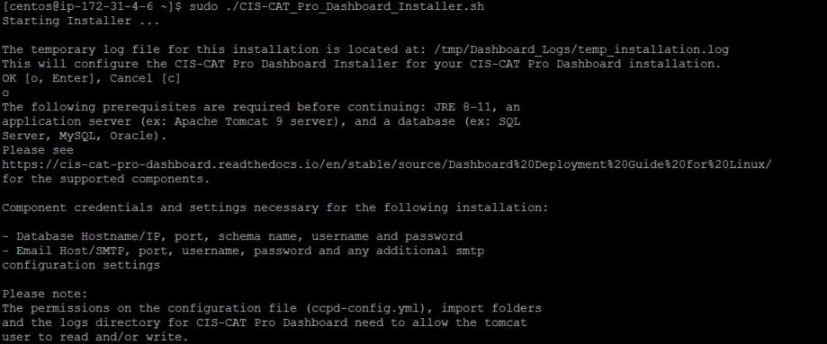
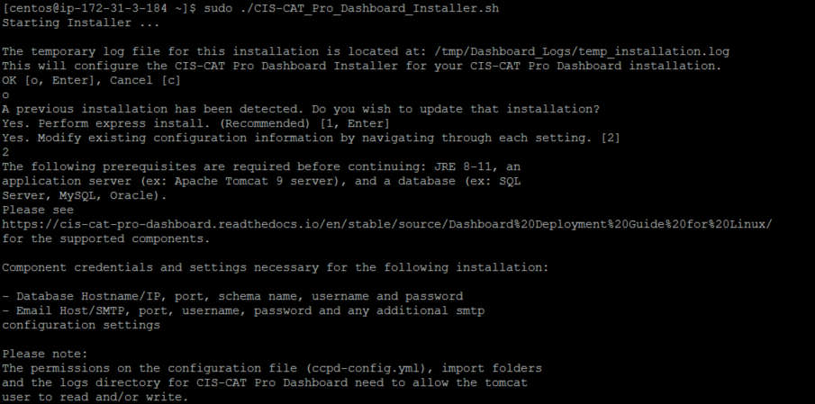
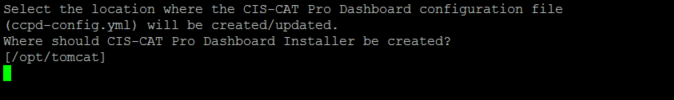

------------------------------
# Environment Requirements #

The following environment characteristics are required.

**Server**

- A single Microsoft Windows Server 2016 or 2019
	- 64 bit
	- 8GB RAM
	- At least 10 GB free disk space allocated to the main OS drive (usually the c:\ drive)
	- 2 vCPUs, 4 cores each
- Server does NOT currently host CIS-CAT Pro Dashboard v2.x 

The application does not heavily utilize processor and memory. Assessment result import process will increase the memory and processing usage. CIS-CAT recommends conducting assessment result imports via the API during low peak business hours to avoid disrupting other business activities.

Load balanced configurations are not supported.

CIS utilizes a Microsoft Windows Server 2019 testing environment in AWS t2.large instance (designed for burst processing).

The following environment characteristics are required.

**Server**
- A single Ubuntu 20.04 server
	- 8GB RAM
	- 10 GB disk space allocated to the main OS location
	- 2 vCPUs, 4 cores each
- Server does NOT currently host CIS-CAT Pro Dashboard v2.x 

The application is lightweight on processor and memory use. Assessment result import process will increase the memory and processing usage. CIS-CAT recommends conducting assessment result imports via the API during low peak business hours to avoid disrupting other business activities.

Load balanced configurations are not supported.

**Browser**
- Google Chrome

Other browsers maybe produce unexpected behavior.

**Traffic**
- Traffic allowed

**Other**
- No other applications present requiring system-installed Java runtime environment (JRE)
	- Including CIS-CAT Pro Assessor
- The main operating system drive must be selected for installation

>
##Configuration and Deployment - Installer##
<b>This section describes how to configure and deploy the Dashboard using the Installer.  For instructions on how to configure and deploy the Dashboard manually, see [Configuration and Deployment - Manual](#confAndDeploymentManual).</b>

The permissions on the configuration file (ccpd-config.yml) and the logs directory for CIS-CAT Pro Dashboard need to allow the tomcat user to read and/or write.

- Locate latest version of CIS-CAT Pro Dashboard in the Downloads section, from [CIS WorkBench](https://workbench.cisecurity.org/)
- Download the CIS-CAT Pro Dashboard Unix bundle from [CIS WorkBench](https://workbench.cisecurity.org/)
- Extract the bundle on your tomcat instance and move contents of the extracted bundle to be placed under `/opt/tomcat/` as opposed to `/opt/tomcat/CIS-CAT Pro Dashboard...`.
- Confirm contents of the bundle look similar to the following image:

				

- Execute CIS-CAT Pro Dashboard Installer (`CIS-CAT_Pro_Dashboard_Installer.sh` in this example) as root or user that has root privileges (use "sudo" or "su" to elevate your privileges)
	- `run: sudo chmod 755 CIS-CAT_Pro_Dashboard_Installer.sh`
	- `run: sudo ./CIS-CAT_Pro_Dashboard_Installer.sh`

####Welcome (First-time user)####
First-time users of the CIS-CAT Pro Dashboard Installer tool will be presented with the below screen. On this screen you can also see the location of the temporary installation log.

####Welcome (From previous installation)####
Users with previous successful use of CIS-CAT Pro Dashboard Installer tool will be presented with the below screen. The screens will navigate only to the information required to be collected for the installation actions selected.

####Existing Dashboard Installation and Express Installation ####
If there are no expected changes to the existing installation, this is the best option to select to simply update the *.war file with the latest. 

####Preload configuration file####

The Installer might be able to detect an existing CIS-CAT Pro Dashboard configuration file (`ccpd-config.yml`). If one is found you will be given the choice of using that one or manually entering the location of one, in order to pre-populate some of the Installer screens. The screens will navigate only to the information required to be collected for the installation actions selected.

####Configuration File Location####
If this is a new installation, the Configuration File Location screen will be presented. This is the location where CIS-CAT Pro Dashboard configuration file (`ccpd-config.yml`) will be created.

####Application Server Location####
For users performing a new installation, or modifying existing configuration information, use the below screen to specify the application server home directory. The default value appearing in the field is the recommended location for the application server. However, each environment may vary. For example, if the Tomcat home directory is `/opt/tomcat`, then the CCPD.war will be created under `/opt/tomcat/webapps/CCPD.war`.

####Import Directory####
It is required to setup processing folders that the Dashboard will use while importing files.Example report folder structure is shown within the CIS-CAT Pro Dashboard Installer.

####Environment Variables####
Specify the environment variables needed by the CIS-CAT Pro Dashboard. CCPD_CONFIG_FILE points to CIS-CAT Pro Dashboard runtime configuration file (`ccpd-config.yml`). CCPD_LOG_DIR is the logs directory for CIS-CAT Pro Dashboard.

####Application Server URL
Specifies the application URL of the CIS-CAT Pro Dashboard application. Example formats are shown within the CIS-CAT Pro Dashboard Installer.

####Email Configuration####
The email configuration information is optional and is intended for users that want to send email messages such as password reset requests. CIS-CAT Pro Dashboard must be able to connect to and utilize a valid SMTP server in order to send email messages. CIS-CAT Pro Dashboard utilizes the Grails mail plugin for email communication.
Along with the default sender email address, CIS-CAT Pro Dashboard's mailing configuration must also include connection to a valid SMTP server in order to correctly distribute the "forgot password" messages. Numerous SMTP services exist, such as Gmail, Hotmail, Amazon SES, or in-house SMTP services available through corporate emailing technologies, such as Exchange. CIS-CAT Pro Dashboard can support these SMTP servers, as long as the connection information entered below is correct. By default, the plugin assumes an unsecured mail server configured at `localhost` on `port 25`. However, this can be modified in the email configuration screen.

####Database Configuration####
The primary purpose of this screen is to assist in establishing a connection to the database for the CIS-CAT Pro Dashboard. Three types of databases are currently supported: MySQL, SQL Server and Oracle. Optional function available in this screen:

 - **Test Database Connection:** Enter correct Hostname/IP, Port, Username, Password, and Schema name and select the “Test Database Connection” button. A message will indicate if the connection was successful.

####Summary####
The Summary screen is intended for a final review of all information provided in previous screens. If any information is incorrect, you can cancel and navigate to the appropriate screen and make a correction.

####Installation####
The system may ask for permission to create a backup of the current configuration file (`ccpd-config.yml`) and/or a backup of the current CCPD.war file. This is a recommended procedure.

The installer does not preserve or setup LDAP configuration. This is done manually using the backup file to merge any existing LDAP settings to the latest ccpd-config.yml

####Complete####
If the installer process was successful, the Complete screen will be presented. On this screen you can also see the location of the final installation log, which is created with a unique date and timestamp added to its name. The tomcat application server can now be started if it was previously stopped.

####Installer Logs
During the installation, the Installer will create logs. The logs will be created in a directory within the temporary directory of the operating system. Each finished installation will create an individual log with a timestamp. If you have trouble with the installation, please provide this log file on a [support ticket created on our support portal](https://www.cisecurity.org/support/). 

The permissions on the configuration file (ccpd-config.yml) and the logs directory for CIS-CAT Pro Dashboard need to allow the tomcat user to read and/or write.

##Configuration and Deployment - Manual##
<b>This section describes how to configure and deploy the Dashboard manually.  For instructions on how to configure and deploy the Dashboard using the Installer, see [Configuration and Deployment - Installer](#confAndDeploymentInstaller).</b>

At this point, it is prudent to deploy the CIS-CAT Pro Dashboard application (the "war") included in the downloadable bundle.  The initial deployment of the web application can then be tested via direct connection to the application server on port `8080`, without the web server.  This can help identify any application or application server misconfigurations prior to web server installation/configuration.

### Mail Configuration ###
CIS-CAT Pro Dashboard utilizes the Grails `mail` plugin in order to send email messages from time to time, including password reset requests.  CIS-CAT Pro Dashboard must be able to connect to and utilize a valid SMTP server in order to send these email messages.  

Configuration of the mail plugin will be member-specific, and those configuration items will also be added to the `/opt/tomcat/ccpd-config.yml` file, noted above.

#### Default Sender Email Address ####
CIS-CAT Pro Dashboard can be configured with a default "sender" email address, indicating that the application has sent a "forgot password" message, allowing users to enter new logon credentials.  Add the following section indented under the `grails` like in the below examples. In the `/opt/tomcat/ccpd-config.yml` file (noted above), add the following section:

    ---
	    plugin:
	    	springsecurity:
	    		ui:
	    			forgotPassword:
	    				emailFrom: "your-email@member-organization.com"

#### SMTP Configuration ####
Coupled with the default sender email address, CIS-CAT Pro Dashboard's mailing configuration must also include connection to a valid SMTP server, in order to correctly distribute the "forgot password" messages.  Numerous SMTP services exist, such as Gmail, Hotmail, Amazon SES, or in-house SMTP services available through corporate emailing technologies, such as Exchange.  CIS-CAT Pro Dashboard can support these SMTP servers, as long as the connection information is correct in the configuration file (the `/opt/tomcat/ccpd-config.yml` noted above).

By default the plugin assumes an unsecured mail server configured at `localhost` on port `25`. However you can change this via the application configuration file (the `/opt/tomcat/ccpd-config.yml` noted above). Add the following section indented under the `grails` like in the below examples.

For example here is how you would configure the default sender to send with a Gmail account:
#### *Mail Configuration - Gmail* ####
    ---
	    mail:
		    host: "smtp.gmail.com"
		    port: 465
		    username: "youracount@gmail.com"
		    password: "yourpassword"
		    props:
			    mail.smtp.auth: "true"
			    mail.smtp.socketFactory.port: "465"
			    mail.smtp.socketFactory.class: "javax.net.ssl.SSLSocketFactory"
			    mail.smtp.socketFactory.fallback: "false"

And the configuration for sending via a Hotmail/Live account:
#### *Mail Configuration - Hotmail/Live* ####
    ---
	    mail:
		    host: "smtp.live.com"
		    port: 587
		    username: "youracount@live.com"
		    password: "yourpassword"
		    props:
			    mail.smtp.starttls.enable: "true"
			    mail.smtp.port: "587"

And the configuration for sending via a Outlook account:
#### *Mail Configuration - Outlook* ####
    ---
	    mail:
		    host: "smtp-mail.outlook.com"
		    port: 587
		    username: "youracount@outlook.com"
		    password: "yourpassword"
		    props:
			    mail.smtp.starttls.enable: "true"
			    mail.smtp.port: "587"

And the configuration for sending via a Yahoo account:
#### *Mail Configuration - Yahoo* ####
    ---
	    mail:
		    host: "smtp.correo.yahoo.es"
		    port: 465
		    username: "myuser"
		    password: "mypassword"
		    props:
			    mail.smtp.auth: "true"
			    mail.smtp.socketFactory.port: "465"
			    mail.smtp.socketFactory.class: "javax.net.ssl.SSLSocketFactory"
			    mail.smtp.socketFactory.fallback: "false"

**Security Considerations**

We want the ccpd-config.yml to be as secure as possible.  Only the tomcat user needs to be able to read and write into the file.  We recommend limiting permissions to the file by running the following commands:

	> sudo chown tomcat ccpd-config.yml
	> sudo chgrp tomcat ccpd-config.yml
	> sudo chmod 600 ccpd-config.yml

### Deploy WAR ###
Connect to the application server and transfer the `CCPD.war` to the `/opt/tomcat/webapps` directory.  If Tomcat is running, it should automatically deploy the application.  If Tomcat is not running, starting it will deploy the application.

Once Tomcat is done with its deployment you should be able to access the application by entering `http://<public url of application server>:8080/CCPD/`, into a browser.

You may need to restart tomcat in order to complete the deployment,  you can do so using the following command

	> sudo service tomcat restart

CIS-CAT Pro Dashboard will bootstrap in a user with:

    username: admin
    password: @admin123

**Notes**:
Your network must allow traffic on 8080
(If deployed to AWS) Your security group in AWS must allow traffic on 8080

### Web Server ###
The final configuration is for a web server to proxy the Tomcat instance and to answer traffic on port `80/443`.

#### Apache HTTP Server for Ubuntu####
Install Apache 2.4 for Ubuntu by running: 
    sudo apt-get install apache2

Create a file named `ccpd.conf` in the following directory: `/etc/apache2/sites-available` with the following lines:

    <VirtualHost *:80>
	    ServerName <public url of application server>
	    ProxyRequests Off
	    <Proxy *>
		    Order deny,allow
		    Allow from all
	    </Proxy>
	    ProxyPreserveHost on
	    ProxyPass / http://localhost:8080/
    </VirtualHost>

The `ServerName` should be the `<public url of application server>`

Execute the following commands to enable the proxy module:

    sudo a2enmod proxy
    sudo a2enmod proxy_ajp
    sudo a2enmod proxy_http
    sudo service apache2 restart

Execute the following commands to enable the reverse proxy to Tomcat:

    sudo a2ensite ccpd.conf
    sudo service apache2 reload

The Apache HTTP server should now be configured to serve requests to CIS-CAT Pro Dashboard.  The application should be available at the URL entered into your `ccpd-config.yml`: `http://<public url http server>/CCPD`

### Securing Web Traffic ###
The steps above will have the CIS-CAT Pro Dashboard application running over normal HTTP on port `80`.  This presents a risk as data, including user credentials, will be transmitted in clear text.  It is recommended that traffic be secured using HTTPS.  The following article explains how to create a self-signed certificate and apply it to a web server in Ubuntu 18.04: [https://www.digitalocean.com/community/tutorials/how-to-create-a-self-signed-ssl-certificate-for-apache-in-ubuntu-18-04)

**NOTE:** 
After completing the steps in the article, you will have to change your connector in ccpd.conf to use port 443 instead of port 80.  Also, when you chose a common name in the certificate creation process, the name must match the DNS name portion of the serverURL in ccpd-config.yml.  i.e.  if your serverURL is https://www.example.com/CCPD, then the common name in the certificate must be www.example.com

### Ensuring Trust ###
In the browser's URL bar, navigate to the CIS-CAT Pro Dashboard application.  Click on the HTTPS certificate chain (next to URL address). In the Google Chrome browser, if the user sees a "Not Secure" label next to the URL, the certificate is not trusted.  Click on the "Not Secure" link to display the certificate information:

- Click the "Details" link to display the "Security Overview" information.
- Click on the "View Certificate" button to display the certificate details.

The certificate information needs to be exported, and added to the servers trust store.  On the "details" tab of the certificate information, click the "Copy to File..." button.  The "certificate export wizard" will be displayed.

- Click the "Next" button to navigate to the second screen, the export type selection:

Select the "DER encoded binary X.509 (.CER)" radio button.  This selection should be the default.  Click "Next" to continue.

Select or browse to a location to where the `.cer` file will be saved.  Clicking "Next" and finally "Finish" to complete the wizard and save the file to the selected location/filename.  This file will need to be transferred via SCP, S/FTP to the application server hosting the CIS-CAT Pro Dashboard application.  Note the location to which the file is transferred.  For the purposes of this User's Guide, assume the location of the `ccpd_cert.cer` file is `/home/ubuntu/ccpd_cert.cer`.

#### Importing the certificate into the java trust store ####
To POST reports to Dashboard from Assessor using the `POST Reports to URL` option with HTTPS, a certificate must be imported to the java trust store.

- Locate JRE, JDK, or openJDK used to launch Tomcat on the Tomcat/Dashboard server
- Note the location of the `cacerts` file prior to importing certificate to `keytool`
	- For example, if OpenJDK is located at `usr/lib/jvm/jdk-11.0.9.101`, then `cacerts` file will be located in `usr/lib/jvm/jdk-11.0.9.101\lib\security\cacerts`
- Use java `keytool` application to import the certificate:

   	 	# Navigate to the $JAVA_HOME folder's bin directory
   		 cd /usr/lib/jvm/jdk-11.0.9.101/bin
     
   	 	# Execute keytool
    	sudo keytool -import -alias ccpd -keystore jre/lib/security/cacerts -file /home/ubuntu/ccpd_cert.cer

- Enter keystore credentials at prompt.  By default, this credential is `changeit`.
- Answer `yes` to import the certificate into the trust store
 		
		# The user will be asked for confirmation
    	Trust this certificate? [no]:

- Restart application server to incorporate trust store

##LDAP/Active Directory Integration (Optional)##
With this integration, LDAP/Active Directory will be used to manage user authentication and permissions within CCPD. 

Users will use their LDAP/AD credentials to log into the application. LDAP/AD roles and user properties such firstname, lastname and email will be imported. If the user doesn't exist in CCPD, the username will be created on login and granted with a basic user role (ROLE\_USER) by default along with LDAP Roles.

####LDAP Configuration####
Here is an example of LDAP structure in OpenLDAP:

Based on the above structure, add the following section in the `/opt/tomcat/ccpd-config.yml` file (noted above) indented under the `grails` like below: 
		
	---
		plugin:
			springsecurity:
				providerNames: ['ldapAuthProvider','rememberMeAuthenticationProvider','restAuthenticationProvider','anonymousAuthenticationProvider']
				ldap:
					active: true
					context:
						managerDn: 'cn=Manager,dc=cisecurity,dc=org'
						managerPassword: 'my_manager_password'
						server: 'ldap://127.0.0.1:389'
					authorities:
						retrieveDatabaseRoles: false                   
						retrieveGroupRoles: true
						groupSearchBase: 'ou=Groups,dc=cisecurity,dc=org'                  
						groupSearchFilter: 'uniquemember={0}'
						groupRoleAttribute: 'cn'        
						clean:
							prefix: 'CCPD_'
					search:
						base: 'dc=cisecurity,dc=org' 
						filter: '(uid={0})'
					authenticator:
						passwordAttributeName: 'userPassword'
					mapper:
						passwordAttributeName: 'userPassword'               
					useRememberMe: true  
				rememberMe:
					persistent: true

####Configuration Options####
Here is a description of some configuration options used for LDAP/AD integration:

- **managerDn/managerPassword:** manager credential to access to LDAP server.

- **server:** URL of the LDAP server.

- **groupSearchBase:** the base directory to start the group search. Note: if  we don't want to retrieve groups (roles) from LDAP, set retrieveGroupRoles to false.

- **groupSearchFilter:** the pattern to be used for the user search. {0} is the user’s DN.

- **groupRoleAttribute:** the ID of the attribute which contains the role name for a group.

- **clean.prefix:** an optional string prefix to strip from the beginning of LDAP group names. For example, 'CCPD\_' will convert CCPD\_ADMIN to ROLE\_ADMIN

- **base:** the base directory to start the search.

- **filter:** the filter expression used in the user search. For LDAP, uid field is typically used as username for the filter. In Active Directory, sAMAccountName (also called "User logon name") is typically used. 

- **passwordAttributeName:** the name of the password attribute to use.

####LDAP/AD Requirements####
The email address is a required field, make sure that LDAP/AD user email field is set properly.

The entire group name needs to be in uppercase in LDAP/AD. 

If some users were previously created in CCPD before the LDAP integration, make sure the username matches with the one in LDAP (uid) or AD (sAMAccountName, also called "User logon name").  

The api user needs to be created in LDAP/AD in order to generate an authentication token to import Asset Report Format (ARF) results from CIS-CAT Assessor. 

Once LDAP/AD authentication is integrated to CCPD, the database authentication will be automatically disabled.

