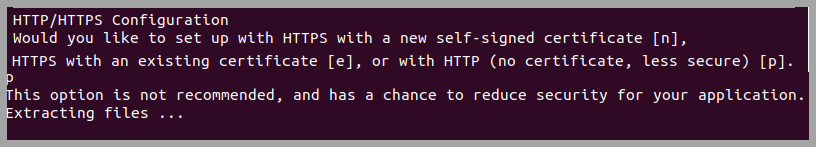

------------------------------
# Environment Requirements #

The following environment characteristics are required.

**Server**

- A single Ubuntu 20.04 server
	- 8GB RAM
	- Minimum 10 GB disk space allocated to the main OS location
	- 2 vCPUs, 4 cores each
- Server does NOT currently host CIS-CAT Pro Dashboard v2.x 

The application does not heavily utilize processor and memory. Assessment result import process will increase the memory and processing usage. CIS-CAT recommends conducting assessment result imports via the API during low peak business hours to avoid disrupting other business activities.

Load balanced configurations are not supported.

**Browser**

- Google Chrome

Other browsers maybe produce unexpected behavior.

**Traffic and Ports**

- Internet available on the server during installation*
- Port 3306 is available for Maria database installation
- Traffic allowed on port 8080 and 443
	- As needed, if installed on AWS, AWS security group must allow traffic on port 8080

\* Ubuntu 20.04 must have certain packages installed. Internet is required at the time of initial installation so the correct packages can be confirmed. The internet connection can be disabled after installation.

**Other**

- No other applications present requiring system-installed Java runtime environment (JRE)
	- Including CIS-CAT Pro Assessor
- The main operating system drive must be selected for installation

# Installation Instructions #

For an initial CIS-CAT Pro Dashboard installation on Ubuntu Linux, follow the basic steps below. CIS-CAT has observed an initial installation effort on a prepared server to complete in less than 10 minutes. As the installation process will effect the Java home environment variables on the machine, CIS-CAT recommends that other applications requiring a system-installed java run time environment (JRE) are not present on the same host.

CIS-CAT Pro Dashboard requires a CIS SecureSuite license. Before initiating the installation process, download your organization's [SecureSuite license](https://cis-cat-pro-dashboard.readthedocs.io/en/latest/source/SecureSuite%20License/).

1. Place your [SecureSuite license](https://cis-cat-pro-dashboard.readthedocs.io/en/latest/source/SecureSuite%20License/) on the CIS-CAT Pro Dashboard server
2. Download the latest CIS-CAT Pro Dashboard zip file from [CIS WorkBench](https://workbench.cisecurity.org/files), select the tag `CIS-CAT Dashboard` 
3. Place the zipped file on a host server that **has not** previously had CIS-CAT Pro Dashboard or CIS-CAT Pro Assessor installed
4. Unzip the files
5. Launch the installer shell script from any hard drive location as `root`
		sudo ./CIS-CAT_Pro_Dashboard_Installer.sh
6. Select Standard or Custom Installation
	- **Standard:** Navigates required options only for most streamlined installation. 
	- **Custom:** Navigates required and selected optional, advanced settings. During navigation, selected optional settings can still be skipped.

** License **

A valid CIS issued SecureSuite license is required. The application may fail to load or some functions may not work as expected without a valid file. Offline license validation is performed utilizing only the license.xml file obtained from the CIS WorkBench.

** Installation Destination **

Select the main operating system drive for installation. For most Ubuntu environments, this will be `/usr/local/CCPD`. Ensure to allocate the system recommended space for this location.

** Email (Custom Option) **

The email configuration information is optional and presented only if selected on the Welccome screen during the first installation or upgrade. Email configuration is required for self-service "forgot password" requests.

CIS-CAT Pro Dashboard utilizes the Grails mail plugin that supports SMTP servers. By default, an unsecured mail server is assumed and configured to at `localhost` on port `25`. This can be modified by expanding the advanced properties for email setup.

** Active Directory - LDAP/S (Custom Option) **

LDAP(S) is an optional configuration. If configured, CIS-CAT Pro Dashboard will only authenticate with the active directory users and default CIS-CAT Dashboard users will be disabled. LDAP/Active Directory will be used to manage user authentication and permissions within CCPD.

LDAP/AD roles and user properties such as firstname, lastname and email will be imported. If the user doesn't exist in CCPD, the username will be created on login and granted with a basic user role (ROLE_USER) by default along with LDAP Roles.

**Requirements for LDAP/AD setup on system:**

- Email address is required to contain a valid value
- Group name must be uppercase
- Must contain a user called api user to support token generation
- Users created prior to LDAP integration, must have a username matching with the one in LDAP (uid) or AD (sAMAccountName, also called "User logon name")
- Port 389 availability
- SSL unchecked

**Additional Requirements for LDAPS**

- Certificate added to Dashboard's utilized java truststore
- Port 636 availability
- SSL selected

**Configuration Parameters **

| Configuration         |    Description |
| -----------------------| ------------- |
| Manager DN | Example: CN=Administrator,CN=Users,DC=corp,DC=cisecuritytest,DC=org |
| Manager Password | Credential for the Manager DN |
| Server | LDAP URL example: ldap://127.0.0.1:389  LDAPS URL example: ldaps://ldap.ciscat.ccp.sbp:636 |
| Group Search Base | Base directory for group search. Example: DC=corp,DC=cisecuritytest,DC=org |
| Group Search Filter | The pattern to be used for the user search. {0} is the user’s DN. Example: OpenLDAP: uniquemember={0} and AD: member={0} |
| Group Search Filter | The pattern to be used for the user search. {0} is the user’s DN. Example: OpenLDAP: uniquemember={0} and AD: member={0} |
| Group Role Attribute | The ID of the attribute which contains the role name for a group. Example: CN |
| Search Base | Base directory for search. Example: DC=corp,DC=cisecuritytest,DC=org |
| Search Filter | Filter expression used in search. Example: OpenLDAP: (uid={0}) or AD: sAMAccountName={0} |
| Password Attribute Name | Example: userPassword|

** Communication Protocol - HTTP(S) Setup **

CIS-CAT Pro Dashboard will receive inbound configuration assessment result data from CIS-CAT Pro Assessor and optionally connect to select targets for a single, ad-hoc configuration assessment using the remote assessment features. 

Select the communication protocol that supports your organization policy. While in the initial stages of installing Dashboard as a proof of concept, you may want to select a self-signed certificate or HTTP. Changes to protocol can be done by executing the installer application any time after initial install.

Choose from the following protocol methods:

- HTTPS (requires port 443 availability - alert when not available)
	- Self-signed certificate using the installer
	
		
	
	- Existing organization certificate
		- Certificates must be in *.p12 or *.jks format
		
		
	
	
- HTTP (transmits data in clear text)
	

		
** Set Database Password **

The MariaDB that supports CIS-CAT Pro Dashboard has a native admin user with the username `root`. Set a strong password with the following requirements:

- Minimum 8 characters
- Contains at least one character in `!#$%^`
- Contain a number
- Does NOT contain any special characters other than `!#$%^`

** Final Installation Process **

The duration of the final steps of the installation can be 2 to 5 minutes. The initial services to support CIS-CAT Pro Dashboard take some time to start. The services installed are:

- CCPD Windows
- MariaDB

Once the installation detects that CIS-CAT Pro Dashboard is ready for use, the `Installation Complete` screen will be presented.

Right click on the link to open CIS-CAT Pro Dashboard.

Depending on the communication protocol selection during installation, the CIS-CAT Pro Dashboard URL will be:

- HTTP: http://localhost:8080/CCPD/
- HTTPS: https://localhost:8080/CCPD/

## Initial Dashboard Login ##

    username: admin 
    password: @admin123

You'll be prompted to change your password upon first login.

---------------------------

# Upgrade Process #

Each release of CIS-CAT Pro Dashboard v3.x will contain upgrades to the main CIS-CAT application and embedded components. Upgrades are applied utilizing the latest installer included in the downloaded CIS-CAT Pro Dashboard.

The installer will detect a previous installation and prompt to update only the application or update/modify configuration changes. If no changes are required, updating only the application is the most efficient. Follow the basic steps below. 

**NOTE:** There is no upgrade or migration path from CIS-CAT Pro Dashboard version 2.x to version 3.x. Please read our FAQ and our [blog](https://www.cisecurity.org/insights/blog/cis-cat-pro-is-now-even-better-heres-how-weve-improved-it) to learn more about CIS-CAT Pro changes.

1. Download the latest CIS-CAT Pro Dashboard zip file from [CIS WorkBench](https://workbench.cisecurity.org/files), select the tag `CIS-CAT Dashboard`
2. Place the zipped file on the CIS-CAT Dashboard host server where CIS-CAT Pro Dashboard v3.x is installed
3. Unzip the files
4. Launch the installer shell script
5. Select Standard or Custom Installation
	- **Update application only:** applies existing configuration, updates CIS-CAT application. No options to modify existing configurations.
	- **Update application and/or configuration settings:** applies existing configuration with options to modify some settings, updates CIS-CAT application. Select **optional** Email or LDAP configuration to modify or initiate these functions.

------------------
# Installation Errors #

Occasionally, a CIS-CAT Pro Dashboard installation or upgrade may result in an error.

- **Check Services:** Verify that `MariaDB` and `CCPD Windows` are started; start them if needed and try again after a few minutes.
- **Retry Installer:** Close and re-launch CCPD Installer. The installer will guide you through any necessary configuration.

If you are unsuccessful, collect logs that have been generated for you and open a support ticket. See further information below.

** Obtaining Installer Logs **

During the installation, the Installer will create logs. The logs will be removed when the installation application is closed. If you receive an error during installation, please capture the Installer log before closing the application. Installation logs are created at `/tmp`. View this log for information regarding the installation or submit this file with your CIS Technical Support ticket when issues involve installation.
 

Additionally, CIS Technical Support may require any logs generated at this location: `/usr/local/CCPD/ccpdlogs`. 

Attach log files to your [Technical Support ticket](https://www.cisecurity.org/support/).

# Uninstall#

The Uninstaller application is located in the root directory of the original installation location. The uninstallation will remove all data and services supporting CIS-CAT Pro Dashboard. A restart is required to complete the uninstallation.

**Proxy information- do we need?**

The `ServerName` should be the `<public url of application server>`

Execute the following commands to enable the proxy module:

    sudo a2enmod proxy
    sudo a2enmod proxy_ajp
    sudo a2enmod proxy_http
    sudo service apache2 restart

Execute the following commands to enable the reverse proxy to Tomcat:

    sudo a2ensite ccpd.conf
    sudo service apache2 reload

### Ensuring Trust ###
In the browser's URL bar, navigate to the CIS-CAT Pro Dashboard application.  Click on the HTTPS certificate chain (next to URL address). In the Google Chrome browser, if the user sees a "Not Secure" label next to the URL, the certificate is not trusted.  Click on the "Not Secure" link to display the certificate information:

- Click the "Details" link to display the "Security Overview" information.
- Click on the "View Certificate" button to display the certificate details.

The certificate information needs to be exported, and added to the servers trust store.  On the "details" tab of the certificate information, click the "Copy to File..." button.  The "certificate export wizard" will be displayed.

- Click the "Next" button to navigate to the second screen, the export type selection:

Select the "DER encoded binary X.509 (.CER)" radio button.  This selection should be the default.  Click "Next" to continue.

Select or browse to a location to where the `.cer` file will be saved.  Clicking "Next" and finally "Finish" to complete the wizard and save the file to the selected location/filename.  This file will need to be transferred via SCP, S/FTP to the application server hosting the CIS-CAT Pro Dashboard application.  Note the location to which the file is transferred.  For the purposes of this User's Guide, assume the location of the `ccpd_cert.cer` file is `/home/ubuntu/ccpd_cert.cer`.

#### Importing the certificate into the java trust store ####
To POST reports to Dashboard from Assessor using the `POST Reports to URL` option with HTTPS, a certificate must be imported to the java trust store.

- Locate JRE, JDK, or openJDK used to launch Tomcat on the Tomcat/Dashboard server
- Note the location of the `cacerts` file prior to importing certificate to `keytool`
	- For example, if OpenJDK is located at `usr/lib/jvm/jdk-11.0.9.101`, then `cacerts` file will be located in `usr/lib/jvm/jdk-11.0.9.101\lib\security\cacerts`
- Use java `keytool` application to import the certificate:

   	 	# Navigate to the $JAVA_HOME folder's bin directory
   		 cd /usr/lib/jvm/jdk-11.0.9.101/bin
     
   	 	# Execute keytool
    	sudo keytool -import -alias ccpd -keystore jre/lib/security/cacerts -file /home/ubuntu/ccpd_cert.cer

- Enter keystore credentials at prompt.  By default, this credential is `changeit`.
- Answer `yes` to import the certificate into the trust store
 		
		# The user will be asked for confirmation
    	Trust this certificate? [no]:

- Restart the server to incorporate trust store
