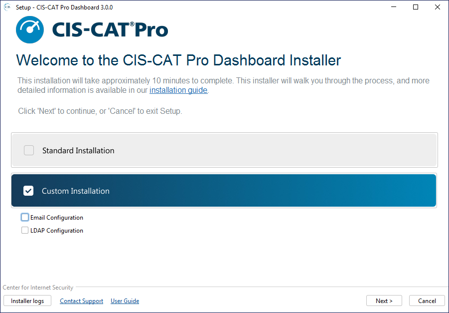
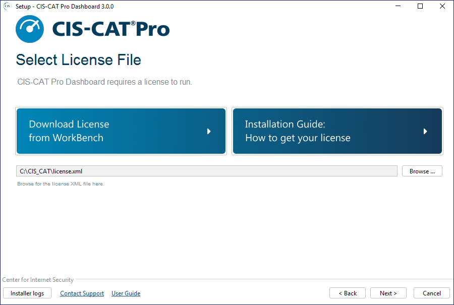
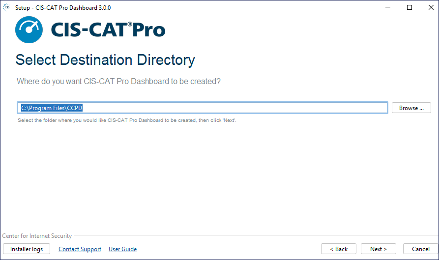

------------------------------
# Environment Requirements #

The following environment characteristics are required.

**Server**

- A single Microsoft Windows Server 2016 or 2019
	- 64 bit
	- 8GB RAM
	- At least 10 GB free disk space allocated to the main OS drive (usually the c:\ drive)
	- 2 vCPUs, 4 cores each
- Server does NOT currently host CIS-CAT Pro Dashboard v2.x 

The application does not heavily utilize processor and memory. Assessment result import process will increase the memory and processing usage. CIS-CAT recommends conducting assessment result imports via the API during low peak business hours to avoid disrupting other business activities.

Load balanced configurations are not supported.

CIS utilizes a Microsoft Windows Server 2019 testing environment in AWS t2.large instance (designed for burst processing).

**Browser**

- Google Chrome

Other browsers maybe produce unexpected behavior.

**Traffic**

- Traffic allowed on port 8080 and 1433
	- As needed, add an inbound rule in Windows firewall
	- As needed, if installed on AWS, AWS security group must allow traffic on port 8080
- If HTTPS communication protocol selected, traffic allowed on 443

**Other** 

- No other applications present requiring system-installed Java runtime environment (JRE)
	- Including CIS-CAT Pro Assessor
- The main operating system drive must be selected for installation

------------------
# About the Installation #
The installation process will create two services that should remain running to support the application. On initial installation and upgrade, it can take several minutes for these services to start. These services are:

- MariaDB
- CCPD Windows
	
By default the installation will be placed C:\Program Files\CCPD. It is not recommended practice to manually modify contents within the structure. See below for additional notes on some of the structure. 

| Folder         |    Description |
| -----------------------| ------------- |
| ccpd_imports | Contains configuration assessment results only in ARF XML format produced by CIS-CAT Pro Assessor. Reports failing to import will move to the `error` folder, while successfully imported reports will move to the `processed`folder. It is possible to manually place reports in the `input` folder for CIS-CAT Pro Dashboard import.|
| certificates | By default, contains only self-signed certificates user-selected/created to support HTTPS during installation. You may optionally store an organizational certificate here, but it is not required. If, during upgrades, Members modify communication protocols, folder contents will not be cleared.|
| conf | Contains the configuration file that supports Dashboard functionality. Modifications to this file are recommended only throught the installation application. If manual changes occur, the services must be restarted and formatting errors may cause functionality in the Dashboard to not function properly. Users other than system or administrator are prevented from viewing this file. |
| content | Contains the supported CIS Benchmark content for CIS-CAT Pro Dashboard. The CIS Benchmarks provided within the build will be the latest supported content at the time of the Dashboard release. The content will be updated and overwritten with the latest on a Dashboard upgrade. CIS-CAT Pro Dashboard officially supports CIS Benchmark automated assessment content delivered with the application in datastream format. |
| logs | The log folder contains assessor and ciscatpro (dashboard) logs. For the purpose of troubleshooting issues, CIS Product Support may ask for these files. |

The installer establishes Java environment variables specifically for use with CIS-CAT Pro Dashboard. Therefore, it is recommended that no other application requiring a java runtime environment (jre) exists on the CIS-CAT Pro Dashboard host server.

The `conf` folder contains the ccpd-config.yml file that contains information to support the CIS-CAT Pro Dashboard operation. The installation process limits read/write privileges to only users whose credentials are validated by Microsoft Windows OS security mechanisms, typically System and Administrators. Users not a member of the authenticated group to not have privileges to view or write to the file. 

------------------

# Installation Instructions #

For an initial CIS-CAT Pro Dashboard installation, follow the basic steps below. CIS-CAT has observed an initial installation effort on a prepared server to complete in less than 10 minutes. As the installation process will effect the Java home environment variables on the machine, CIS-CAT recommends that other applications requiring a system-installed java run time environment (JRE) are not present on the same host.

CIS-CAT Pro Dashboard requires a CIS SecureSuite license. Before initiating the installation process, download your organization's [SecureSuite license](https://cis-cat-pro-dashboard.readthedocs.io/en/latest/source/SecureSuite%20License/).

1. Place your [SecureSuite license](https://cis-cat-pro-dashboard.readthedocs.io/en/latest/source/SecureSuite%20License/) on the CIS-CAT Pro Dashboard server
2. Download the latest CIS-CAT Pro Dashboard from [CIS WorkBench](https://workbench.cisecurity.org/files), select the tag `CIS-CAT Dashboard` 
3. Place the application on a host server that **has not** previously had CIS-CAT Pro Dashboard or CIS-CAT Pro Assessor installed
4. Verify downloaded file is unblocked by right-clicking on file and selecting `properties` 
5. Launch the downloaded executable from any hard drive location as an administrator
6. Select Standard or Custom Installation
	- **Standard:** Navigates through only required options for most streamlined installation. 
	- **Custom:** Navigates through required and optional, advanced settings. During navigation, selected optional settings can be skipped.
7. Select `Yes` if prompted for permission to proceed with installation
8. Review installer screens below for additional information, if necessary

** License **

A valid CIS issued SecureSuite license is required. The application may fail to load or some functions may not work as expected without a valid file. The license is primarily used for the remote assessment functionality. Offline validation is performed utilizing only the license.xml file provided by the CIS WorkBench.

** Installation Destination **

Select the main operating system drive for installation. For most Microsoft Windows environments, this will be `C:\Program Files\CCPD`. Ensure to allocate the system recommended space for this drive.

** Email (Custom Option) **

The email configuration information is optional and presented only if selected on the Welccome screen during the first installation or upgrade. Email configuration is required for self-service "forgto password" requests.

CIS-CAT Pro Dashboard supports SMTP servers. By default, an unsecured mail server is assumed and configured to at `localhost` on port `25`. 

**Gmail Example**

scr5_EmailConfigurationGmailAdvanced.png

**Outlook Example**

** Active Directory - LDAP/S (Custom Option) **

LDAP(S) is an optional configuration. If configured, CIS-CAT Pro Dashboard will only authenticate with the active directory users and default CIS-CAT Dashboard users will be disabled. LDAP/Active Directory will be used to manage user authentication and permissions within CCPD.

LDAP/AD roles and user properties such as firstname, lastname and email will be imported. If the user doesn't exist in CCPD, the username will be created on login and granted with a basic user role (ROLE\_USER) by default along with LDAP Roles.

**Requirements:**

- LDAP/AD email address is required to contain a valid value
- LDAP/AD group name must be uppercase
- LDAP/AD must contain a user called api user to support token generation
- LDAPS configuration must add the certificate to Dashboard's utilized java truststore

**Example Active Directory Configuration**

| Configuration         |    Description |
| -----------------------| ------------- |
| Manager DN | Example: CN=Administrator,CN=Users,DC=corp,DC=cisecuritytest,DC=org |
| Manager Password | Credential for the Manager DN |
| Server | LDAP URL example: ldap://127.0.0.1:389  LDAPS URL example: ldaps://ldap.ciscat.ccp.sbp:636 |
| Group Search Base | Base directory for group search. Example: DC=corp,DC=cisecuritytest,DC=org |
| Group Search Filter | The pattern to be used for the user search. {0} is the user’s DN. Example: OpenLDAP: uniquemember={0} and AD: member={0} |
| Group Search Filter | The pattern to be used for the user search. {0} is the user’s DN. Example: OpenLDAP: uniquemember={0} and AD: member={0} |
| Group Role Attribute | The ID of the attribute which contains the role name for a group. Example: CN |
| Search Base | Base directory for search. Example: DC=corp,DC=cisecuritytest,DC=org |
| Search Filter | Filter expression used in search. Example: OpenLDAP: (uid={0}) or AD: sAMAccountName={0} |
| Password Attribute Name | Example: userPassword|

** Communication Protocol - HTTP(S) Setup **

CIS-CAT Pro Dashboard will receive inbound configuration assessment result data from CIS-CAT Pro Assessor and optionally connect to select targets for a single, ad-hoc configuration assessment using the remote assessment features. Select the communication protocol that supports your organization policy. It is possible to select a self-signed certificate or HTTP while in the initial stages of testing or proving the concept of utilizing the Dashboard. A different protocol can be selected by executing the installer and selecting the option to modify existing functionality.

HTTPS
	- CIS-CAT generated self-signed certificate 
		
	- Existing organization certificate
		
HTTP
This communication protocol transmits data in clear text.

** Set Database Password **

The MariaDB that supports CIS-CAT Pro Dashboard has a native admin user with the username `root`. Set a strong password with the following requirements:

- Minimum 8 characters
- Contains at least one character in `!#$%^`
- Does NOT contain any special characters other than `!#$%^`

** Final Installation Process **

The duration of the final steps of the installation can be 2 to 5 minutes. The initial services to support CIS-CAT Pro Dashboard take some time to start. The services installed are:

- CCPD Windows
- MariaDB

Once the installation detects that CIS-CAT Pro Dashboard is ready for use, the `Installation Complete` screen will be presented.

Select `Open CIS-CAT Pro Dashboard` or `Finish & Open Dashboard` to login to CIS-CAT Pro Dashboard.

Depending on the communication protocol selection during installation, the CIS-CAT Pro Dashboard URL will be:

- HTTP: http://localhost:8080/CCPD/
- HTTPS: https://localhost:8080/CCPD/

## Initial Dashboard Login ##

    username: admin 
    password: @admin123

You'll be prompted to change your password upon first login.

---------------------------

# Upgrade Process #
Each release of CIS-CAT Pro Dashboard v3.x will contain upgrades to the main CIS-CAT application and embedded components. Upgrades are applied utilizing the latest installer included in the downloaded CIS-CAT Pro Dashboard.

The installer will detect a previous installation and prompt to update only the application or update/modify configuration changes. If no changes are required, updating only the application is the most efficient. Follow the basic steps below. 

**NOTE:** There is no upgrade or migration path from CIS-CAT Pro Dashboard version 2.x to version 3.x. Please read our FAQ and our [blog](https://www.cisecurity.org/insights/blog/cis-cat-pro-is-now-even-better-heres-how-weve-improved-it) to learn more about CIS-CAT Pro changes.

1. Download the latest CIS-CAT Pro Dashboard from [CIS WorkBench](https://workbench.cisecurity.org/files), select the tag `CIS-CAT Dashboard`
2. Place the application on a host server that **has** previously had CIS-CAT Pro Dashboard v3.x installed
3. Verify downloaded file is unblocked by right-clicking on file and selecting `properties` 
4. Launch the downloaded executable from any hard drive location as an administrator
5. Select Standard or Custom Installation
	- **Update application only:** applies existing configuration, updates CIS-CAT application. No options to modify existing configurations.
	- **Update application and/or configuration settings:** applies existing configuration with options to modify some settings, updates CIS-CAT application. Select **optional** Email or LDAP configuration to modify or initiate these functions.
6. Select `Yes` if prompted for permission to proceed with installation

------------------
# Installation Errors #

Occasionally, a CIS-CAT Pro Dashboard installation or upgrade may result in an error.

- **Check Services:** Navigate to Windows Services manager. You will find `MariaDB` and `CCPD Windows` listed; start them if needed and try again after a few minutes.
- **Retry Installer:** Close and re-launch CCPD Installer. The installer will guide you through any necessary configuration.

If you are unsuccessful, collect logs that have been generated for you and open a support ticket. See further information below.

** Obtaining Installer Logs **

During the installation, the Installer will create logs. The logs will be removed when the installation is complete. If you receive an error during installation, please capture the Installer log before closing the application. Installation logs are created in the operating system's temporary directory, which is `C:\Users\loggedinUser\AppData\Local\Temp`. Select the `Installer Logs` button to navigate to the log location.
 

Additionally, support may require any logs generated at this location: `C:\Program Files\CCPD\logs\ccpdlogs`. 

If you need assistance, please provide the above log files on a [support ticket](https://www.cisecurity.org/support/).

# Uninstall#