------------------------------

# Environment Requirements #

The following environment characteristics are required.

- [Server](#server)
- [Browser](#browser)
- [Traffic and Ports](#traffic)
- [Other considerations](#other)

**Server**

- A single Microsoft Windows Server 2016 or 2019
	- 64 bit
	- 8GB RAM
	- Minimum 10 GB free disk space allocated to the main OS drive (usually the c:\ drive)
	- 2 vCPUs, 4 cores each
- Server does NOT currently host CIS-CAT Pro Dashboard v2.x 

The application does not heavily utilize processor and memory. Assessment result import process will increase the memory and processing usage. CIS-CAT recommends conducting assessment result imports via the API during low peak business hours to avoid disrupting other business activities.

CIS utilizes a Microsoft Windows Server 2019 testing environment in AWS t2.large instance (designed for burst processing).

**Browser**

- Google Chrome

Other browsers maybe produce unexpected behavior.

**Traffic and Ports**

- Port 3306 is available for Maria database installation
- Traffic allowed on port 8080 (HTTP) and 443(HTTPS)
	- As needed, if installed on AWS, AWS security group must allow traffic on port 8080/443
	- As needed, add an inbound rule in Windows firewall
- If HTTPS communication protocol selected, traffic allowed on 443

If utilizing LDAP/LDAPS/AD, refer to the installation steps in this section for additional ports that may be required.

The installation process will verify that certain ports are open and available. If you receive a message regarding port availability, please verify the availability of the notified ports.

**Other Considerations** 

_No other applications present requiring system-installed Java runtime environment (JRE)._

CIS-CAT Pro Dashboard v3 deploys with embedded openJDK and sets the Java Home variable on the host system. If other applications require a system installed Java (like CIS-CAT Assessor), the additional application may not function. CIS-CAT Pro Assessor will offer embedded Java for all operating systems in Q1 2023. If you are utilizing a version of CIS-CAT that contains the embedded Java then this will not cause a Java conflict. 

_Additional host system memory and processing resources may be needed when Dashboard host also hosts CIS-CAT Assessor._

If you have determined that there is no Java conflict, the host system's resources must also be considered if the system will host CIS-CAT Pro Assessor and Dashboard. CIS-CAT Pro Dashboard includes an embedded Apache Tomcat and Maria Database. Recommended server resources are 2 vCPUs (4 cores each), 10 GB of free disk space, and 8GB of RAM. Should this host server also host CIS-CAT Assessor or other applications, additional power and memory may be needed. Additionally, it is best practice for a host server containing a web application to only host the application it supports.

 

------------------

# Installation Instructions #

For an initial CIS-CAT Pro Dashboard installation on Microsoft Windows, follow the basic steps below. CIS-CAT has observed an initial installation effort on a prepared server to complete in less than 10 minutes. As the installation process will effect the Java home environment variables on the machine, CIS-CAT recommends that other applications requiring a system-installed java run time environment (JRE) are not present on the same host.

CIS-CAT Pro Dashboard requires a CIS SecureSuite license. Before initiating the installation process, download your organization's [SecureSuite license](https://cis-cat-pro-dashboard.readthedocs.io/en/latest/source/SecureSuite%20License/). Obtain the CIS-CAT Pro Dashboard application from the [CIS WorkBench](https://cis-cat-pro-dashboard.readthedocs.io/en/latest/source/About%20Dashboard/#obtain-dashboard).

- [Prepare for Installation](#PrepareInstallation)
- [License](#License)
- [Installation Destination](#InstallDestination)
- [Email (Optional Custom Option)](#Email)
- [Active Directory - LDAP/S (Optional Custom Option](#LDAP)
- [Communication Protocol - HTTP(S) Setup](#HTTPS)
- [Set Database Password](#DBpass)
- [Final](#Final)
- [Login to Dashboard](#login)

**Prepare for Installation**

1. Place your [SecureSuite license](https://cis-cat-pro-dashboard.readthedocs.io/en/latest/source/SecureSuite%20License/) on the CIS-CAT Pro Dashboard server
2. Download the latest CIS-CAT Pro Dashboard zip file from [CIS WorkBench](https://workbench.cisecurity.org/files), select the tag `CIS-CAT Dashboard` 
3. Place the zipped file on a host server that **has not** previously had CIS-CAT Pro Dashboard or CIS-CAT Pro Assessor installed
4. Unzip the files
5. Verify the installer file is unblocked by right-clicking on file and selecting `properties` and click the box `unblock`

	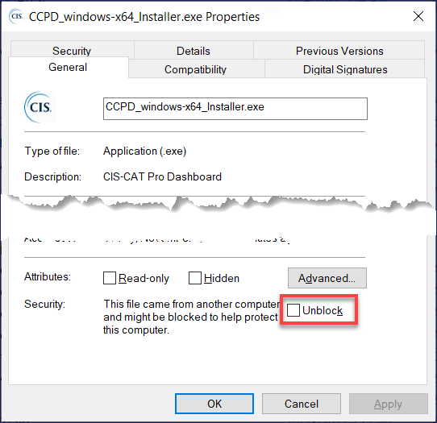

6. Launch the installer executable from any hard drive location as an administrator
7. Select Standard or Custom Installation
	- **Standard:** Navigates required options only for most streamlined installation. 
	- **Custom:** Navigates required and selected optional, advanced settings. During navigation, selected optional settings can still be skipped.
8. Select `Yes` if prompted for permission to proceed with installation
9. Review installer screens below for additional information, if necessary

**License**

A valid CIS issued SecureSuite license is required. The application may fail to load or some functions may not work as expected without a valid file. Offline license validation is performed utilizing only the license.xml file obtained from the CIS WorkBench.

** Installation Destination **

Select the main operating system drive for installation. For most Microsoft Windows environments, this will be `C:\Program Files\CCPD`. Ensure to allocate the system recommended space for this drive.

** Email (Custom Option) **

The email configuration information is optional (NOT REQUIRED) and presented only if selected on the Welcome screen during the first installation or upgrade. Email configuration is **required** for self-service "forgot password" requests. Email is the only way to reset a user's password when active directory is not setup. Organization's may contact support for assistance if it is not possible to configure email. No other functionality or alerts utilize the email setup. All alerts will be sent to the Dashboard "Inbox".

CIS-CAT Pro Dashboard utilizes the Grails mail plugin that supports SMTP servers. Expand the advanced properties for additional email setup.

**Example**

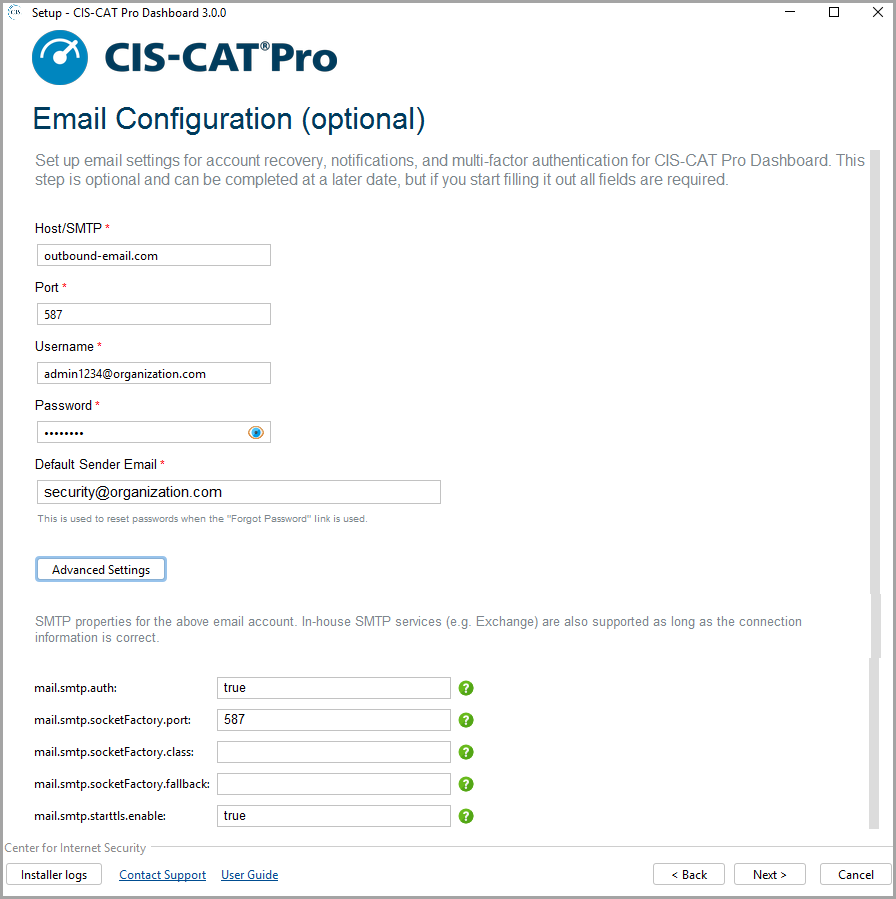

** Active Directory - LDAP/S (Custom Option) **

LDAP server structure specifically for CIS-CAT Pro Dashboard is REQUIRED before configuring LDAP in the Dashboard.

LDAP(S) is an optional configuration. If configured, CIS-CAT Pro Dashboard will only authenticate with the active directory users and default CIS-CAT Dashboard users will be disabled. LDAP/Active Directory will be used to manage user authentication and permissions within CCPD. Once LDAP/AD is integrated, the database authentication will be disabled and the "Reset password" button will not be present. Customization of the naming or user utilized is not supported.

LDAP/AD roles and user properties such as firstname, lastname and email will be imported. If the user doesn't exist in CCPD, the username will be created on login and granted with a basic user role (ROLE_USER) by default along with LDAP Roles.

- [Setup LDAP Server Structure](#structure)
- [Configure LDAP in CIS-CAT Dashboard installation](#configure)

**Setup LDAP Structure**

The LDAP Server Structure must be in place before configuring LDAP during the CIS-CAT Pro Dashboard installation.

Deeply nested groups may be incompatible with Dashboard's SpringSecurity plugin.

- Create all **mandatory** and **uppercase** user group names (CCPD_API needed for token generation for Assessor integration)
	- `CCPD_ADMIN`
	- `CCPD_API`
	- `CCPD_USER`
- Create the following **mandatory** users
	- `apiuser`
	- `admin`
- Verify user information
	- User name must include: firstname (given or firstname), lastname (sn or surname) and email
	- Email is required and must be a valid value for an email-based AD
	- Ensure "User must change password on next logon" is NOT selected
	- Where users were previously created in the CCPD program before the LDAP integration, ensure the username matches with the one in LDAP (uid) or AD (sAMAccountName, also called "User logon name")
- Assign existing and created users to created Dashboard groups (CCPD_USER, CCPD_ADMIN, CCPD_API)
	- `apiuser` assigned to CCPD_API group
	- `admin` assigned to `CCPD_ADMIN` and `CCPD_USER` group
	- Other users to desired roles ([Roles](https://cis-cat-pro-dashboard.readthedocs.io/en/stable/source/Dashboard%20User's%20Guide/#user-management))

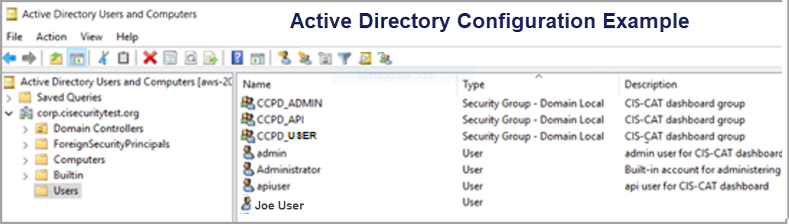

**Configure LDAP in CIS-CAT Dashboard Installation**

Execute the CIS-CAT Pro Dashboard installer and choose to configure LDAP. If wishing to allow a subset of users access to Dashboard, apply a Search filter. The below example is one way to limit user access to just users who are a member of the newly created CCPD groups. 

Ensure that the desired users have been added as a member of the CCPD_USER or CCPD_ADMIN or CCPD_API groups. 

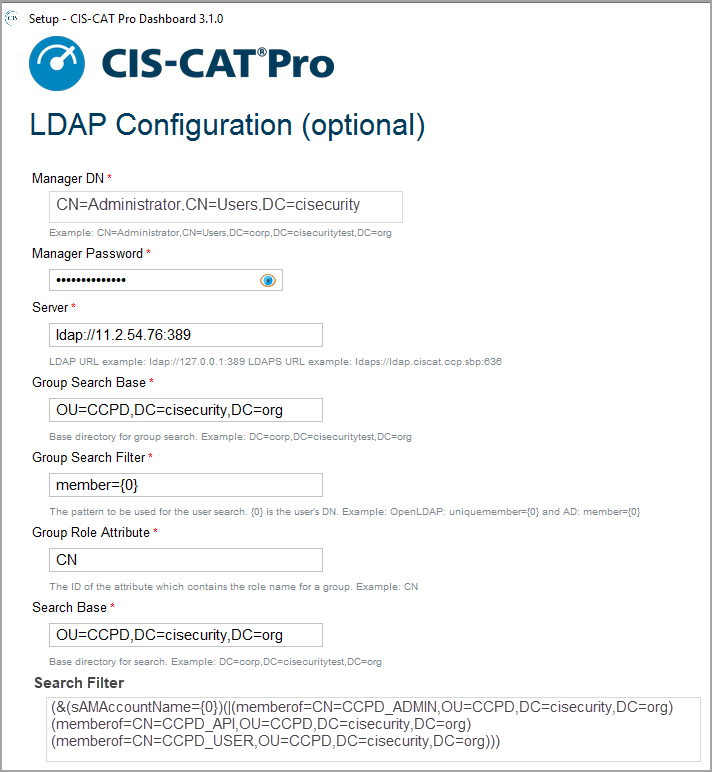

**Additional Requirements for LDAPS**

- Certificate added to Dashboard's utilized java truststore
- Port 636 availability

**Configuration Parameters**

| Configuration         |    Description |
| -----------------------| ------------- |
| Manager DN | Example: CN=Administrator,CN=Users,DC=corp,DC=cisecuritytest,DC=org |
| Manager Password | Credential for the Manager DN |
| Server | LDAP URL example: ldap://127.0.0.1:389  LDAPS URL example: ldaps://ldap.ciscat.ccp.sbp:636 |
| Group Search Base | Base directory for group search. Example: DC=corp,DC=cisecuritytest,DC=org |
| Group Search Filter | The pattern to be used for the user search. {0} is the user’s DN. Example: OpenLDAP: uniquemember={0} and AD: member={0} |
| Group Role Attribute | The ID of the attribute which contains the role name for a group. Example: CN |
| Search Base | Base directory for search. Example: DC=corp,DC=cisecuritytest,DC=org |
| Search Filter | Filter expression used in search. Example: OpenLDAP: (uid={0}) or AD: sAMAccountName={0}   OR apply access restrictions using advanced filter <pre>(&(sAMAccountName={0})(\|(memberof=CN=CCPD_ADMIN,OU=CCPD,DC=cisecurity,DC=org)(memberof=CN=CCPD_API,OU=CCPD,DC=cisecurity,DC=org)(memberof=CN=CCPD_USER,OU=CCPD,DC=cisecurity,DC=org)))</pre>|
| Password Attribute Name | Example: userPassword|

** Communication Protocol - HTTP(S) Setup **

CIS-CAT Pro Dashboard will receive inbound configuration assessment result data from CIS-CAT Pro Assessor. Any protocol supports use of the API imports. 

Select the communication protocol that supports your organization policy. While in a testing phase, some Members have found it useful to start quickly with HTTP. Changes to protocol can be done by executing the installer application any time after initial install.

HTTPS protocol is recommended for production use. The installation will assist in creating a self-signed organizational certificate. It is also possible for organizations to utilize an organizational certificate. HTTPS requires port 443 to be available. The installation validates the availability of this port and will provide an alert if its unavailability is detected.

**Supported protocols:**

- HTTPS - Self-Signed
	- Requires port 443 availability
	- Certificate created using the installer
	- Certificate stored in `certificates` folder of root installation
	- Certificate password does NOT contain an @ or $ character
	- Valid for 90 days from creation
		- Alias (can be any description of the certificate), could place expiry date as part of description
		- Chrome browser warns of expiration
		- Update self-signed cert by executing installer and selecting `Update application and/or configuration settings`
	- CIS-CAT Pro Assessor commands must ignore SSL warnings if importing to Dashboard via API. See [Configuration Options](https://cis-cat-pro-dashboard.readthedocs.io/en/stable/source/Configuration%20Options/).
	
- HTTPS - Organizational Certificate

	- Requires port 443 availability
	- Obtain your organization's certificate from your Certificate Authority. The CIS-CAT Dashboard installation stores self-signed certificates to installationLocation\CCPD\certificates.
	- Create certificate service request (CSR) to generate a keystore file in .jks or .p12 format
		- Use tool of choice. [Some Members have found this site useful](https://www.digicert.com/kb/csr-ssl-installation/tomcat-keytool.htm#create_csr_keytool).
		- The name of the keystore file (often referred to as common name or alias, some Members use the Fully Qualified Domain Name for this value) and `password` screen entries **must** match the CSR and what is installed into your keystore
		- A new keystore is recommended. The CSR must come from the keystore planned for use.
	- Trust the certificate utilizing the command line during/post installation or via Google Chrome post installation. Review [Certificate Trust]( https://cis-cat-pro-dashboard.readthedocs.io/en/stable/source/Dashboard%20Deployment%20Guide%20for%20Windows/#https-certificate-trust).
		- Install certificate to keystore using the java keytool
		- Dashboard Keystore location: installationLocation\CCPD\jre\lib\security\cacerts
		- Dashboard Keytool location: installationLocation\CCPD\jre\bin
	- Ensure to specify a list of names covered by the SSL certificate in the Subject Alternative Name (SAN) in Google Chrome
	- Server may need to restarted to complete incorporation
	
- HTTP
	- Transmits data in clear text (typically chosen for quick startup during testing or proof of concept)
	- No certificate needed
	- CIS-CAT Pro Assessor commands must ignore SSL warnings if importing to Dashboard via API. See [Configuration Options](https://cis-cat-pro-dashboard.readthedocs.io/en/stable/source/Configuration%20Options/).

**Example Screens**
	
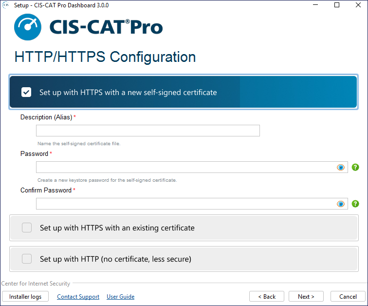
		

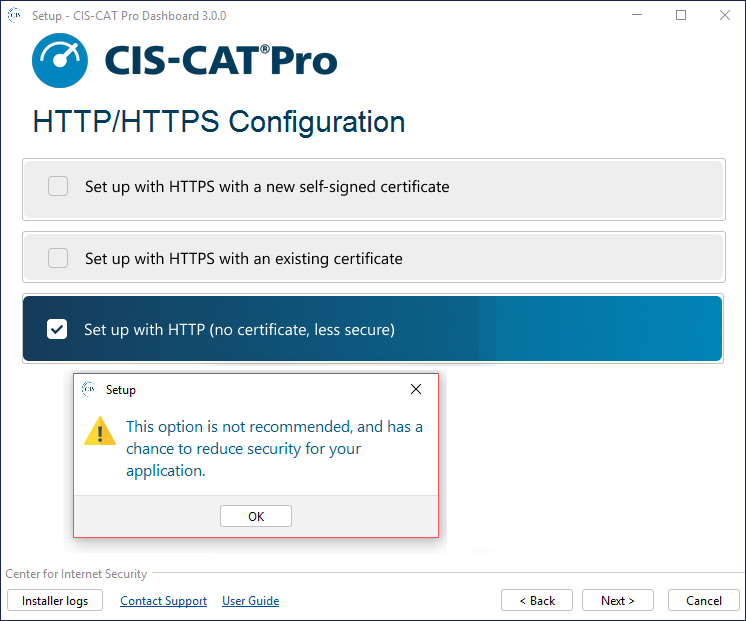

** Set Database Password **

The MariaDB that supports CIS-CAT Pro Dashboard has a native admin user with the username `root`. Set a strong password with the following requirements:

- Minimum 14 characters
- Does not start with a character
- At least 1 lowercase letter
- At least 1 uppercase letter
- At least 1 number
- At least 1 of these special characters: `!#$%^` with no other special characters allowed

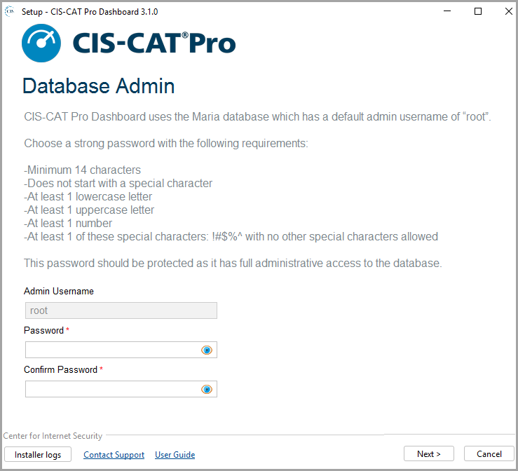

** Final Installation Process **

The duration of the final steps of the installation can be 2 to 5 minutes. The initial services to support CIS-CAT Pro Dashboard take some time to start. The services installed are:

- CCPD_Windows
- MariaDB

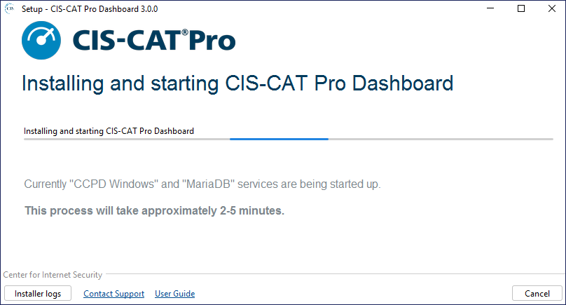

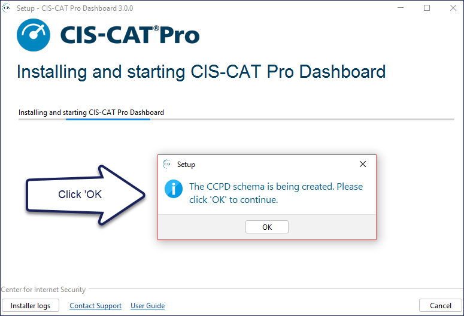

Once the installation detects that CIS-CAT Pro Dashboard is ready for use, the `Installation Complete` screen will be presented.

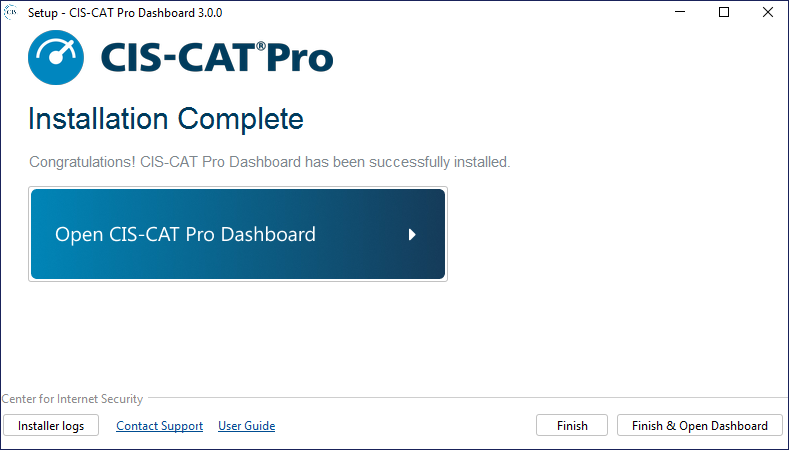

Select `Open CIS-CAT Pro Dashboard` or `Finish & Open Dashboard` to login to CIS-CAT Pro Dashboard.

Depending on the communication protocol selection during installation, the CIS-CAT Pro Dashboard URL will be:

- HTTP: http://localhost:8080/CCPD/
- HTTPS: https://localhost/CCPD/

## Initial Dashboard Login ##

    username: admin 
    password: @admin123

You'll be prompted to change your password upon first login.

---------------------------

# Upgrade Process #
Each release of CIS-CAT Pro Dashboard v3.x will contain upgrades to the main CIS-CAT application and embedded components. Upgrades are applied utilizing the latest installer included in the downloaded CIS-CAT Pro Dashboard. On upgrade, the application will verify that the version installing is newer than the installed version and fail if this scenario is detected.

The installer will detect a previous installation and prompt to update only the application or update/modify configuration changes. If no changes are required, updating only the application is the most efficient. Follow the basic steps below. 

](**NOTE:** There is no upgrade or migration path from CIS-CAT Pro Dashboard version 2.x to version 3.x. Please read our [FAQ](https://cis-cat-pro-dashboard.readthedocs.io/en/stable/source/About%20Dashboard/#version-3-faq) and our [blog](https://www.cisecurity.org/insights/blog/cis-cat-pro-is-now-even-better-heres-how-weve-improved-it) to learn more about CIS-CAT Pro changes.

1. Download the latest CIS-CAT Pro Dashboard zip file from [CIS WorkBench](https://workbench.cisecurity.org/files), select the tag `CIS-CAT Dashboard`
2. Place the zipped file on the CIS-CAT Dashboard host server where CIS-CAT Pro Dashboard v3.x is installed
3. Unzip the files
4. Verify downloaded file is unblocked by right-clicking on file and selecting `properties` and select the box `unblock`
4. Launch the installer executable from any hard drive location as an administrator
5. Select Standard or Custom Installation
	- **Update application only:** applies existing configuration, updates CIS-CAT application. No options to modify existing configurations.
	- **Update application and/or configuration settings:** applies existing configuration with options to modify some settings, updates CIS-CAT application. Select this option to modify communication protocol or update SecureSuite License. Select **optional** Email or LDAP configuration to modify or initiate these functions.
6. Select `Yes` if prompted for permission to proceed with installation

**NOTE:** Version 3 of CIS-CAT Pro Dashboard does NOT upgrade version 2. Version 3 requires a new installation.

------------------
# Installation Errors #

Occasionally, a CIS-CAT Pro Dashboard installation or upgrade may result in an error.

- **Check Services:** Navigate to Windows Services manager. You will find `MariaDB` and `CCPD_Windows` listed; start them if needed and try again after a few minutes.
- **Retry Installer:** Close and re-launch CCPD Installer. The installer will guide you through any necessary configuration.

If you are unsuccessful, collect logs that have been generated for you and open a support ticket. See further information below.

**Below are some error messages that may be received:**

- An error occurred starting up the CCPD Windows and/or MariaDB services. CCPD Windows is not working as intended.
	- CCPD Windows service isn't running after 10 minutes of waiting.
- An error occurred starting up the CCPD Windows and/or MariaDB services. MariaDB is not working as intended.
	- MariaDB service isn't running after 10 minutes of waiting.
- An error occurred starting up the CCPD Windows and/or MariaDB services. CCPD Windows is not working as intended. MariaDB is not working as intended.
	- CCPD Windows service and MariaDB service aren't running after 10 minutes of waiting.

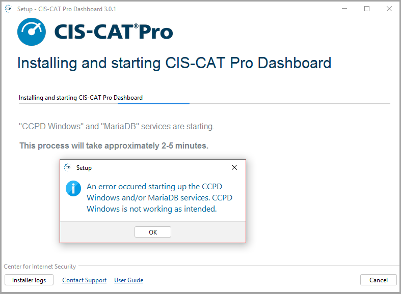

** Obtaining Installer Logs **

During the installation, the Installer will create logs. The logs will be removed when the installation application is closed. If you receive an error during installation, please capture the Installer log before closing the application. Installation logs are created in the operating system's temporary directory, which is `C:\Users\loggedinUser\AppData\Local\Temp`. Select the `Installer Logs` button to navigate to the log location. View this log for information regarding the installation or submit this file with your CIS Technical Support ticket.
 

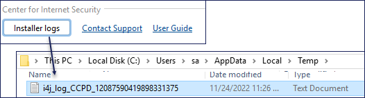

Additionally, CIS Technical Support may require any logs generated at this location: `C:\Program Files\CCPD\logs\ccpdlogs`. 

Attach log files to your [Technical Support ticket](https://www.cisecurity.org/support/).

# Uninstall#

The Uninstaller application is located in the root directory of the original installation location. The uninstallation will remove all data and services supporting CIS-CAT Pro Dashboard. A restart is required to complete the uninstallation.

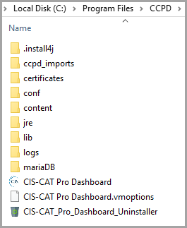

# HTTPS Certificate Trust #

CIS-CAT Pro Dashboard is currently only supported using Google Chrome. Other browsers may produce unexpected behaviors. 

**About Certificates for Dashboard**

Self-signed certificates will produce a trust warning within the browser. The warning can be ignored by selecting `Advanced` and `Proceed to localost` from within the browser. Per some organization's security policies, self-signed certificates are not permitted and an organization must utilize a certificate trusted by a public or private certificate authority. While both a self-signed and organizational certificate do assist in protecting incoming assessment data, it will be up to your organization on whether the browser warnings are acceptable or not.

By default, the Dashboard URL will publish as localhost. Utilizing a public or private organizational certificate is an optional way of allowing others within your organization to access the URL. See below more information on validated certificates.

**Certificates Validated by Certificate Authority**

To enable others to access the application outside of the localhost, a certificate issued by a public or private Certificate Authority (CA) would be the best approach. With this, you would be able to associate a different FQDN of your choosing that would be accessible to others. Organizations can also choose not to purchase a publicly validated certificate and setup a private certificate authority.

Organizations should publish a DNS record that matches the subject alternative name (common name attribute is deprecated), which will be the FQDN. The DNS name is selected by the organization. It’s possible to use an IP address to the subject alternative name, however, if the IP changes, a new certificate would need to be generated.

It is possible to utilize the IP of the host server, but utilizing an organizational certificate is a good approach to avoid exposing the IP of the host server. Using a certificate is best practice as it ensures you are accessing the correct page and avoids “man in the middle” and cache poisoning attempts.

It is an organization’s preference whether to purchase a certificate from a public Certificate Authority (CA) such as Digicert. Most organization’s have access to a public CA when they have a website. Certificates allow the organization’s website to be automatically trusted by various browsers.

Organization’s may also choose to maintain a private certificate authority. This certificate will be validated over a corporate/VPN internal network. This is a good approach for an internal application that an organization wants to trust. If this approach is pursued, the certificate still must be added to the trust store/keychain.

When testing access to a webserver, it’s helpful to use the FQDN from the host to ensure it is working. Try pinging the site and flushing the DNS after any changes.

For example, a server can have the hostname web on the domain acme.org and there's an A record for web.acme.org with the IP address 1.2.3.4. You can create a CNAME DNS record that uses web.acme.org and set an alias to something else like website.acme.com and the cert is valid as long as it matches up with website.acme.com.

**View the Certificate Details**

- Select the `Not secure` text to the left of the URL
- Select 'Certificte is not valid' 
- View the `Details` tab to view the information on the validity dates of the certificate. 

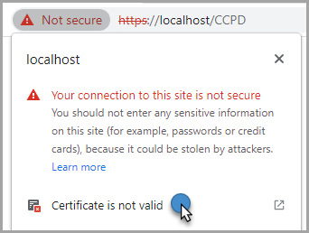

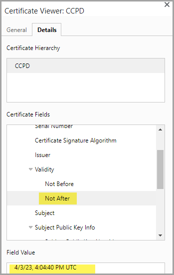

To fully trust and avoid browser warnings, an organizational certificate issued from a private or public certificate authority (CA) should be added to the trust store. 
