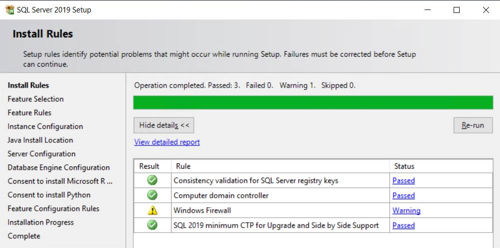
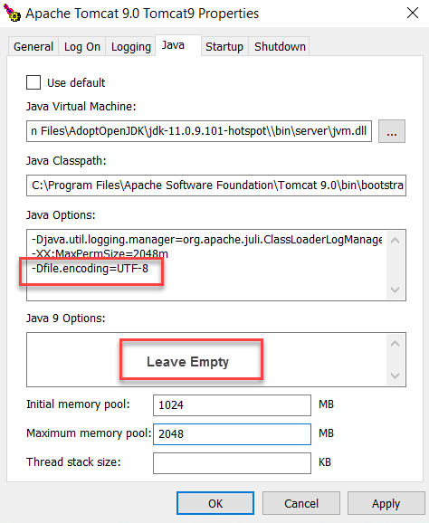
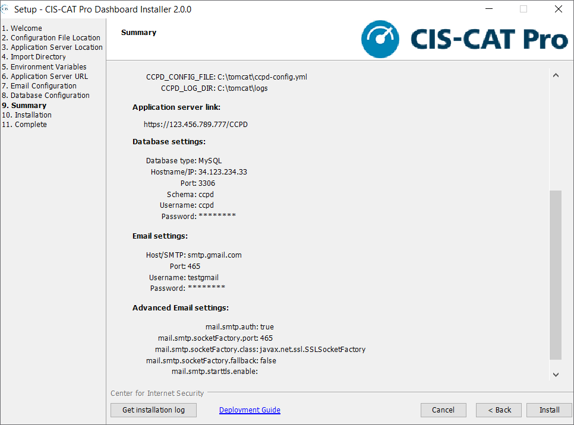
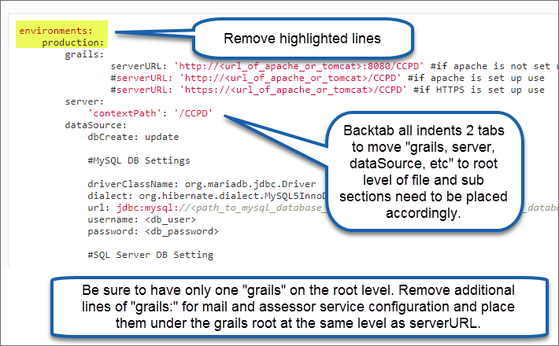

# CIS-CAT Pro Dashboard Deployment Guide for Windows #

End of Life and Final Release Dashboard version 2.x - Replaced with Dashboard v3.0.0
------------------

Version 2.3.1 will be the final release of CIS-CAT Pro Dashboard version 2 series. Dashboard version 3.0.0 will replace the 2.x versions in early Q4 2022, but will not be backwards compatible. A clean install of Dashboard version 3.0.0 will be required as there will be no upgrade or data migration options available from any previous 2.x version. Please read our [knowledge base article](https://cisecurity.atlassian.net/l/cp/mF6o97vs) to learn more. 

Version 2.3.1 will be available on the CIS WorkBench for download through December 2022.

Vulnerability assessment features will be deprecated.

Previous versions of this tool will no longer be distributed.

Final installation and configuration and installation guides will be packaged with Dashboard v2.3.1.  Dashboard version 3.0.0 documentation will be available online upon release.

----------

## Introduction ##
CIS-CAT Pro Dashboard is a web application built using the Grails Framework. The grails framework uses a hibernate data model, which allows CIS-CAT Pro Dashboard to be database management system (DBMS) agnostic. Grails code compiles into java byte code and runs on the Java virtual machine (JVM). Although CIS-CAT Pro dashboard is database agnostic, CIS only tests and supports use of the listed databases below. The documentation below describes how to deploy CIS-CAT Pro Dashboard on the CIS-preferred, officially supported components.

**CIS Supported Relational Database Management Systems (RDBMS)**

 - MySQL until version 5.7 (MariaDB 10.2)
 - MS SQL Server
 - Oracle (versions 12c, 18c, 19c)

**CIS Preferred Component Installation**<br/>
The preferred component installation instructions are included in this documentation. Any operating system can host the application server provided the platform can utilize software capable of hosting a Java web application archive (.war file). The supported version of Database may be limited by the database OS version.

 - 2 Windows Server 2016 or 2019 servers* 
 - **Server 1:** Microsoft SQL Server 2017 or 2019
 - **Server 2:** Tomcat 8.5 or 9 (Recommended for Dashboard v2.0.0+)
 - **Server 2:** IIS 10.0 Web Server
 - **Server 2:** Java Runtime or Development Environment 8 to 11
 	- OpenJDK (free and open-source) implementations are supported. We have found this [website](https://adoptopenjdk.net/) easy to navigate. The official source is [OpenJDK](https://openjdk.java.net/).
	- Java Development Kits (JDK) versions 9+ contain the JRE

*Separate servers are recommended to contain the identified components above for security and performance purposes.

## System Recommendations ##
 CIS currently tests using Microsoft Windows Server 2019. Disk space will be minimal on the application server, but will require more space on your database server depending upon the size of your organization and the amount of endpoints you have.

Load balanced configurations are not currently supported.

Our test environment uses an AWS t2.large instance (designed for burst processing), which has:

 - 8GB RAM
 - 2 vCPU’s with 4 cores each
 - Microsoft Windows Server 2016 or 2019 Base
 
The application is fairly lightweight on processor and memory use. However, when importing results, the usage will spike. Our recommendation would be to conduct importing off hours and then the functionality of the application will not be hindered during business hours.

\*\*Please be advised that it is a necessity for port 1433 and 8080 to be included as inbound rules\*\*

## Component Deployment ##
The following sections describe the installation and configuration of all components necessary to deploy CIS-CAT Pro Dashboard.

###Database###
#### Microsoft SQL Server ###
 
Download SQL Server 2017 or 2019 from [the official website.](https://www.microsoft.com/en-us/sql-server/sql-server-editions-express)

Install the database following the important steps described below, for more details regarding the installation, please follow [the official guide](https://docs.microsoft.com/en-us/sql/database-engine/install-windows/installation-for-sql-server) or [this unofficial website](https://www.brentozar.com/archive/2017/10/sql-server-2017-installation-screenshot-tour-windows/).

The below screen shots depict SQL Server 2019. There should be minimal differences between the look of 2017 and 2019. CIS uses both database versions in testing.

Chose "Custom" type installation and a target location to download.

Once "SQL Server Installation Center" starts, click on "New SQL Server installation or add features to an existing installation"

During the SQL Server installation wizard, make sure that you follow those important steps:

- In "Install Rules" step, you might have a warning regarding Windows firewall ports which needs to be opened for TCP/IP, as following. Please ignore the warning, the firewall configuration will be set up during the next section.



- In "Instance Configuration" step, make sure that you select **default instance** instead of "named instance". The default instance will listen on a static port (1433). The "named instance" will listen on a dynamic port which changes every time the server restarts.
  

 
- In "Database Engine Configuration" step, select Mixed Mode for the authentication.
This allows the username and password to be added later to CIS-CAT Pro Dashboard configuration file (ccpd-config.yml). You also need to set the password of the "sa" user.


Please note the following information in order to configure later SQL Server client as well as CIS-CAT Pro Dashboard application:<br/>
- hostname/IP of database server (machine which hosts the database)<br/>
- port for connecting, by default this is 1433<br/>
- username/password for connecting to the database. **This will need to be a SQL user, Domain users are not currently supported.**<br/>

#### Windows Firewall Configuration for SQL Server####
To access an instance of the SQL Server through a firewall, Windows firewall ports needs to be opened for TCP/IP port 1433.

Open Windows Firewall with Advanced Security application. Then in the left pane, right-clicked Inbound Rules, and click New Rule. In the Rule Type dialog box, select Port, then click Next. In the Protocol and Ports dialog box, select TCP. In Specific local ports, put 1433 (default instance SQL Server port), see screenshot. Then in the Action dialog box, select Allow the connection, then click Next.<br/>
For more information, please follow [the official website](https://docs.microsoft.com/en-us/sql/sql-server/install/configure-the-windows-firewall-to-allow-sql-server-access)


**Notes:** Your network must also allow traffic on TCP/IP 1433, (If deployed to AWS) your security group in AWS must allow traffic on TCP/IP 1433.

#### Enable TCP/IP in SQL Server Configuration Manager####
Open "SQL Server Configuration Manager" tool and enable TCP/IP as following in "SQL Server Network Configuration/Protocols for <Name_of_the_instance>":


Make sure that you restart the database service after, as following:


At this point, you can verify that "sqlservr.exe" process is listening to TCP 1433 port by executing the following command in a Command prompt:

	netstat -a -b


#### SQL Server Management Studio 17 (client) ####
A SQL Server client should be installed in the distant server (the second server which aims to deploy the application) in order to test connectivity with the database and create the schema for CIS-CAT Pro Dashboard.

Download the client from [the official website.](https://docs.microsoft.com/en-us/sql/ssms/download-sql-server-management-studio-ssms)

Connected to the distant SQL server using as following:


<br/>For "Server name", use the hostname/IP of the database server (machine which hosts the database)<br/>


Then click right on "Databases" folder on the left panel (I.E. Object Explorer) then click on "New Database". Set the Database Name to `ccpd`. 


###Java Runtime Environment (JRE)###

Because CIS-CAT Pro Dashboard is a java-based application, a compatible java runtime environment (JRE) is required. OpenJDK versions are also supported. 

Stable versions of JRE, JDK, or openJDK versions 8 and 11 are officially supported by CIS-CAT Pro Dashboard. **Versions of Dashboard prior to v2.0.0 only work with Java 8.250 and below.**

Verify the version of Java installed using the command below at Command Prompt:

	# Ensure the Java installed is version 8 is installed
	java -version
 

### Application Server###

It is recommended to utilize Apache Tomcat 9 with Dashboard v2.0.0+. Install Apache Tomcat 9 by reviewing the [Apache Official Guide](https://tomcat.apache.org/tomcat-9.0-doc/index.html). Find and download the [Apache Tomcat 9](https://tomcat.apache.org/download-90.cgi). 

Should Apache Tomcat 8 be required by your organization for prior versions of Dashboard, follow, download tomcat 8.5 32-bit/64-bit Windows Service Installer from [the official website](https://tomcat.apache.org/download-80.cgi). Follow [the official guide.](https://tomcat.apache.org/tomcat-8.5-doc/)<br/>


**Required Tomcat Configurations:**

 - Start Options: Service Startup and Start Menu
 - Specify JRE (OpenJDK or JDK)
 - Memory pool and maxPermSize
 - UTF 8 default character encoding
 - maxPostSize attribute
 - Remove default applications
 - Add bcprov*.jar to "jars to skip" in catalina.properites file

#### Set Start Options ####

Select the `Service startup` and `Start Menu Items` options during the installation.


The default tomcat location can be changed during the installation. For the purposes of this User's Guide, assume the tomcat location is set to "C:\tomcat" directory.    

Configure Tomcat Options by selecting the system tray Tomcat icon and click Configure. If the system tray tomcat icon is not present, navigate to "Start Menu/Apache Tomcat" and click on "Monitor Tomcat"<br/>

####Set Java Location####
If the installation of a Java Runtime Environment is not automatically found, navigate to the installation's root.


####Set Memory Pool and maxPermSize ####

Add `-XX:MaxPermSize=2048m` in java option and set up initial `Initial memory pool` to `1024` and `Maximum memory pool` to `2048`. 


####Set UTF 8 Character Encoding ####

The application requires tomcat to use **UTF-8** as a default character encoding.<br/>
If you receive the following error during an import, that means your system uses another character encoding:

	Invalid byte 1 of 1-byte UTF-8 sequence

To change the tomcat default character encoding to UTF-8, please add `-Dfile.encoding=UTF-8` option as following:




Tomcat service can be started/stopped from the system tray tomcat monitoring icon or from the windows services screen. 

####Set maxPostSize

Open `C:\tomcat\conf\server.xml` and find this line:

    <Connector port="8080" protocol="HTTP/1.1"
           connectionTimeout="20000"
           redirectPort="8443"/>

and add the maxPostSize attribute:

    <Connector port="8080" protocol="HTTP/1.1"
           connectionTimeout="20000"
           redirectPort="8443"
           maxPostSize="35728640"/>

This will increase the max allowable file size for upload.  Many CIS-CAT Pro Assessor ARF reports will be larger than the default size.

**Note:** Report import exceptions related to the maxPostSize limitation can be resolved by setting CIS-CAT Pro Assessor's property to compress result XML reports. For more details, please refer to the options that are set in the ```config\assessor-cli.properties```. 


#### Remove Default Applications ####

Remove the default applications available from the Tomcat install, including the examples and management applications. These default sites may expose information about the environment and present an information security risk.<br/>
Please delete every directory inside `C:\tomcat\webapps\*` to help reduce the attack surface of the application server.

#### Modify Property File ####

Locate the catalina.properties file, typically located in `c:\tomcat\conf` and add bcprov*.jar to the list that appears here:


	tomcat.util.scan.StandardJarScanFilter.jarsToSkip

### Web Browser###
The CIS-CAT Pro Dashboard officially supports **Google Chrome** web browser. Other browsers may also work but may produce unexpected behavior.

<a name="confAndDeploymentInstaller"></a>
##Configuration and Deployment - Installer##
<b>This section describes how to configure and deploy the Dashboard using the Installer.  For instructions on how to configure and deploy the Dashboard manually, see [Configuration and Deployment - Manual](#confAndDeploymentManual).</b>

### CIS-CAT Pro Dashboard Runtime Configuration File###
Locate the latest version of CIS-CAT Pro Dashboard by navigating to [CIS WorkBench](https://workbench.cisecurity.org/files). Select the tag of `CIS-CAT Dashboard` and download the CIS-CAT Pro Dashboard bundle that corresponds to your Java installation (32-bit or 64-bit). Place and extract the bundle on your tomcat instance. 
 
The extracted contents will look similar to the following image (64-bit Java version example shown):


We recommend that the Tomcat application server has been stopped before continuing. Additionally, ensure that component installation including installation of a [Java Runtime Environment](https://cis-cat-pro-dashboard.readthedocs.io/en/stable/source/Dashboard%20Deployment%20Guide%20for%20Windows/#introduction) (or JRE equivalent), Apache Tomcat and a Database (MySQL, SQL Server or Oracle) has been completed before continuing.

Execute the CIS-CAT Pro Dashboard Installer (`CIS-CAT_Pro_Dashboard_Installer-x64.exe` in this example).


####Welcome (First-time user)####
First-time users of the CIS-CAT Pro Dashboard Installer tool will be presented with the below screen.


####Welcome (Previous installation)####
Users with previous successful use of CIS-CAT Pro Dashboard Installer tool will be presented with the below screen.


####Existing Dashboard Installation and Express Installation ####
If there are no expected changes to the existing installation, this is the best option to select to simply update the *.war file with the latest. The CCPD.war and ccpd-config.yml will automatically be backed up as part of this process.


####Modify Existing Configuration Information####
Select this option on upgrade if you would like to review previous settings and potentially modify information. The following options and screens will be part of the navigation on a new installation or if you have selected to modify the existing information.

####Configuration File Location####
If this is a new installation, selecting `Next` on the Welcome screen will begin the setup of the configuration file that supports Dashboard. The first screen will define the location where CIS-CAT Pro Dashboard configuration file `ccpd-config.yml` will be created.


####Application Server Location####
Specify the application server home directory. The default value appearing in the field is the recommended location for the application server. However, each environment may vary. For example, if the Tomcat home directory is `C:\tomcat`, then the CCPD.war will be created under `C:\tomcat\webapps\CCPD.war`.


####Import Directory####
It is required to setup processing folders that the Dashboard will use while importing files. Example report folder structure is shown within the CIS-CAT Pro Dashboard Installer.


####Environment Variables####
Specify the Windows environment variables needed by the CIS-CAT Pro Dashboard. `CCPD_CONFIG_FILE` points to CIS-CAT Pro Dashboard runtime configuration file (`ccpd-config.yml`). `CCPD_LOG_DIR` is the logs directory for CIS-CAT Pro Dashboard.


####Application Server URL 
Specifies the application URL of the CIS-CAT Pro Dashboard application. Example formats are shown within the CIS-CAT Pro Dashboard Installer.


####Email Configuration####
The email configuration information is optional and is intended for users that want to send email messages such as password reset requests. CIS-CAT Pro Dashboard must be able to connect to and utilize a valid SMTP server in order to send email messages. CIS-CAT Pro Dashboard utilizes the Grails mail plugin for email communication.

Along with the default sender email address, CIS-CAT Pro Dashboard's mailing configuration must also include connection to a valid SMTP server in order to correctly distribute the "forgot password" messages. Numerous SMTP services exist, such as Gmail, Hotmail, Amazon SES, or in-house SMTP services available through corporate emailing technologies, such as Exchange. CIS-CAT Pro Dashboard can support these SMTP servers, as long as the connection information entered below is correct.
By default, the plugin assumes an unsecured mail server configured at `localhost` on `port 25`. However, this can be modified in the email configuration screen.


####Database Configuration####
The primary purpose of this screen is to assist in establishing a connection to the database for the CIS-CAT Pro Dashboard. Three types of databases are currently supported: MySQL, SQL Server and Oracle. Optional functions are available in this screen:

 - **Create a Schema:** Enter correct Hostname/IP, Port, Username, Password and select the “Create Schema” button. This process currently applies only to MySQL and SQL Server databases. 
 - **Test Database Connection:** Enter correct Hostname/IP, Port, Username, Password, and Schema name and select the “Test Database Connection” button. A message will indicate if the connection was successful.


####Summary####
The Summary screen is intended for a final review of all information provided in previous screens. If any information is incorrect, the back button can be used to navigate to the appropriate screen and make a correction.



####Installation####
The system will always take a backup of the current configuration file `ccpd-config.yml` as well as the `CCPD.war`.

The installer does not preserve or setup LDAP configuration. This is done manually using the backup file to merge any existing LDAP settings to the latest ccpd-config.yml


####Complete####
If the installer process was successful, the Complete screen will be presented. Select Finish to complete the selected Installer actions. The tomcat application server can now be started if it was previously stopped.


####Installer Logs
During the installation, the Installer will create logs. The logs will be created in a directory within the temporary directory of the operating system. Each installation attempt will create an individual log with a timestamp. For Windows, this location would be `C:\Users\loggedinUser\AppData\Local\Temp`. If you have trouble with the installation, please provide this log file on a [support ticket](https://www.cisecurity.org/support/). To view the log at any time, select the button that says Get Installation log.

<a name="confAndDeploymentManual"></a>
##Configuration and Deployment - Manual##
<b>This section describes how to configure and deploy the Dashboard manually.  For instructions on how to configure and deploy the Dashboard using the Installer, see [Configuration and Deployment - Installer](#confAndDeploymentInstaller).</b>

### CIS-CAT Pro Dashboard Runtime Configuration File###
Download the CIS-CAT Pro Dashboard bundle from [CIS WorkBench](https://workbench.cisecurity.org/) and place the bundle on the tomcat instance. The latest version of CIS-CAT Pro Dashboard will be pinned at the top of the Downloads section.

Create the CIS-CAT Pro Dashboard runtime configuration file (configured by default for MySQL database): `C:\tomcat\ccpd-config.yml`, and add to the file the following lines:

	grails:
    	serverURL: 'http://<url_of_apache_or_tomcat>:8080/CCPD' #if apache is not set up, only tomcat
		#serverURL: 'http://<url_of_apache_or_tomcat>/CCPD' #if apache is set up use
		#serverURL: 'https://<url_of_apache_or_tomcat>/CCPD' #if HTTPS is set up use
    	mail:
        	host: ""
        	port: 
        	username: ""
       	 	password: ""
        	props:
            	mail.smtp.auth: ""
            	mail.smtp.socketFactory.port: ""
            	mail.smtp.socketFactory.class: ""
            	mail.smtp.socketFactory.fallback: ""
            	mail.smtp.starttls.enable: ""
    
		plugin:
        	springsecurity:
            	ui:
                	forgotPassword:
                    	emailFrom: "no-reply@CISCATProDashboard.com"
    	assessorService:
        	active: false
        	url: ""
        	ignoreSslCertErrors: false
	server:
    	'contextPath': '/CCPD'
    	servlet:
        	context-path: '/CCPD'
	dataSource:
		dbCreate: update
	
		#MySQL DB Settings

		driverClassName: org.mariadb.jdbc.Driver
		dialect: org.hibernate.dialect.MySQL5InnoDBDialect
		url: jdbc:mysql://<path_to_mysql_database_server>:3306/<schema_name_of_mysql_database>
		username: <db_user>
		password: <db_password>

		#SQL Server DB Setting

		#driverClassName: com.microsoft.sqlserver.jdbc.SQLServerDriver
		#dialect: org.hibernate.dialect.SQLServer2008Dialect
		#url: jdbc:sqlserver://<path_to_mysql_database_server>:1433;databaseName=<schema_name_of_database>
		#username: <db_user>
		#password: <db_password>

		#Oracle DB Settings

		#driverClassName: oracle.jdbc.OracleDriver
		#dialect: org.hibernate.dialect.Oracle12cDialect
		#url: jdbc:oracle:thin:@<path_to_mysql_database_server>:1521:<schema_name_of_database>
		#username: <db_user>
		#password: <db_password>
	
		properties:
			  jmxEnabled: true
			  initialSize: 5
			  maxActive: 50
			  minIdle: 5
			  maxIdle: 25
			  maxWait: 10000
			  maxAge: 600000
			  #validationQuery: SELECT 1 from DUAL #ORACLE
			  validationQuery: SELECT 1 #Non-Oracle
			  validationQueryTimeout: 3
			  validationInterval: 15000
			  defaultTransactionIsolation: 2 # ORACLE AND MYSQL
			  #defaultTransactionIsolation: 1 #SQL SERVER ONLY
			  dbProperties:
					autoReconnect: true
	database: MySQL										
			

Replace the pertinent information, marked with <>, with the specifics of your environment.


**NOTE:** This example file is exhibits configuration for the 3 supported databases. See each individual database section for more information. Remove the database section that are not utilized in your environment. 

**NOTE 2:** To create a new schema called `ccpd` for MySQL database using UTF-8 Character set (required), please run the following command:

	CREATE DATABASE ccpd CHARACTER SET utf8 COLLATE utf8_general_ci;


**MySQL Timezone setting:** It is important for the timezone on the application server and the database server to be the same.  If this is not the case in your environment you can set the timezone of the database connection using a jdbc option:

	jdbc:mysql://<path_to_mysql_database_server>:3306/<schema_name_of_mysql_database>?useLegacyDatetimeCode=false&serverTimezone=<3-letter-timezone>

**MySQL 5.7 specific:**
If you use MySQL 5.7, you need to replace:
 
	database: MySQL

by:

	database: MySQL.5.7 
 
### Manually Upgrading Dashboard Configuration File from Prior Versions to v2.0.0+###

If updating Dashboard's ccpd-config.yml file manually, there are a few spacing changes that need to occur as well as a removal of two lines. See the below screen shot for what to change.




### Database Configuration ###
By default, the ccpd-config.yml is configured to utilize a MySQL database.  Microsoft SQL Server and Oracle Databases are also supported.  In the ccpd-config.yml, there are several settings you need to make to utilize these other DBMS:

**SQL Server**

You will need to comment out the MySQL configuration and uncomment the SQL Server Section:

	#MySQL DB Settings
	
    #driverClassName: org.mariadb.jdbc.Driver
    #dialect: org.hibernate.dialect.MySQL5InnoDBDialect
    #url: jdbc:mysql://<path_to_mysql_database_server>:3306/<schema_name_of_mysql_database>
    #username: <db_user>
    #password: <db_password>

    #SQL Server DB Setting

    driverClassName: com.microsoft.sqlserver.jdbc.SQLServerDriver
    dialect: org.hibernate.dialect.SQLServer2008Dialect
    url: jdbc:sqlserver://<path_to_mysql_database_server>:1433;databaseName=<schema_name_of_database>
    username: <db_user>
    password: <db_password>

Then enter the connection information appropriate to your SQL Server database.

In the database properties section, comment out the following property for SQL Server:

	#defaultTransactionIsolation: 2 # ORACLE AND MYSQL
	defaultTransactionIsolation: 1 #SQL SERVER ONLY

At the very bottom of the file comment out the database entry for MySQL and uncomment the entry for SQL Server:

	#database: MySQL
	database: SQLServer
	#database: Oracle


**Oracle**

You will need to comment out the MySQL configuration and uncomment the SQL Server Section:

	#MySQL DB Settings
	
    #driverClassName: org.mariadb.jdbc.Driver
    #dialect: org.hibernate.dialect.MySQL5InnoDBDialect
    #url: jdbc:mysql://<path_to_mysql_database_server>:3306/<schema_name_of_mysql_database>
    #username: <db_user>
    #password: <db_password>

    #Oracle DB Settings
	
    driverClassName: oracle.jdbc.OracleDriver
    dialect: org.hibernate.dialect.Oracle12cDialect
    url: jdbc:oracle:thin:@<path_to_mysql_database_server>:1521:<schema_name_of_database>
    username: <db_user>
    password: <db_password>

Then enter the connection information appropriate to your Oracle database.


At the very bottom of the file comment out the database entry for MySQL and uncomment the entry for Oracle:

	#database: MySQL
	#database: SQLServer
	database: Oracle

You will also need to comment out the validationQuery in the dataSource properties, and replace it with the one appropriate to Oracle:

	validationQuery: SELECT 1 from DUAL #ORACLE
	#validationQuery: SELECT 1 #Non-Oracle

### Mail Configuration ###
CIS-CAT Pro Dashboard utilizes the Grails `mail` plugin in order to send email messages from time to time, including password reset requests.  CIS-CAT Pro Dashboard must be able to connect to and utilize a valid SMTP server in order to send these email messages.  

Configuration of the mail plugin will be member-specific, and those configuration items will also be added to the `C:\tomcat\ccpd-config.yml` file, noted above.

#### Default Sender Email Address ####
CIS-CAT Pro Dashboard can be configured with a default "sender" email address, indicating that the application has sent a "forgot password" message, allowing users to enter new logon credentials.  In the `C:\tomcat\ccpd-config.yml` file (noted above), add the following section indented under the `grails` like below and also in [this example](https://cis-cat-pro-dashboard.readthedocs.io/en/stable/source/Dashboard%20Deployment%20Guide%20for%20Windows/#configuration-and-deployment-manual):

    ---
        plugin:
	    	springsecurity:
	    		ui:
	    			forgotPassword:
	    				emailFrom: "your-email@member-organization.com"

#### SMTP Configuration ####
Coupled with the default sender email address, CIS-CAT Pro Dashboard's mailing configuration must also include connection to a valid SMTP server, in order to correctly distribute the "forgot password" messages.  Numerous SMTP services exist, such as Gmail, Hotmail, Amazon SES, or in-house SMTP services available through corporate emailing technologies, such as Exchange.  CIS-CAT Pro Dashboard can support these SMTP servers, as long as the connection information is correct in the configuration file (the `C:\tomcat\ccpd-config.yml` noted above).

By default the plugin assumes an unsecured mail server configured at `localhost` on port `25`. However you can change this via the application configuration file (the `C:\tomcat\ccpd-config.yml` noted above). 

For example, configure the default sender to send with a Gmail account section indented under the `grails` like below and also in [this example](https://cis-cat-pro-dashboard.readthedocs.io/en/stable/source/Dashboard%20Deployment%20Guide%20for%20Windows/#configuration-and-deployment-manual)::
#### *Mail Configuration - Gmail* ####
    ---
        mail:
		    host: "smtp.gmail.com"
		    port: 465
		    username: "youracount@gmail.com"
		    password: "yourpassword"
		    props:
			    mail.smtp.auth: "true"
			    mail.smtp.socketFactory.port: "465"
			    mail.smtp.socketFactory.class: "javax.net.ssl.SSLSocketFactory"
			    mail.smtp.socketFactory.fallback: "false"

And the configuration for sending via a Hotmail/Live account:
#### *Mail Configuration - Hotmail/Live* ####
    ---
        mail:
		    host: "smtp.live.com"
		    port: 587
		    username: "youracount@live.com"
		    password: "yourpassword"
		    props:
			    mail.smtp.starttls.enable: "true"
			    mail.smtp.port: "587"

And the configuration for sending via a Outlook account:
#### *Mail Configuration - Outlook* ####
    ---
        mail:
		    host: "smtp-mail.outlook.com"
		    port: 587
		    username: "youracount@outlook.com"
		    password: "yourpassword"
		    props:
			    mail.smtp.starttls.enable: "true"
			    mail.smtp.port: "587"

And the configuration for sending via a Yahoo account:
#### *Mail Configuration - Yahoo* ####
    ---
        mail:
		    host: "smtp.correo.yahoo.es"
		    port: 465
		    username: "myuser"
		    password: "mypassword"
		    props:
			    mail.smtp.auth: "true"
			    mail.smtp.socketFactory.port: "465"
			    mail.smtp.socketFactory.class: "javax.net.ssl.SSLSocketFactory"
			    mail.smtp.socketFactory.fallback: "false"


### Environment Variables ###
Create the following Windows Environment variables:
 


`CCPD_CONFIG_FILE` points to CIS-CAT Pro Dashboard runtime configuration file (ccpd-config.yml). <br/>
`CCPD_LOG_DIR` is the logs directory for CIS-CAT Pro Dashboard.
   

**Note:**  The values of these environment variables can be configured to any location the administrator wishes, and must be to file system locations to which the Tomcat application server can access on startup.

###Initial War Deployment###
The CCPD.war file can be deployed by utilizing the CIS-CAT Pro Dashboard Installer or it can be done manually. Refer to the below instructions to deploy the CCPD.war file manually.

At this point, it is prudent to deploy the CIS-CAT Pro Dashboard application (the "war") included in the downloadable bundle.  The initial deployment of the web application can then be tested via direct connection to the application server on port `8080`, without the web server (IIS).  This can help identify any application or application server misconfigurations prior to web server (IIS) installation/configuration.

Connect to the application server and transfer the `CCPD.war` to the `c:\tomcat\webapps` directory.  If Tomcat is running, it should automatically deploy the application.  If Tomcat is not running, starting it will deploy the application.

Either way, after the deployment of the CCPD.war file you should keep following these instructions below:

Once Tomcat is done with its deployment you should be able to access the application by entering `http://<public url of application server>:8080/CCPD/`, into a browser.

It is necessary to restart tomcat in order to complete the deployment.

CIS-CAT Pro Dashboard will bootstrap in a user with:

    username: admin 
    password: @admin123

**Notes**:
Your network must allow traffic on 8080. Add an inbound rule in Windows firewall on TCP 8080 (if needed).
If deployed to AWS, your security group in AWS must allow traffic on 8080.

**Notes 2**: If you see this message in the logs: "LegacyImport - Source folder does NOT exist",  please ignore it, Import folder will be set up in the next section (Set up Import Folders).


###Set up Import Folders###
In order to import files into the Dashboard, you need to set up the temp folders that it uses for processing. <br/>

Create the three following directories:

	c:\tomcat\legacy\source
	c:\tomcat\legacy\processed
	c:\tomcat\legacy\error

Then login to the system as a user with ROLE_ADMIN, go to the settings menu (gear icon) and click on "System Settings". Set the three following settings:

	legacy.sourceDir = c:\tomcat\legacy\source
	legacy.processedDir = c:\tomcat\legacy\processed
	legacy.errorDir = c:\tomcat\legacy\error
	
You can also set legacy.processedRetentionNumber setting, which determines how many processed xml files are saved in the process directory after being imported into the Dashboard.  


## Web Server and Securing Web Traffic ##
The final configuration is for a web server to proxy the Tomcat instance and to answer traffic on port `80/443`.

### IIS Web Server Installation###
For the purposes of this User's Guide, IIS 10.0 will be installed in Windows Server 2016 or 2019.

Install IIS 10.0 using Server Manager application as following:

Open Server Manager from the start menu and click on “Add roles and features”:


On "Installation type", select "Role-Based" as following:


In "Server Selection", select your local server that you want to install IIS.

In "Server Roles". check "Web Server (IIS)" as following:


Click "Next" until "Confirmation" then click "Install".<br/>
Once installed, IIS server will appear in Server Manager Dashboard.
  
As a final test, open a web browser and type `http://localhost/`, you should see the default IIS page.

For more details, please follow "Install IIS Through GUI" on [Server 2016](https://www.rootusers.com/how-to-install-iis-in-windows-server-2016/) or [Server 2019](https://www.rootusers.com/how-to-install-iis-in-windows-server-2019/). 

###Initial Site Configuration###
Access Internet Information Service (IIS) Manager tool as following:


On the left panel expend the Sites directory and rename "Default Web Site" to "CCPD" as following. 


The advantage of using the Default Web Site is that it will work "out-of-the-box" with all definitions and permissions already taken care of.

**Note:** As a security concern, delete default documents inside `C:\inetpub\wwwroot` directory, it should contain only `iisstart.html` and `iisstart.png` files.

###Configure IIS Reverse Proxy to connect to Tomcat###
In order to configure IIS Reverse Proxy, two IIS modules need to be installed first:<br/>
Download and install "URL Rewrite" module from [this website.](https://www.iis.net/downloads/microsoft/url-rewrite)<br/>
Download and install Application Request Routing module from [this website.](https://www.iis.net/downloads/microsoft/application-request-routing)

In Internet Information Service (IIS) Manager tool, click on "CCPD" site on the left panel. Then double click on "URL Rewrite" icon on the right panel:


On URL Rewrite screen, click right and select "Add Rule(s)".

On the rule template, select "Reverse Proxy":


Create the following Reverse Proxy rule:<br/>


**Note:** Public url should use the default http port (80), so no need specify a port in the url.<br/>If your serverURL is http://www.example.com/CCPD, then set www.example.com to "To" field. 

For more details regarding URL Rewrite, please follow [this website.](https://blogs.msdn.microsoft.com/friis/2016/08/25/setup-iis-with-url-rewrite-as-a-reverse-proxy-for-real-world-apps/)

The IIS web server should now be configured to serve requests to CIS-CAT Pro Dashboard. 

Modify your `ccpd-config.yml` in order to use your public url `http://<public url of web server>/CCPD` instead of `http://<url_of_apache_or_tomcat>:8080/CCPD`, then restart tomcat.<br/>
Open a web browser and type `http://<public url of web server>/CCPD`, you should be redirected to CIS-CAT Pro Dashboard login page.

**Note 2**: Your network should now block traffic on 8080. Disable the inbound rule in Windows firewall on TCP 8080 (if needed).

### Set Application Request Routing ###

In order to integrate with and establish [authentication with CIS WorkBench](https://cis-cat-pro-dashboard.readthedocs.io/en/stable/source/Dashboard%20Deployment%20Guide%20for%20Windows/#cis-workbench-integration), certain proxy settings must be configured. Configure the following:

1. Navigate to the ARR proxy settings under IIS --> Application Request Routing Cache --> Server Proxy Settings
2. Uncheck `Reverse rewrite host in response headers`


### Securing Web Traffic ###
The steps above will have the CIS-CAT Pro Dashboard application running over normal HTTP on port `80`.  This presents a risk as data, including user credentials, will be transmitted in clear text. It is recommended that traffic be secured using HTTPS.  

#### Creating a Self-Signed Certificate using Windows Powershell ####
The following steps describe how to create a Self Signed Certificate. To request and use a certificate signed by a trusted third-party, please follow [this article.](https://www.digicert.com/kb/csr-creation-ssl-installation-iis-10.htm)

**Note :** The Self-Signed certificate can be created from IIS but it doesn't allow to set the domain (common name), so a warning message will show up on the web browser when you access the website using https (i.e. "NET::ERR\_CERT\_COMMON\_NAME\_INVALID" error in Chrome).

Open Windows Powershell program (start menu/Windows Powershell) then execute the following commands one at a time:
	
	#Create Root Certificate
	New-SelfSignedCertificate -certstorelocation cert:\localmachine\my -dnsname "My Lab Root Certificate Authority" -KeyUsage DigitalSignature,CertSign

	#Replacing <> by the thumbprint returned by the previous command
	#This command will export the root certificate to c:\safeDirectory
	Export-Certificate -Cert cert:\localMachine\my\<Thumprint of Root Certificate> -FilePath "c:\rootCertificate.crt"
	
	#Load the root authority certificate	
	$rootcert = ( Get-ChildItem -Path cert:\LocalMachine\My\<Thumprint of Root Certificate>)
	
	#Create Self-Signed certificate ccpd
	#If your serverURL is https://www.example.com/CCPD, then the DnsName (common name) must be www.example.com  
	New-SelfSignedCertificate -DnsName "<Common name of the web server>"  -CertStoreLocation "cert:\LocalMachine\My" -FriendlyName "ccpd cert" -Signer $rootcert -KeyUsage KeyEncipherment,DigitalSignature 

For more details regarding `New-SelfSignedCertificate` Powershell commands, here is [the official website.](https://docs.microsoft.com/en-us/powershell/module/pki/new-selfsignedcertificate?view=win10-ps)

#### Binding website certificate to IIS site####
Open IIS manager, click on CCPD site on the left panel then click on "Bindings..." on the right panel.

Click "Add" and add the following Site Binding, using "ccpd cert" certification created previously:


Once created, remove the other binding for port 80, so the application will be accessible only in https.

In ccpd.conf, modify the serverURL so the url should start by https instead of http.

Restart the application server and the web server.

Now if you open a web browser and access the application using https, a message will show up regarding a problem with the website’s security certificate. This issue will be solved in the next section. (i.e. Importing Root Certificate into Trusted Root Certification Authorities)

#### Importing Root Certificate into Trusted Root Certification Authorities####
After completing "Creating a Self-Signed Certificate using Windows Powershell" section, the Root Certificate should be located in `c:\rootCertificate.crt`.

Open Microsoft Management Console (type "mmc" on Windows search). If "Certificates" folder doesn't show up on the left panel, click on File/"Add Remove Snap-in...":<br/>


Double click on "Certificates" then click "Ok".

Now Click right on Certificates/Trusted Root Certification Authorities folder then select "All Tasks/Import":


Click "Next", Browse `c:\rootCertificate.crt` file, Click "Next" then "Next" then "Finish". Verify that the certificate got imported inside "Trusted Root Certification Authorities" folder:


Before opening a web browser, close every opened web browser first. If you use chrome click on 3 points/Exit or Ctr+Shift+Q instead of the cross icon. <br/>
Now if you access the application using https, the web browser will indicate that the connection is secure and the certificate is valid. 

Please repeat every step of this section for each client who wants to access the application. 

#### Importing the certificate into the java trust store ####
To POST reports to Dashboard from Assessor using the `POST Reports to URL` option with HTTPS, a certificate must be imported to the java trust store.

- Locate JRE, JDK, or openJDK used to launch Tomcat on the Tomcat/Dashboard server
- Note the location of the `cacerts` file prior to importing certificate to `keytool`
	- For example, if OpenJDK is located at `C:\Program Files\AdoptOpenJDK\jdk-11.0.9.101`.  When using OpenJDK 11, then `cacerts` file will be located in `C:\Program Files\AdoptOpenJDK\jdk-11.0.9.101\lib\security\cacerts`
- Use the java `keytool` application to import the certificate:

    	# Navigate to the $JAVA_HOME folder's bin directory.
    	cd C:\Program Files\AdoptOpenJDK\jdk-11.0.9.101\bin
     
    	# Execute keytool
    	keytool -import -alias ccpd -keystore ../lib/security/cacerts -file c:\rootCertificate.crt

- Enter keystore credentials at prompt.  By default, this credential is `changeit`.
- Answer `yes` to import the certificate into the trust store
 		
		# The user will be asked for confirmation
    	Trust this certificate? [no]:

- Restart application server to incorporate trust store


##Upgrading from a previous version##

To upgrade from an earlier version of CCPD:

There are two ways to upgrade your current CCPD version.

You can follow the instructions given above and do so by using the CIS-CAT Pro Dashboard Installer or you can follow the manual instructions provided below:

1) Stop your application server. If you followed the deployment guide that would be tomcat.<br/>Tomcat service can be stopped from the system tray tomcat monitoring icon or from the windows services screen:  


2) Copy the new CCPD.war into the c:/tomcat/webapps directory.

3) Start the application server, the service can be started from the system tray tomcat monitoring icon or from the windows services screen:   


That will redeploy the new war over the old application.  CCPD has a bootstrap initialization script that will run on its first deployment that will make necessary data changes.

If there are any additional upgrading steps specific to a release version, information about those steps will be included in that versions README.txt


##LDAP/Active Directory Integration (Optional)##
With this integration, LDAP/Active Directory will be used to manage user authentication and permissions within CCPD. 

Users will use their LDAP/AD credentials to log into the application. LDAP/AD roles and user properties such firstname, lastname and email will be imported. If the user doesn't exist in CCPD, the username will be created on login and granted with a basic user role (ROLE\_USER) by default along with LDAP Roles.

###LDAP Configuration###
Here is an example of LDAP structure in OpenLDAP:


Based on the above structure, add the following section in the `/opt/tomcat/ccpd-config.yml` file (noted above): 
		
	---
	grails:
		plugin:
			springsecurity:
				providerNames: ['ldapAuthProvider','rememberMeAuthenticationProvider','restAuthenticationProvider','anonymousAuthenticationProvider']
				ldap:
					active: true
					context:
						managerDn: 'cn=Manager,dc=cisecurity,dc=org'
						managerPassword: 'my_manager_password'
						server: 'ldap://127.0.0.1:389'
					authorities:
						retrieveDatabaseRoles: false                   
						retrieveGroupRoles: true
						groupSearchBase: 'ou=Groups,dc=cisecurity,dc=org'                  
						groupSearchFilter: 'uniquemember={0}'
						groupRoleAttribute: 'cn'        
						clean:
							prefix: 'CCPD_'
					search:
						base: 'dc=cisecurity,dc=org' 
						filter: '(uid={0})'
					authenticator:
						passwordAttributeName: 'userPassword'
					mapper:
						passwordAttributeName: 'userPassword'               
					useRememberMe: true  
				rememberMe:
					persistent: true

**Note**: If you have previously configured the application to connect to a SMTP server, you need to remove `grails:` from the above section. So the section will start with `plugin:` instead.
   
###Active Directory Configuration###
Here is an example of Active Directory structure in Windows server 2016:


Based on the above structure, add the following section in the `/opt/tomcat/ccpd-config.yml` file (noted above): 
		
	---
	grails:
		plugin:
			springsecurity:
				providerNames: ['ldapAuthProvider','rememberMeAuthenticationProvider','restAuthenticationProvider','anonymousAuthenticationProvider']
				ldap:
					active: true
					context:
						managerDn: 'CN=Administrator,CN=Users,DC=corp,DC=cisecuritytest,DC=org'
						managerPassword: 'my_manager_password'
						server: 'ldap://127.0.0.1:389'
					authorities:
						ignorePartialResultException: true
						retrieveDatabaseRoles: false                   
						retrieveGroupRoles: true
						groupSearchBase: 'DC=corp,DC=cisecuritytest,DC=org'                  
						groupSearchFilter: 'member={0}'
						groupRoleAttribute: 'CN'     
						clean:
							prefix: 'CCPD_'                 
					search:
						base: 'DC=corp,DC=cisecuritytest,DC=org' 
						filter: 'sAMAccountName={0}'
					auth:
						hideUserNotFoundExceptions: false
					authenticator:
						passwordAttributeName: 'userPassword'
					mapper:
						passwordAttributeName: 'userPassword'               
					useRememberMe: true                                 
				rememberMe:
					persistent: true

**Note**: If you have previously configured the application to connect to a SMTP server, you need to remove `grails:` from the above section. So the section will start with `plugin:` instead.

###Configuration Options###
Here is a description of some configuration options used for LDAP/AD integration:

- **managerDn/managerPassword:** manager credential to access to LDAP server.

- **server:** URL of the LDAP server.

- **groupSearchBase:** the base directory to start the group search. Note: if  we don't want to retrieve groups (roles) from LDAP, set retrieveGroupRoles to false.

- **groupSearchFilter:** the pattern to be used for the user search. {0} is the user’s DN.

- **groupRoleAttribute:** the ID of the attribute which contains the role name for a group.

- **clean.prefix:** an optional string prefix to strip from the beginning of LDAP group names. For example, 'CCPD\_' will convert CCPD\_ADMIN to ROLE\_ADMIN

- **base:** the base directory to start the search.

- **filter:** the filter expression used in the user search. For LDAP, uid field is typically used as username for the filter. In Active Directory, sAMAccountName (also called "User logon name") is typically used. 

- **passwordAttributeName:** the name of the password attribute to use.

###LDAP/AD Requirements###
The email address is a required field, make sure that LDAP/AD user email field is set properly.

The entire group name needs to be in uppercase in LDAP/AD. 

If some users were previously created in CCPD before the LDAP integration, make sure the username matches with the one in LDAP (uid) or AD (sAMAccountName, also called "User logon name").  

The api user needs to be created in LDAP/AD in order to generate an authentication token to import Asset Report Format (ARF) results from CIS-CAT Assessor. 

Once LDAP/AD authentication is integrated to CCPD, the database authentication will be automatically disabled.

##CIS-CAT Pro Assessor Integration##

### Introduction ###

The CIS-CAT Pro Dashboard has the ability to automatically import assessment results from CIS-CAT Pro Assessor. There are a few possible methods to configure the integration of CIS-CAT Pro Assessor and CIS-CAT Pro Dashboard to enable the upload of assessment results to the CIS-CAT Pro Dashboard database. From CIS-CAT Pro Assessor v4, results reports can be uploaded from a single CIS-CAT assessment by using the graphical user interface, command-line user interface or via “centralized” method to assess multiple Windows or Unix/Linux targets. 
In order for the CIS-CAT Pro Dashboard and CIS-CAT Pro Assessor to communicate and share assessment results, authentication/authorization must be configured. Once the CIS-CAT Pro Dashboard has been installed, follow the instructions to generate an Authentication Token that will be used to validate the authentication in supporting CIS-CAT Pro Assessor files.

In support of SCAP 1.2, CIS-CAT Pro Dashboard can generate assessment results in Asset Reporting Format (ARF). The ARF report supports assessed content created as SCAP 1.2 data-stream collection or XCCDF 1.2-based data streams. CIS Benchmark content is created as XCCDF 1.2-based data streams. 

<a name="establishAuthWithAssessor"></a>
### Establish authentication with Assessor ###
The setting for Authentication Token is a key piece of the integrations between CIS-CAT "Assessor" and CIS-CAT Pro Dashboard. Once a user has been configured in the CIS-CAT Pro Dashboard application to be assigned to the API Role (ROLE_API in the application), that user can generate an authentication token to be used in CIS-CAT. This token verifies the user's privileges in CIS-CAT Pro Dashboard when attempting to upload CIS-CAT results into the application's database.


Once the authentication token is generated in CIS-CAT Pro Dashboard, place the token in the assessor-cli.properties file for the Assessor that will post to the Dashboard. This file is typically located in the config folder of the Assessor v4. See the [Assessor Configuration Guide](https://ccpa-docs.readthedocs.io/en/latest/Configuration%20Guide/#cis-cat-pro-dashboard-integration) for more information.
 
**NOTE:** By default there is a user named apiuser which has ROLE_API.  The default password for this user is @apiuser123.  

**Generate the token**

 1. Login initially as the apiuser and reset the temporary default password  
 2. Login as an administrator and navigate to the user management page for the apiuser
 3. Generate the token

### Assessor Centralized deployment Dashboard Integration ###
CIS-CAT Pro Dashboard-specific scripts have been developed to allow for reports to be generated in the correct format and uploaded to the CIS-CAT Pro Dashboard database.

#### Assessor V4: ####

#### Microsoft Windows Environments: cis-cat-centralized-ccpd.bat####
To use `cis-cat-centralized-ccpd.bat` script, please follow [Assessing Multiple Windows Targets](https://ccpa-docs.readthedocs.io/en/latest/Configuration%20Guide/#centralized-windows) from Assessor V4 Configuration guide.

#### Unix/Linux Environments: cis-cat-centralized-ccpd.sh ####
To use `cis-cat-centralized-ccpd.sh` script, please follow [Assessing Multiple Unix/Linux Targets](https://ccpa-docs.readthedocs.io/en/latest/Configuration%20Guide/#centralized-unixlinux) from Assessor V4 Configuration guide.


##CIS-CAT Pro Assessor v4 Service Integration##

CIS-CAT Pro Assessor v4 Service is a separate application that is available only to CIS SecureSuite members from the Download section of CIS WorkBench. CIS-CAT Pro Assessor v4 Service is designed to interact with the CIS-CAT Pro Dashboard v1.1.11+ to allow configuration assessments to be run from CIS-CAT Pro Dashboard against a specified target system. For installation instructions, please see the [CIS-CAT Pro Assessor v4 documentation](https://ccpa-docs.readthedocs.io/en/latest/User%20Guide%20for%20Assessor%20Service/). Details on how to integrate a configured version CIS-CAT Pro Assessor v4 Service with CIS-CAT Pro Dashboard are provided below.

###Enable Assessor v4 Service Features###

**Pre-Requisites:**

- CIS-CAT Pro v4 Service deployed. [See the guide.](https://ccpa-docs.readthedocs.io/en/latest/User%20Guide%20for%20Assessor%20Service/)
- CIS-CAT Pro Dashboard v1.1.11+ installed


----------


1. Note location of Assessor v4 Service deployment
	- Separate host system
	- CIS-CAT Pro Dashboard's Tomcat host
3. Configure CIS-CAT Pro Dashboard ccpd-yml file
	- Ensure spacing and tabbing matches the examples very closely as yml files are particular with information "lining up"
	- For Assessor v4 Service deployments on Tomcat host, avoid local port conflict by setting the assessor service to an open port 
2. Modify ccpd-config.yml in one of the examples based on current installation configuration
	- HTTP communication: when setting URL, use the port set in Assessor v4 Service server.conf file (http://localhost:2222)
	- HTTPS communication: set URL as set in Assessor v4 Service server.conf file (https://your_url)  

	Example entry in ccpd-config.yml which must be place indented under single `grails` section: 

		---
       		assessorService: 
				active: true
				url: 'http://localhost:2222'
				ignoreSslCertErrors: true
	

1. Restart Tomcat
2. Ensure [assessor-service.properties](https://ccpa-docs.readthedocs.io/en/latest/User%20Guide%20for%20Assessor%20Service/#configuration) in Assessor v4 Service has been configured 

| Property                         | Description                                   |
| -------------------------------- | --------------------------------------------- |
| active  | hides(false) or displays(true) features for orchestrating an assessment |
| url | Mandatory value when active:true representing URL of the Assessor v4 Service web server.|
| ignoreSslCertErrors | ignores(true) or allows(false) certificate errors |


##CIS WorkBench Integration##

### Introduction ###
This new feature is an optional service provided to members to receive automatic notifications on new CIS-CAT Pro releases. 

**Setting up the connection is an admin only ability. Additionally, the application requires a direct internet connection, a proxy will not work.**

When the connection is active, inbox alerts will appear within CIS-CAT Pro Dashboard when a new CIS-CAT Pro release is available.

Retrieve the new release using links in the alert message from within CIS-CAT Pro Dashboard without logging directly into CIS WorkBench.

CIS utilizes [OAuth 2.0](https://oauth.net/2/) authorization framework to establish a connection between the two applications.

A one-way API is established from an instance of CIS-CAT Pro Dashboard to CIS WorkBench.

Each connection or integration is unique per Dashboard installation, which allows organizations with multiple instances of Dashboard to establish a communication between CIS-CAT Pro Dashboard and CIS WorkBench.

CIS-CAT Pro Dashboard will check CIS WorkBench daily for the availability of a new release of CIS-CAT Pro. Establishing this connection will not allow CIS to collect any assessment results from your organization.

### Establish a connection with CIS WorkBench ###
Under the settings menu, an option called Systems Integrations is available to users with the admin role.

Select System Integrations menu item:


In System Integrations, select the Connect button:


Select Continue to CIS WorkBench:


Enter CIS WorkBench credentials and select Authorize:


Review the screen and Select Authorize:


**Note:** The switch button appears grayed out because "Downloads of new CIS-CAT Pro updates" is the only service offered so far. In the future, members will have the option to opt-in/out from multiple services.

The connection is successfully made:


**Note:** The switch button appeared grayed out because "Downloads of new CIS-CAT Pro updates" is the only service offered so far. In the future, members will have the option to opt-in/out from multiple services.

###Test connection between CIS-CAT Pro Dashboard and CIS WorkBench###
Test button is available to verify the connection between CIS-CAT Pro Dashboard and CIS WorkBench.

When a connection is active, test the connection by pressing Test button:


If successful, a message will show on the screen.

If not, instructions will be provided in an error message.

###Disconnect from CIS WorkBench###
Select Disconnect:


Select Disconnect again in the popup:


The disconnection is successfully made:


Now CIS-CAT Pro Dashboard and CIS WorkBench are disconnected.

Although your connection is no longer active between CIS-CAT Pro Dashboard and CIS WorkBench, **an active API client exists on your organization’s profile on the CIS WorkBench**. We keep this API client to allow you to reconnect easily.
 
However, if you no longer want to utilize the service, please open a ticket at the [CIS Support Portal](https://www.cisecurity.org/support/) in order to delete the API client.

##Dashboard API##

#### Upload Report API ####
CIS-CAT Pro Dashboard utilizes an API to upload assessment reports (ARF,XML) generated by CIS-CAT Pro Assessor v4. The API utilizes a POST_URL feature. The API can also be called from a script (python, powershell etc...). The API definition can assist organizations, where necessary, in building their own, organization-approved scripts to upload reports into the Dashboard.

**Description**


- **Url**: ```http(s)://[MY-DASHBOARD-SERVER]/CCPD/api/reports/upload```
- **Method:** ```POST```
- **Header:** <br/>
**'Authorization':** ```'Bearer=[MY_DASHBOARD_AUTHENTICATION_TOKEN]'``` <br/>
Note: ```[MY_DASHBOARD_AUTHENTICATION_TOKEN]``` is the token generated from the Dashboard with the a user assigned with ROLE_API. For more details, please see [Establish authentication with Assessor](#establishAuthWithAssessor) section.<br/>
**'Content-type'**: ```multipart/form-data``` <br/>
Note: In the below example of the Python script, content-type is automatically generated. There is no need to specify it. 
- **POST Data Params:** <br/>
**'ciscat-report'**: String content of the XML report generated by the Assessor <br/>
**'report-name'**: A given name of the report. For example, the name can follow the Assessor naming convention as following: ```hostname_benchmark-timestamp-ARF.xml```.
- **Responses code:** <br/>
**200:** Assessment report successfully uploaded<br/>
**400:** Unexpected failure with details on response status message<br/>
**401:** Assessment failed to upload because of an Authentication Failure.  Please ensure your authentication token is correct. <br/>
**500:** Assessment failed to upload with details on response status message

**Example of Python script:**

Below is a script to upload of a single report into the Dashboard:

Assuming ```Hostname_CIS_Microsoft_Windows_10_Enterprise_Release_1803_Benchmark-20190805T135433Z-ARF.xml``` is the name of the report file generated by CIS-CAT Pro Assessor and located in ```./reports``` directory.<br/>The generated token is ```eertaa2pg2h7vb3ms97kdjebakr22v15``` and the Dashboard URL is ```https://mydashboard/CCPD/api/reports/upload``` 


	import sys
	import json
	import requests
	import http
	import datetime
	
	print(str(datetime.datetime.today()) + " *********************** Start dashboard upload script ***********************")
	
	apiHeaders = {'Authorization': 'Bearer=eertaa2pg2h7vb3ms97kdjebakr22v15'}
	
	with open('./reports/Hostname_CIS_Microsoft_Windows_10_Enterprise_Release_1803_Benchmark-20190805T135433Z-ARF.xml', 'rb') as f:
	    filecontent = f.read()
	requests.post("https://mydashboard/CCPD/api/reports/upload", headers=apiHeaders,  data={'ciscat-report': filecontent ,'report-name':'Hostname_CIS_Microsoft_Windows_10_Enterprise_Release_1803_Benchmark-20190805T135433Z-ARF.xml'})

	print(str(datetime.datetime.today()) + " *********************** End dashboard upload script ***********************")

Note: In order to troubleshoot authorization/upload issues, SSL certificate verification can be ignored using ```requests.post(...,verify=False)```
