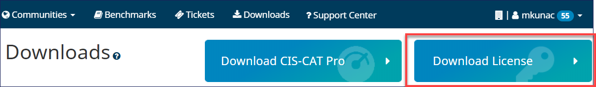

----------

A SecureSuite License is required for CIS-CAT Pro Dashboard v3.0.0. If a valid license is not present, some Dashboard features such as remote configuration assessment will not properly function. 

Your CIS SecureSuite license only changes if the terms of your Membership have recently changed. There is no need to input a new license on each install unless you are certain your terms have changed. The license is required and primarily enables the remote assessment features, which is now default functionality. 

**Steps to Download Your SecureSuite License**

1. Login to [CIS WorkBench](https://workbench.cisecurity.org/dashboard)
2. Navigate to the [Downloads](https://workbench.cisecurity.org/files) menu item
3. Select `Download License` button

4. From the “Licenses” tab, select the `Download` button next to your key
	- NOTE: Ensue that JavaScript is unblocked on your browser if you do not see that the file has downloaded.
5. Navigate to the downloaded files and extract/unzip the contents
6. Open the folder where the extracted files were stored, and copy the file `license.xml` to the host of CIS-CAT Pro Dashboard
	- During the installation process, you'll be prompted to select the license file

